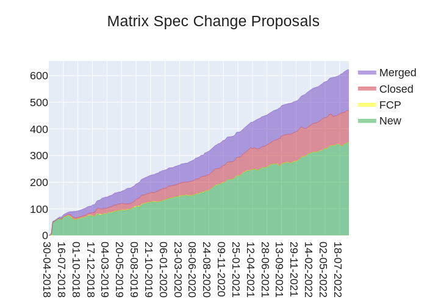
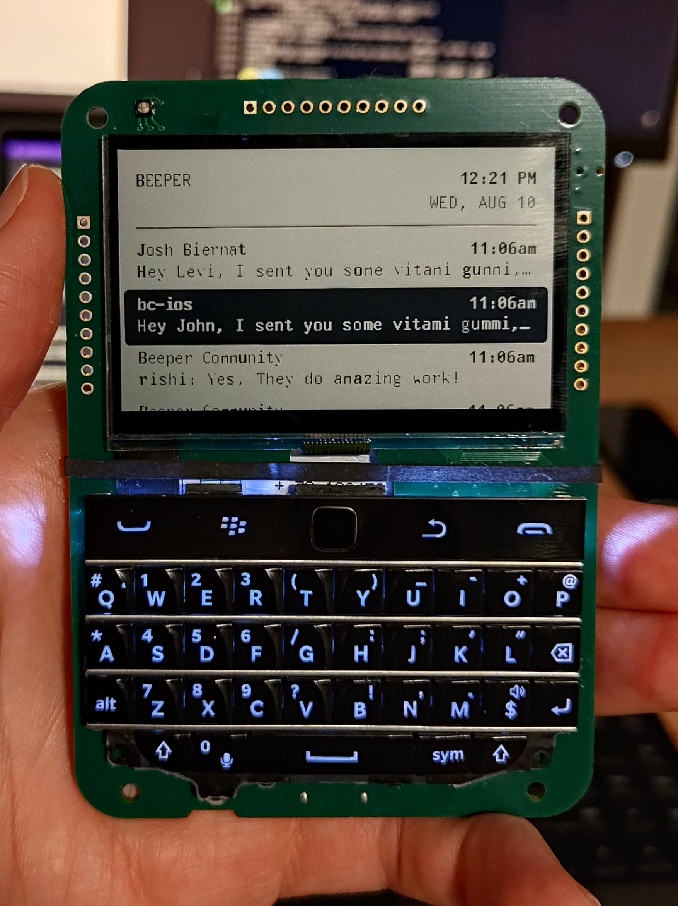

+++
title = "This Week in Matrix 2022-09-02"
path = "/blog/2022/09/02/this-week-in-matrix-2022-09-02"

[taxonomies]
author = ["Thib"]
category = ["This Week in Matrix"]
+++

## Matrix Live 🎙

{{ youtube_player(video_id="RzhMDi1aNEM") }}

<!-- more -->

## Dept of Spec 📜


  > Here's your weekly spec update! The heart of Matrix is the specification - and this is modified by Matrix Spec Change (MSC) proposals. Learn more about how the process works at <https://matrix.org/docs/spec/proposals>.
  >
  >
> ## MSC Status
  >
  > **Merged MSCs:**
  >
  > * *No MSCs were merged this week.*
  >
  > **MSCs in Final Comment Period:**
  >
  > * *No MSCs are in FCP.*
  >
  > **New MSCs:**
  >
  > * *There were no new MSCs this week.*
  >
> ## Spec Core Team
  >
  > It's been a light week for the spec core team, but we have been looking at [MSC3862](https://github.com/matrix-org/matrix-spec-proposals/pull/3862) and [MSC3758](https://github.com/matrix-org/matrix-spec-proposals/pull/3758).  These are two proposals that try to extend push rules in different ways to be able to match more than just strings.  So we have been discussing the relative merits of both proposals.
  >
> ## Random MSC of the Week
  >
  > The random MSC of the week is... [MSC3386: Unified Join Rules](https://github.com/matrix-org/matrix-spec-proposals/pull/3386)!
  >
  > Currently, a room can be set so that prospective members can [knock](https://github.com/matrix-org/matrix-doc/pull/2403) to request to join the room, or allow [members of a different room to join](https://github.com/matrix-org/matrix-doc/pull/3083).  However a room cannot be set up to allow both; MSC3386 proposes a change to the join rules to change this.
  >
> <!-- markdownlint-disable-next-line no-alt-text -->
  > 


## Dept of Servers 🏢

### Synapse ([website](https://github.com/matrix-org/synapse/))

Synapse is a Matrix homeserver implementation developed by the matrix.org core team

[Shay](https://matrix.to/#/@shayshay:matrix.org) reports

> This week we released Synapse 1.66.0! Some notable features are:
>
> * Adding forgotten status to Room Details Admin API.
> * Adding an experimental implementation for MSC3852 (Expose user agents on Device).
> * Adding org.matrix.msc2716v4 experimental room version with updated content fields. Part of MSC2716 (Importing history)
> * Adding support for compression to federation responses.
> * Improving performance of sending messages in rooms with thousands of local users.
>
> Plus a host of bugfixes and other changes to make Synapse faster and leaner! Take a look. <https://github.com/matrix-org/synapse/releases/tag/v1.66.0>. In addition, work continues on fast room joins-stay tuned, as we are getting closer to the finish line.

### Dendrite ([website](https://github.com/matrix-org/dendrite))

Second generation Matrix homeserver

[Till](https://matrix.to/#/@s7evink:matrix.org) says

> This week we released [Dendrite 0.9.6](https://github.com/matrix-org/dendrite/releases/tag/v0.9.6) which includes a number of fixes, including a rewrite of the appservice component:
>
> ### Features
>
> * The appservice API has been refactored for improved performance and stability
>     * The appservice database has been deprecated, as the roomserver output stream is now used as the data source instead
> * The `generate-config` tool has been updated to support additional scenarios, i.e. for CI configuration generation and generating both monolith and polylith skeleton config files
>
> ### Fixes
>
> * The username length check has been fixed on new account creation
> * The length of the `type`, `sender`, `state_key` and `room_id` fields in events are now verified by number of codepoints rather than bytes, fixing the "Cat Overflow" bug
> * UTF-16 surrogate handling in the canonical JSON implementation has been fixed
> * A race condition when starting the keyserver has been fixed
> * A race condition when configuring HTTP servers and routing at startup has been fixed
> * A bug where the incorrect limit was used for lazy-loading memberships has been fixed
> * The number of push notifications will now be sent to the push gateway
> * A missing index causing slow performance on the sync API send-to-device table has been added (contributed by [PiotrKozimor](https://github.com/PiotrKozimor))
> * Event auth will now correctly check for the existence of the `"creator"` field in create events
>
> As always, please feel free to join us in [#dendrite:matrix.org](https://matrix.to/#/#dendrite:matrix.org) for more Dendrite-related discussion.

## Homeserver Deployment 📥️

### Helm Chart ([website](https://gitlab.com/ananace/charts))

Matrix Kubernetes applications packaged into helm charts

[Ananace](https://matrix.to/#/@ace:kittenface.studio) announces

> This week has seen some updates to [my Helm Charts](https://gitlab.com/ananace/charts), bumping element-web to 1.11.4 and matrix-synapse to 1.66.0 - as well as making the worker configuration more flexible in handling multiple instances of specialised workers.

[Ananace](https://matrix.to/#/@ace:kittenface.studio) says

> And another quick update on [my Helm Charts](https://gitlab.com/ananace/charts), bumped my synatainer package to the just released 0.4.2

## Dept of Bridges 🌉

### Postmoogle ([website](https://gitlab.com/etke.cc/postmoogle))

An Email to Matrix bridge. 1 room = 1 mailbox.

[Aine](https://matrix.to/#/@aine:etke.cc) says

> Postmoogle v0.9.0
>
> * ACLs with wildcards, controlled directly from matrix chat
> * Admin users
> * Ability to list all mailboxes and disable/remove them directly from matrix chat
> * Display options (show/hide sender, show/hide subject, html/text-only parsing, enable/disable email -> matrix threads, enable/disable attachments support)
>
> [Source code](https://gitlab.com/etke.cc/postmoogle), matrix room: [#postmoogle:etke.cc](https://matrix.to/#/#postmoogle:etke.cc)

### matrix-hookshot ([website](https://github.com/Half-Shot/matrix-hookshot))

A multi purpose multi platform bridge, formerly known as matrix-github

[Half-Shot](https://matrix.to/#/@Half-Shot:half-shot.uk) reports

> Another week, another hookshot release. This release brings support for **Arm64** docker builds, a revamped JSON logger and much prettier error reporting in the widget. As always, there is a good chunk of bugfixes too.
>
> You can check out version [2.1.1](https://github.com/matrix-org/matrix-hookshot/releases/tag/2.1.1) here!
>
> Come chat to us in [#hookshot:half-shot.uk](https://matrix.to/#/#hookshot:half-shot.uk) if you need a hand setting up.
>
> In terms of what will be appearing in the near future:
>
> * Support for adding JIRA connections via widgets.
> * Encryption support (at long last) so you can bridge in hookshot to encrypted rooms.
> * An experimental new way to *share* logic between rooms configured with custom JS functions. Possibly utilizing Matrix rooms-as-software-libraries.

## Dept of Clients 📱

### Beeper

[Eric Migicovsky](https://matrix.to/#/@eric:beeper.com) says

> Hey it’s Eric from [Beeper](https://www.beeper.com)! Been a while since our last update. Reminder: [Beeper](https://www.beeper.com) is a universal chat app built on top of Matrix. We've created 12+ open source Matrix bridges and integrated them into an easy to use all-in-one service which does not require setting up your own homeserver.
>
> Since our last update in [February](/blog/2022/02/11/this-week-in-matrix-2022-02-11#beeper-website) (!) we have been really busy! We published a short-term [roadmap](https://blog.beeper.com/p/product-roadmap-april-2022) back in April and have almost completed all items on the list.
>
> Today I want to share the improvements we’ve made to **Beeper Desktop**. Check out the [video](https://www.youtube.com/watch?v=xjMOb4Jwrfg) below for a full demo!
>
> ### New features
>
> * Shiny new design and theme (just released yesterday!
> * Completely updated inbox workflow
>     * It’s designed to make it easier to prioritize the chats that matter most to you, and quickly archive everything else
>     * Actions like archive/pin/mark as unread
>     * Collapsible archive section
>     * Auto-archive messages after you reply or a fixed time
>     * Tons of new keyboard shortcuts
>     * See a full chat preview without opening chat or marking it read
> * Scheduled messages - schedule a message to be sent in any chat. Works on any chat network that Beeper supports, and will send even if your devices are all powered off.
> * Start New Chat directly from Beeper Desktop on any bridged chat network
> * Sent status for bridged messages - get confirmation or a failure alert if the bridge is unable to send a message to the remote network
> * Two-factor verification codes sent via Android SMS or iMessage are automatically copied to clipboard. Just like Safari!
> * Tons and tons of bugfixes and smaller new features
>
> We’ve also been working hard on new bridges + features, Beeper Android and Beeper iOS, but I will save those for another post!
>
> Want to get access to Beeper? Sign up on [beeper.com](http://beeper.com) and if you want to jump the line, [send us a DM](https://twitter.com/onbeeper) on Twitter. Or chat with the community [#beeper:beeper.com](https://matrix.to/#/#beeper:beeper.com)
>
> Want to work with us at Beeper? We are hiring 100% remote backend, iOS and Android developers. Send me a message @eric:beeper.com. And if you want to develop an open source bridge, we will fund it with up to $5,000.
>
> {{ youtube_player(video_id="IY5zOevr08I") }}

### Nheko ([website](https://nheko-reborn.github.io))

Desktop client for Matrix using Qt and C++17.

[Nico](https://matrix.to/#/@deepbluev7:neko.dev) says

> We now properly inherit the sticker packs from the parent spaces, which gives you the possibility to expose stickers to your whole community by editing them in a single space. The bug that deleted widgets were shown, that sneaked into the last release, should also be resolved. If your server doesn't follow the client server spec on event size limits, Nheko is now stricter when validating the return values and might refuse to show events or room violating such constraints. Before this fix using a non-compliant server could make Nheko fail to properly process the sync response. Forest cleaned up our formatting configuration, Zirnc fixed our misleading bug report template suggesting the version field would be somewhere it isn't and Hiers made the edit button in the room profile match the one in the user profile. Forest also fixed our usage of the Qt colour palette for reactions and made hitting the escape key always return focus to the message input.
>
> Also, if you managed to find me on the Matrix Community Summit, you might have had the chance to get one of the rare hardware Nheko patches (contrary to the software ones).

### Element Web/Desktop ([website](https://github.com/vector-im/element-web))

Secure and independent communication, connected via Matrix. Come talk with us in [#element-web:matrix.org](https://matrix.to/#/#element-web:matrix.org)!

[Danielle](https://matrix.to/#/@daniellekirkwood:one.ems.host) says

> 🔒 **We have a security release: Please update to v1.11.4 ASAP.**
>
> Last weekend we received a report from Val Lorentz (thank you!) that it was possible to create a situation where Element wouldn’t show all of the user’s rooms or Spaces, causing minor (temporary) corruption and Denial of Service (DoS). We’ve fixed this case in v1.11.4 and encourage everyone to update as soon as possible.
>
> While the vulnerabilities themselves are not disclosed yet, there is more information on the [element.io blog](https://element.io/blog/element-web-desktop-1-11-4-a-security-update-deferred-dms-and-more/) and the [matrix.org blog](https://matrix.org/blog/2022/08/31/security-releases-matrix-js-sdk-19-4-0-and-matrix-react-sdk-3-53-0).
>
> Please note that this also affects consumers of the matrix-react-sdk and matrix-js-sdk: updating to v3.53.0 and v19.4.0 respectively should resolve the issue.
>
> 🥼  **In labs (you can enable labs features in settings on develop.element.io or on Nightly):**
>
> * Threads Notification improvements are coming! This week the team met to review all the feedback given by Beta users, alongside our MSCs, and Proof of Concept work to finalise the plan and approach for Threads Notifications. Watch this space!

### Element iOS ([website](https://github.com/vector-im/element-ios))

Secure and independent communication for iOS, connected via Matrix. Come talk with us in [#element-ios:matrix.org](https://matrix.to/#/#element-ios:matrix.org)!

[Ștefan](https://matrix.to/#/@stefan.ceriu:matrix.org) says

> * Element 1.9.2 is now available on the AppStore and with it comes a brand new home screen layout. The new view is cleaner, easier to browse, and faster to navigate. We’d love for you to enable the labs setting and try it out.
> * There’s exciting work happening in other areas as well: we’re working hard on deferring DM creation until the first message is sent and the new rich text editor is quickly taking shape.
> * On the ElementX front we have made very good progress on integrating the new sync mechanism and the new Rust Timeline API is proving to be quite a treat.
> * And, as always, we fixed some big bugs and some not so big ones. Enjoy!

### Element Android ([website](https://github.com/vector-im/element-android))

Secure and independent communication for Android, connected via Matrix. Come talk with us in [#element-android:matrix.org](https://matrix.to/#/#element-android:matrix.org)!

[Manu](https://matrix.to/#/@Manu:matrix.org) announces

> * Coming soon on Element Android is the new app layout. The home page of the app has been redesigned. The new view is cleaner, easier to browse, and faster to navigate. Keep an eye out on twitter for our teaser trailers!
> * The team has been working on deferring DM creation until after the first message has been sent. So you’ll no longer invite another person to an empty room, instead they’ll see your message and a new invite all at once.
> * Along with these exciting improvements we’ve fixed several bugs, including improving the speed of the app when you resume it.

### Element ([website](https://element.io))

Everything related to Element but not strictly bound to a client

[kittykat](https://matrix.to/#/@kittykat:matrix.org) says

> **Community testing**
>
> * We’d love to hear your feedback on the new composer redesign, including an all new WISYWIG editor: [sign up to take part in testing](https://docs.google.com/forms/d/e/1FAIpQLSeGZMdaWFnaf9XMc6iNWaXu6MpKsdAX8QE83POm9_nu2JGzsg/viewform?usp=sf_link)!
> * For more info on our next testing sessions, you can join us at [#element-community-testing:matrix.org](https://matrix.to/#/#element-community-testing:matrix.org)!

### Cinny ([website](https://cinny.in))

Cinny is a Matrix client focused on simplicity, elegance and security

[ajbura](https://matrix.to/#/@ajbura:matrix.org) reports

> Security update
>
> This release address the vulnerability found this week in matrix-js-sdk <19.4.0, so please update to Cinny v2.1.3 at your earliest convenience.
>
> If you are using [our hosted version](https://app.cinny.in) then it is already up-to-date and all you need is a refresh and clear cache (if you were hit by the vulnerability).
>
> You can read more about the vulnerability at [Security releases: matrix-js-sdk 19.4.0](https://matrix.org/blog/2022/08/31/security-releases-matrix-js-sdk-19-4-0-and-matrix-react-sdk-3-53-0).
>
> Find more about Cinny at <https://cinny.in/>
> Join our space at: <https://matrix.to/#/#cinny-space:matrix.org>
> Github: <https://github.com/ajbura/cinny>
> Twitter: <https://twitter.com/@cinnyapp>

## Dept of Non Chat Clients 🎛️

### Circles ([website](https://www.kombuchaprivacy.com/circles/))

E2E encrypted social networking built on Matrix. Safe, private sharing for your friends, family, and community.

[cvwright](https://matrix.to/#/@cvwright:matrix.org) reports

> The Circles project is now Circuli.  F-Droid users can get a sneak peek at the new Android beta by installing our [beta repo](https://circu.li/fdroid/repo).  Coming soon on Google Play!

## Dept of SDKs and Frameworks 🧰

### Trixnity ([website](https://gitlab.com/trixnity/trixnity))

Multiplatform Kotlin SDK for Matrix

[Benedict](https://matrix.to/#/@benedict:imbitbu.de) says

> Trixnity 2.3.0 is out. We've done a large refactoring in `trixnity-client` making it even more modular by using dependency injection. This theoretically allows you to disable modules (e. g. E2EE) or add custom functionality. We've also made some improvements in the `*api-server` modules APIs to enable implementing just a few and not all endpoints (e. g. in proxies).
>
> Moreover, you can now play with Trixnity without building the whole SDK by using the new [Trixnity examples repository](https://gitlab.com/trixnity/trixnity-examples). The examples are running on the JVM, in your Browser, NodeJS environment or as native binary on your host. It's pretty fun, except for the fact that you don't need something like a ping bot with E2EE in the browser 😄

### matrix-rust-sdk ([website](https://github.com/matrix-org/matrix-rust-sdk))

Next-gen crypto-included SDK for developing Clients, Bots and Appservices; written in Rust with bindings for Node, Swift and WASM

[ben](https://matrix.to/#/@gnunicorn:matrix.org) announces

> After merging [the types into ruma](https://github.com/ruma/ruma/pulls?q=is%3Apr+is%3Aclosed+sort%3Aupdated-desc) a few weeks back, now the [Sliding Sync PR has been handed in for review](https://github.com/matrix-org/matrix-rust-sdk/pull/728) on the Rust SDK, too. With its own jack-in test client and Element-X iOS being build on it, the authors are pretty confident with the current state of that API, which will still only be available behind a feature-flag after merge (which is on by default for FFI though). That said, work isn't done here, [extensions aren't even fully specified](https://github.com/ruma/ruma/pull/1273) yet and many other aspects, like v3-fallback, aren't even started. Once this is reviewed and merged a tracking issue will be initiated documenting the missing pieces and allow the work to be more spread out (if you are interested in helping out, ping us in our matrix channel!).
>
> Similarly, the [new Timeline API](https://github.com/matrix-org/matrix-rust-sdk/pull/940) is making progress as well, to that point that [fractal has a PR trying it out](https://github.com/matrix-org/matrix-rust-sdk/pull/940#issuecomment-1227557200). Same goes for the crypto for web-js bindings, which have seen some further planning and coordination effort and minor fixes and exposing of further functions as a result of that. Aside from the usual clean ups and API improvements, we have found one significant problem during last weeks workshops at Matrix Summit Berlin: a recent change in the API lead to some functions now stalling if you await on some within a sync-callback or -handler. [A fix has been merged to the examples](https://github.com/matrix-org/matrix-rust-sdk/pull/940#issuecomment-1227557200), but the team has agreed to revisit the API and change the return type to prevent this foot-gun from breaking existing code elsewhere - stay tuned for that update.
>
> ️👉️ Wanna hack on matrix rust? Go check out our [`help wanted` tagged issues](https://github.com/matrix-org/matrix-rust-sdk/issues?q=is%3Aissue+is%3Aopen+label%3A%22help+wanted%22) and join our matrix channel at Matrix Rust SDK.

### Matrix Dart SDK ([website](https://github.com/famedly/matrix-dart-sdk))

Matrix SDK written in pure Dart.

[Nico](https://matrix.to/#/@deepbluev7:neko.dev) announces

> We released version 0.13.0, which includes some small breaking changes, but also cools stuff like support for MSC3814, Dehydrated Devices V2 aka Shrivelled Sessions and key requests in more cases. Fixes for group calls and properly updating of the last message in a room. And for better performance on web a migration to Hive Box Collections.

## Dept of Ops 🛠

### Synatainer ([website](https://gitlab.com/mb-saces/synatainer))

Synapse Maintenance Container – Docker container with tools for synapse & postgres database maintenance

[saces](https://matrix.to/#/@saces:c-base.org) announces

> New in v0.4.2
>
> * MXPASSFILE - like PGPASSFILE, but for matrix tokens. See [MXPassfile.adoc](https://gitlab.com/mb-saces/synatainer/-/blob/main/MXPassfile.adoc) for details.
>
>
> `stui` is a typical golang binary, it's also available as stand alone version from the [release page](https://gitlab.com/mb-saces/synatainer/-/releases)
>
>
> Tools for `No state group for unknown or outlier event`
>
> ```bash
> [docker run -it --rm registry.gitlab.com/mb-saces/synatainer:0.4.2] stui 12507 --help
> ```
>
> ```bash
> [docker run -it --rm registry.gitlab.com/mb-saces/synatainer:0.4.2] stui 13026 --help
> ```
>
> The tools scan the database for the issues and tells you which rooms are affected. Adding the `--fix` option, it ~~destroys your database~~ deletes the bogus extremeties. Use at your own risc. And make a backup.
>
> ***
>
> Start the container without command and let do its magic :)
>
> What it does by default:
>
> * daily:
>     * purge all rooms without local members
>     * run the state autocompressor (500/100)
> * weekly:
>     * delete old remote media (>90 days)
>     * delete old message history from public joinable rooms (>180 days)
> * monthly:
>     * vacuum the database
>
> Source: <https://gitlab.com/mb-saces/synatainer>
>
> Room: [#synatainer:c-base.org](https://matrix.to/#/#synatainer:c-base.org)

## Dept of Events and Talks 🗣️

### Matrix Community Summit

[Sumner Evans](https://matrix.to/#/@sumner:nevarro.space) says

> I wrote a [blog post about my experience at the Berlin Matrix Community Summit](https://sumnerevans.com/posts/travel/2022-berlin-matrix-summit/summit/). I had a wonderful time meeting people in the community and talking about Matrix. Thanks to the organizers of the summit for putting together such a great schedule!

### Matrix User Meetup Berlin

[saces](https://matrix.to/#/@saces:c-base.org) reports

> Next Matrix user meetup 7.9.2022, 8 pm @ c-base
>
> Meet other matrix users, chat about Matrix, the rest, and everything else, discuss your Matrix ideas, sign each other in persona, and maybe spice the evening with a good mate or beer.
>
> Also when the bbq is lit you may wish you brougth your favorite item :)
>
> Every first Wednesday of the month in the c-base at 8pm ('til the next pandemic).
>
> Matrix room: [#mumb:c-base.org](https://matrix.to/#/#mumb:c-base.org)

### DWeb Camp

[cel](https://matrix.to/#/@cel:spruceid.com) announces

> DWeb Camp 2022 (SF) happened!
>
> Camp ended Sunday, August 28th, 2022 (Navarro, CA, USA) (Internet Archive / Gatherings For Good / Custom Camps / Camp Navarro).
>
> Previous update: <https://matrix.org/blog/2022/08/19/this-week-in-matrix-2022-08-19#one-week-until-dweb-camp> ([!QQpfJfZvqxbCfeDgCj:matrix.org/$891I4nVQp4ZBGG79-vsO6w8rEGJ_Vfar69QsICy8R98](https://matrix.to/#/!QQpfJfZvqxbCfeDgCj:matrix.org/$891I4nVQp4ZBGG79-vsO6w8rEGJ_Vfar69QsICy8R98?via=matrix.org&via=element.io&via=kde.org))
>
> ### Summit Bridge Call
>
> There was an informal audio/video chat time where Matrix Community Summit (Berlin / c-base).
>
> ### Next DWeb Camp
>
> Planning for next camp(s) has begun. To participate, check out [#decentralizedweb-general:matrix.org](https://matrix.to/#/#decentralizedweb-general:matrix.org) & <https://getdweb.net/get-involved>

## Dept of Interesting Projects 🛰️

[Bram](https://matrix.to/#/@bram:noordstar.me) announces

> It can be useful from time to time to experiment with some silly stuff and see where it leads. This week, I created a public Matrix room that is exclusive for people called Bram: everyone can join, but only people called Bram can send messages.
>
> The room can be found at [#all:brams.dev](https://matrix.to/#/#all:brams.dev) and everyone's allowed to take a look at it. The process is not yet automated but that might change either through spec functionality of with the use of a simple bot.

### Effektio ([website](https://effektio.org))

The one mobile-first, decentralized community organizing app

[ben](https://matrix.to/#/@gnunicorn:matrix.org) reports

> For the first time, at Matrix Summit Berlin last Saturday, we have presented Effektio to, its goals, ambitions and plans to a wider audience and we couldn't be more ecstatic about the response. Even though the presentation didn't quite go as planned, as we decided on a highly engaged audience and discussed various aspects, the overall feedback was great- with many people asking for access and sharing useful ideas and contacts. Unfortunately the presentation wasn't recorded (the quality of our own recording isn't really sufficient) and the slides alone will not be enough, but we are working on making something along it available.
>
> That has given the team another motivational boost, before as well as the feedback after, to get something usable out there. While the task-lists and news features presented have now properly mocked, other features on the chat side have fully materialized: like [real time updates](https://github.com/effektio/effektio/pull/217), [typing notifications](https://github.com/effektio/effektio/pull/225) and cross device verification (so you can share your existing keys) and general things like switching to a [event-handlers rather than overloading the sync-callback](https://github.com/effektio/effektio/pull/210). Unfortunately we have also seen quite a few set backs, mainly around using ffi-gen as the intermediate between rust and dart, which makes us wonder if switching to uniffi and share back more of our work in effektio upstream might even be easier in the long run.
>
> Either way, we are motivated than ever before to build it out and get it into the hands of the first real users than ever.
>
> 📰 You want updates more frequently and closer to when they actually happen? Join our [Effektio Matrix News room](https://matrix.to/#/#news:effektio.org) or hangout and discuss with the team in our [public foyer Matrix channel](https://matrix.to/#/#foyer:effektio.org).

### Beeper beeper

[Eric Migicovsky](https://matrix.to/#/@eric:beeper.com) says

> Oh and as a fun side project we are building a real Beeper beeper. It might be the very first dedicated Matrix device? It’s basically a Blackberry for Matrix, with an e-paper display (same tech as Pebble) 🙂 <https://twitter.com/ericmigi/status/1558137599893524480> If you are a hacker who wants to build something with it, I have a few extra that I might be able to give out. Send me a message with a convincing argument 😉
>
> <!-- markdownlint-disable-next-line no-alt-text -->
> 

## Dept of Ping 🏓

Here we reveal, rank, and applaud the homeservers with the lowest ping, as measured by [pingbot](https://github.com/maubot/echo), a [maubot](https://github.com/maubot/maubot) that you can host on your own server.

### [#ping:maunium.net](https://matrix.to/#/#ping:maunium.net)

Join [#ping:maunium.net](https://matrix.to/#/#ping:maunium.net) to experience the fun live, and to find out how to add YOUR server to the game.

|Rank|Hostname|Median MS|
|:---:|:---:|:---:|
|1|conduit.rs|271|
|2|babel.sh|354|
|3|envs.net|358.5|
|4|keks.club|559|
|5|dendrite.babel.sh|617|
|6|kittenface.studio|740|
|7|jacksonchen666.com|999|
|8|diasp.in|1105|
|9|icbm.codes|1125|
|10|cutema.re|1206.5|

### [#ping-no-synapse:maunium.net](https://matrix.to/#/#ping-no-synapse:maunium.net)

Join [#ping-no-synapse:maunium.net](https://matrix.to/#/#ping-no-synapse:maunium.net) to experience the fun live, and to find out how to add YOUR server to the game.

|Rank|Hostname|Median MS|
|:---:|:---:|:---:|
|1|babel.sh|127|
|2|dendrite.babel.sh|240|
|3|conduit.hazmat.jacksonchen666.com|241|
|4|matrix.sum7.eu|335|
|5|cutema.re|352|
|6|babel1.eu|390|
|7|dendrite.s3cr3t.me|413|
|8|rustybever.be|518|
|9|grin.hu|853|
|10|johnson.gg|1148|

## That's all I know 🏁

See you next week, and be sure to stop by [#twim:matrix.org](https://matrix.to/#/#twim:matrix.org) with your updates!
