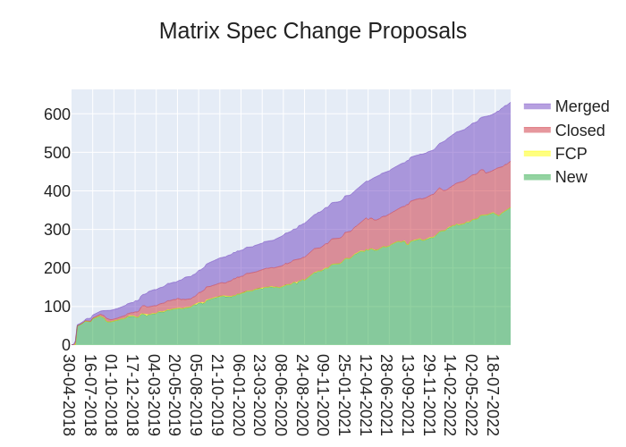

+++
title = "This Week in Matrix 2022-09-09"
date = "2022-09-09T19:45:20Z"
path = "/blog/2022/09/09/this-week-in-matrix-2022-09-09"

[taxonomies]
author = ["Thib"]
category = ["This Week in Matrix"]
+++

## Matrix Live 🎙

{{ youtube_player(video_id="wFSmDn-PlYg") }}

A short Matrix Live where we can see the goodness coming to Element very shortly!

<!-- more -->

## Dept of Spec 📜

[Andrew Morgan (anoa)](https://matrix.to/#/@andrewm:element.io) announces

> Here's your weekly spec update! The heart of Matrix is the specification - and this is modified by Matrix Spec Change (MSC) proposals. Learn more about how the process works at <https://matrix.org/docs/spec/proposals>.
>
> ## MSC Status
>
> **New MSCs:**
>
> * [MSC3888: Voice Broadcast](https://github.com/matrix-org/matrix-spec-proposals/pull/3888)
> * [MSC3887: List matching push rules](https://github.com/matrix-org/matrix-spec-proposals/pull/3887)
> * [MSC3886: Simple client rendezvous capability](https://github.com/matrix-org/matrix-spec-proposals/pull/3886)
> * [MSC3885: Sliding Sync Extension: To-Device messages](https://github.com/matrix-org/matrix-spec-proposals/pull/3885)
> * [MSC3884: Sliding Sync Extension: E2EE](https://github.com/matrix-org/matrix-spec-proposals/pull/3884)
> * [MSC3883: Fundamental state changes](https://github.com/matrix-org/matrix-spec-proposals/pull/3883)
> * [MSC3882: Allow an existing session to sign in a new session](https://github.com/matrix-org/matrix-spec-proposals/pull/3882)
> * [MSC3881: Remotely toggle push notifications for another client](https://github.com/matrix-org/matrix-spec-proposals/pull/3881)
> * [MSC3880: dummy replies for Olm](https://github.com/matrix-org/matrix-spec-proposals/pull/3880)
> * [MSC3879: Trusted key forwards](https://github.com/matrix-org/matrix-spec-proposals/pull/3879)
>
> **MSCs that entered Proposed Final Comment Period:**
>
> * [MSC3771: Read receipts for threads](https://github.com/matrix-org/matrix-spec-proposals/pull/3771)
> * [MSC3856: Threads List API](https://github.com/matrix-org/matrix-spec-proposals/pull/3856)
> * [MSC3773: Notifications for threads](https://github.com/matrix-org/matrix-spec-proposals/pull/3773)
>
> **MSCs in Final Comment Period:**
>
> * _No MSCs are in FCP._
>
> **Accepted MSCs:**
>
> * _No MSCs were merged this week._
>
> **Merged MSCs:**
>
> * _No MSCs were merged this week._
>
> ## Spec Updates
>
> I hope you like new MSCs, because this week has had a lot of them!
>
> Spec Core Team review this week has focused on getting the remaining bits of threads over the line, mainly [MSC3773](https://github.com/matrix-org/matrix-spec-proposals/pull/3773), [MSC3771](https://github.com/matrix-org/matrix-spec-proposals/pull/3771), [MSC3874](https://github.com/matrix-org/matrix-spec-proposals/pull/3874) and [MSC3856](https://github.com/matrix-org/matrix-spec-proposals/pull/3856).
>
> ## Random MSC of the Week
>
> The random MSC of the week is... [MSC2730: Verifiable forwarded events](https://github.com/matrix-org/matrix-spec-proposals/pull/2730)!
>
> Ever noticed how when you forward an event in Matrix today, it simply looks like you've just copy/pasted the message and sent it yourself? Other messengers will often include some metadata with the forwarded message to inform the room that it's a message originally from another room and/or user, rather than being originally authored by yourself.
>
> This MSC attempts to optionally add that metadata to messages, with the crucial goal of preventing that metadata from being faked (which could be dangerous). Check if out if that's something that interests you!
>
> <!-- markdownlint-disable-next-line no-alt-text -->
> 

## Dept of Servers 🏢

### Synapse ([website](https://github.com/matrix-org/synapse/))

Synapse is a Matrix homeserver implementation developed by the matrix.org core team

[Brendan Abolivier](https://matrix.to/#/@babolivier:element.io) reports

> This week the team released [Synapse 1.67.0rc1](https://github.com/matrix-org/synapse/releases/tag/v1.67.0rc1)! This first release candidate includes a few features, a bunch of notable performance improvements and bugfixes, and also removes the long-deprecated TCP replication. We thank everyone who help us test this RC by running it ahead of the release next week, and reporting any bug or feedback on [the Synapse repo](https://github.com/matrix-org/synapse/issues/new?assignees=&labels=&template=BUG_REPORT.yml) or in [#synapse:matrix.org](https://matrix.to/#/#synapse:matrix.org), respectively.
>
> Another very exciting thing that happened this week is the merge of the base code infrastructure to support running Rust code in Synapse! You can find more about this in [the pull request](https://github.com/matrix-org/synapse/pull/12595), but what this means is we can now replace some bits of Synapse written in Python with code written in Rust to make it more efficient. This is _not_ a rewrite of Synapse in Rust, but rather a way for us to optimise some specific hot paths. Currently there's some more work going on with [implementing push rules support in Rust](https://github.com/matrix-org/synapse/pull/13720), as well as [converting some caching code](https://github.com/matrix-org/synapse/pull/13733). Watch this space for more info!

### Dendrite ([website](https://github.com/matrix-org/dendrite))

Second generation Matrix homeserver

[neilalexander](https://matrix.to/#/@neilalexander:matrix.org) announces

> This week we released [Dendrite 0.9.7](https://github.com/matrix-org/dendrite/releases/tag/v0.9.7) with quite a few bug fixes and performance improvements. It's a recommended upgrade, so if you have a Dendrite installation, please upgrade! Changes include:
>
> * Initial supporting code to enable full-text search has been merged (although not ready for use yet)
> * Newly created rooms now have higher default power levels for enabling encryption, setting server ACLs or sending tombstone events
> * Incoming signing key updates over federation are now queued in JetStream for processing, so that they cannot be dropped accidentally
> * A race condition between the roomserver output events being generated, forward extremities being updated and room info being updated has been fixed
> * Appservices will no longer receive invite events which they are not interested in, which caused heavy load in some cases or excessive request sizes in others
> * A bug in state resolution v2 where events could incorrectly be classified as control events has been fixed
> * A bug in state resolution v2 where some specific events with unexpected non-empty state keys are dropped has been fixed
> * A bug in state resolution v2 when fetching auth events vs partial state has been fixed
> * Stale device lists should now be handled correctly for all user IDs, which may help with E2EE reliability
> * A number of database writer issues have been fixed in the user API and sync API, which should help to reduce `database is locked` errors with SQLite databases
> * Database migrations should now be detected more reliably to prevent unexpected errors at startup
> * A number of minor database transaction issues have been fixed, particularly for assigning NIDs in the roomserver, cleaning up device keys and cleaning up notifications
> * The database query for finding shared users in the sync API has been optimised, using significantly less CPU time as a result
>
> As always, please feel free to join us in [#dendrite:matrix.org](https://matrix.to/#/#dendrite:matrix.org) for more Dendrite-related discussion.

## Dept of Bridges 🌉

### Postmoogle ([website](https://gitlab.com/etke.cc/postmoogle))

An Email to Matrix bridge. 1 room = 1 mailbox.

[Aine](https://matrix.to/#/@aine:etke.cc) reports

> Postmoogle v0.9.1
>
> "Are we bridge yet?" - Yes. The most notable changes in that release - you can send emails from matrix!
>
> other changes:
>
> * bugfixes
> * removed migrations
> * smart auto joins according to ACL
> * send emails from matrix
> * send emails with proper DKIM signature
> * Secure SMTP (with TLS) for incoming emails
> * and lots of under-the-hood changes (48, actually)
>
> [Source code with updated Roadmap and feature list](https://gitlab.com/etke.cc/postmoogle), say hi in the [#postmoogle:etke.cc](https://matrix.to/#/#postmoogle:etke.cc)

## Dept of Clients 📱

### Nheko ([website](https://nheko-reborn.github.io))

Desktop client for Matrix using Qt and C++17.

[Nico](https://matrix.to/#/@deepbluev7:neko.dev) says

> New release out now, it includes improvements to stability and performance.
>
> Okay, Nheko might start with N, but you can get a proper changelog too:
>
> ## Highlights
>
> * Community editing support 🤼
>     * You can now create communities.
>     * You can add and remove rooms to and from communities in various ways.
> * Prettier joins ✨
>     * You can now see the avatar, title, topic and member count of the room you
>     are trying to join.
>     * You can see if a room requires knocking or can be joined directly.
>     * Requires MSC3266 support from your server.
>
> ## Features
>
> * Add a discrete edit button to room profiles. (Hiers)
> * Don't escape the summary tags on sending.
> * Focus message area when pressing Escape. (Forest)
> * Barebones spoiler support on desktop platforms.
> * Enable encryption for DMs started from a profile by default.
> * Enable option to disable notification sounds and badges on macOS.
> * Speed up the completion trie. (nenomius)
>
> ## Translations
>
> * Polish (Romanik, luff)
> * Dutch (Thulinma)
> * Finnish (Lurkki)
> * Estonian (Priit)
> * Indonesian (Linerly)
>
> ## Bugfixes
>
> * Fix crash on empty private receipts sent by some servers.
> * Don't set a transient parent for child chat windows.
> * Validate roomid, state_key, event_id and userids sent by the server.
> * Fix empty widgets showing up in the widget list.
> * Clean up linter config. (Forest)
> * Use the right palette colors for reactions. (Forest)
> * Fix groups sidebar's grammar. (Forest)
> * Fix version position. (Zirnc)
> * Properly validate urls in image tags.
> * Case insensitive member search.
> * Fix crash on global profiles.
> * Fix crash on incomplete identity keys.
> * Fix message notification format on Windows.
> * Fix room members menu opening profiles for the wrong room.
>
> ## Notes
>
> Requires mtxclient 0.8.1 and fixes a few crashes that can be abused by remote
> users.
>
> THANK YOU EVERYONE WHO CONTRIBUTED TO THIS!

### FluffyChat ([website](https://fluffychat.im))

[Krille Fear](https://matrix.to/#/@krille:janian.de) says

> FluffyChat 1.6.4 has been released. 🥳 This time it is only a minor bugfix release which also updates translations and some dependencies. The app now tries to automatically request keys for undecryptable messages and displays a detailed explanation why a message is unable to decrypt, when clicking on it.
>
> Full changelog:
>
> * Translated using Weblate (Chinese (Simplified)) (Eric)
> * Translated using Weblate (Estonian) (Priit Jõerüüt)
> * Translated using Weblate (Galician) (Xosé M)
> * Translated using Weblate (Indonesian) (Linerly)
> * Translated using Weblate (Slovak) (Marek Ľach)
> * Translated using Weblate (Turkish) (Oğuz Ersen)
> * Translated using Weblate (Ukrainian) (Ihor Hordiichuk)
> * chore: Adjust bubble color in dark mode (Christian Pauly)
> * chore: Update matrix sdk (Christian Pauly)
> * chore: Update to flutter 3.3.0 (Christian Pauly)
> * feat: Automatic key requests and better key error dialog (Christian Pauly)
> * fix: Styling and notification settings (Christian Pauly)
> * fix: add missing command localizations (Christian Pauly)
> <!-- markdownlint-disable-next-line no-alt-text -->
> 

### Element ([website](https://element.io))

Everything related to Element but not strictly bound to a client

[kittykat](https://matrix.to/#/@kittykat:matrix.org) says

> **Community testing**
>
> * We are continuing to collect feedback on the WISYWIG editor: [sign up to take part in testing](https://docs.google.com/forms/d/e/1FAIpQLSeGZMdaWFnaf9XMc6iNWaXu6MpKsdAX8QE83POm9_nu2JGzsg/viewform?usp=sf_link)!
> * We will have a group session to test Element Call at 16:00 BST on Monday 12th September.
> * If you would like to help with testing Element Call in your own time, you will be able to find more details in the community testing room!
> * For more info on our next testing sessions (sync or async), you can join us at [#element-community-testing:matrix.org](https://matrix.to/#/#element-community-testing:matrix.org)!

### Element Web/Desktop ([website](https://github.com/vector-im/element-web))

Secure and independent communication, connected via Matrix. Come talk with us in [#element-web:matrix.org](https://matrix.to/#/#element-web:matrix.org)!

[kittykat](https://matrix.to/#/@kittykat:matrix.org) says

> * 🔒 We had a security release: please update to v1.11.4 ASAP.
> * The DM flow has seen a rework: when you start a DM with someone for the first time, they will only see the room after you send your first message (in any form) rather than when you first open the room
>
> In labs (you can enable labs features in settings on develop.element.io or on Nightly):
>
> * We are getting closer to Element Call being ready for release. We will be running testing next week if you’d like to help out!

### Element iOS ([website](https://github.com/vector-im/element-ios))

Secure and independent communication for iOS, connected via Matrix. Come talk with us in [#element-ios:matrix.org](https://matrix.to/#/#element-ios:matrix.org)!

[kittykat](https://matrix.to/#/@kittykat:matrix.org) announces

> * **We have a new release candidate out and this time around the New App Layout is enabled by default!** 🥳 And, as if that wasn’t enough, we have also fixed all the iOS16 issues, just in time for the big release on Monday.
> * Also starting with this release, Direct Message rooms will only be created when the first message is sent
> * In ElementX land we fixed the last issues on sliding sync, the timeline can now handle edits, redactions and reactions, we’re implementing proper signing out and started adding more timeline actions like copying permalinks and replies.
>
> <!-- markdownlint-disable-next-line no-alt-text -->
> 

### Element Android ([website](https://github.com/vector-im/element-android))

Secure and independent communication for Android, connected via Matrix. Come talk with us in [#element-android:matrix.org](https://matrix.to/#/#element-android:matrix.org)!

[benoit](https://matrix.to/#/@benoit.marty:matrix.org) reports

> * Next release 1.4.36 will include the new App Layout, behind a lab flag. To the application settings, then _Labs_, then _Enable new layout_. This release will also include a fix for the Push not received and so missing notification.
> * In the meantime, we are making progress on the WYSIWYG editor, and on creating Direct Message on the first message.
> * We are also working to improve our test coverage. Currently we are evaluating several options to add screenshot tests to the project.

## Dept of VoIP 🤙

### Element Call ([website](https://call.element.io))

Native Decentralised End-to-end Encrypted Group Calls in Matrix, as a standalone web app

[Dave](https://matrix.to/#/@dave:matrix.org) announces

> **Hello from the VoIP team** 👋
>
> We've just released element call v0.2.11 which we hope should fix any remaining problems with multiple calls (aka split-brain) in a room: please rageshake if you see further problems 🙂
>
> Additionally, we are really excited about embedding Element Call into Element Web and we need your help: It's time for Community testing.
>
> 🕓 12th of Sept (16:00 BST / 17:00 CEST / 11:00 EDT)
>
> ❓ Please help us test our new integration of Element Call into Element Web.
>
> (Details in <https://matrix.to/#/#element-community-testing:matrix.org>)

## Dept of SDKs and Frameworks 🧰

### Trixnity ([website](https://gitlab.com/trixnity/trixnity))

Multiplatform Kotlin SDK for Matrix

[Benedict](https://matrix.to/#/@benedict:imbitbu.de) says

> I externalized the building of libolm binaries into a [separate git repository](https://gitlab.com/trixnity/olm-binaries). As a result, opening the Trixnity project does not need any C-Library-Building-Tools, because the binaries are just downloaded. On the one hand this speeds up building Trixnity significantly and on the other hand contributing to Trixnity is much easier (especially on Windows machines). Just do `./gradlew build`.

### matrix-rust-sdk ([website](https://github.com/matrix-org/matrix-rust-sdk))

Next-gen crypto-included SDK for developing Clients, Bots and Appservices; written in Rust with bindings for Node, Swift and WASM

[ben](https://matrix.to/#/@gnunicorn:matrix.org) reports

> This week saw the merge of [PR/Issue #1000](https://github.com/matrix-org/matrix-rust-sdk/pull/1000), a milestone, that, though random, marks the continuous progress and pace this project has taken up. 🥂 to the next 1000!
>
> Further more we saw the merge of [make `create_dm_room` public](https://github.com/matrix-org/matrix-rust-sdk/pull/1015), allowing any developer using the SDK to use it as well saw the first review of the [sliding sync PR](https://github.com/matrix-org/matrix-rust-sdk/pull/728), which now also has [a tracking issue](https://github.com/matrix-org/matrix-rust-sdk/issues/1014) explaining what remains to be done (and when) once the PR has landed. Other than that we had several refactorings, clean ups and minor fixes merged, in anticipation of the upcoming release of 0.6, which we expect to land before the end of the month. If all goes will that release will contain both sliding sync and [the new timeline API](https://github.com/matrix-org/matrix-rust-sdk/pull/940) behind feature flags to use and play with. 🫰 Fingers crossed.
>
> 👉 Wanna hack on matrix rust? Go check out our [`help wanted` tagged issues](https://github.com/matrix-org/matrix-rust-sdk/issues?q=is%3Aissue+is%3Aopen+label%3A%22help+wanted%22) and join our matrix channel at Matrix Rust SDK.

### matrix-crdt ([website](https://github.com/yousefED/matrix-crdt))

Use Matrix as a backend for local-first applications with the Matrix-CRDT Yjs provider.

[yousefed](https://matrix.to/#/@yousefed:matrix.org) reports

> Matrix-CRDT v0.2.0
>
> [Matrix CRDT](https://github.com/yousefed/matrix-crdt) enables you to build collaborative applications (like Google Docs) by using Matrix as backend for sharing application updates.
>
> In this release we've updated matrix-js-sdk to the latest version 19.4.0, which was a big jump. This opens up the path to adding support for End-to-end Encryption and Sliding Sync - and are looking for people excited to work on this.
>
> I've also rolled it out to the [preview version of TypeCell](https://www.typecell.org); which is a multiplayer document / programming environment that runs on top of Matrix (more soon!)
>
> [Come chat in our Matrix space](https://matrix.to/#/#typecell-space:matrix.org) or in Beyond Chat!

## Dept of Ops 🛠

### matrix-docker-ansible-deploy ([website](https://github.com/spantaleev/matrix-docker-ansible-deploy))

Matrix server setup using Ansible and Docker

[Slavi](https://matrix.to/#/@slavi:devture.com) says

> Thanks to [Julian-Samuel Gebühr (@moan0s)](https://github.com/moan0s), [matrix-docker-ansible-deploy/](https://github.com/spantaleev/matrix-docker-ansible-deploy/) can now set up [Cactus Comments](https://cactus.chat) - federated comment system for the web based on Matrix.
>
> See our [Setting up a Cactus Comments server](https://github.com/spantaleev/matrix-docker-ansible-deploy/blob/master/docs/configuring-playbook-cactus-comments.md) documentation to get started.

## Dept of Bots 🤖

### matrix-rss-bridge

[imbev](https://matrix.to/#/@imbev:matrix.org) reports

> matrix-rss-bridge is a bridge for reading RSS feeds in Matrix rooms. You can find the repository at <https://gitlab.com/imbev/matrix-rss-bridge>
>
> ### Setup
>
> Requires Python ^3.8
>
> ```sh
> python3 -m pip install poetry
> git clone https://gitlab.com/imbev/matrix-rss-bridge.git
> cd matrix-rss-bridge
> python3 -m poetry install
> ```
>
> ### Usage
>
> #### Config
>
> Create `config.toml` to configure the bridge.
>
> ```toml
> # config.toml
> homeserver = "https://example.com"
> username = "username"
> password = "password"
> interval = 60 # seconds
>
> [[bridge]]
>     name = "matrix.org blog"
>     feed_url = "https://matrix.org/blog/feed"
>     room_id = "!AUweUQXCxcVfFOaOIU:matrix.org"
> ```
>
> #### Running
>
> ```sh
> python3 -m poetry run bridge
> ```

## Dept of Ping 🏓

Here we reveal, rank, and applaud the homeservers with the lowest ping, as measured by [pingbot](https://github.com/maubot/echo), a [maubot](https://github.com/maubot/maubot) that you can host on your own server.

### [#ping:maunium.net](https://matrix.to/#/#ping:maunium.net)

Join [#ping:maunium.net](https://matrix.to/#/#ping:maunium.net) to experience the fun live, and to find out how to add YOUR server to the game.

|Rank|Hostname|Median MS|
|:---:|:---:|:---:|
|1|conduit.rs|259.5|
|2|babel.sh|279.5|
|3|jameskitt616.one|362|
|4|kootstra.frl|485|
|5|alemann.dev|510.5|
|6|cezeri.tech|588|
|7|rollyourown.xyz|709|
|8|kittenface.studio|767.5|
|9|dendrite.babel.sh|785.5|
|10|rom4nik.pl|875|

### [#ping-no-synapse:maunium.net](https://matrix.to/#/#ping-no-synapse:maunium.net)

Join [#ping-no-synapse:maunium.net](https://matrix.to/#/#ping-no-synapse:maunium.net) to experience the fun live, and to find out how to add YOUR server to the game.

|Rank|Hostname|Median MS|
|:---:|:---:|:---:|
|1|conduit.rs|109|
|2|babel.sh|112|
|3|conduit.hazmat.jacksonchen666.com|208|
|4|dendrite.babel.sh|253.5|
|5|matrix.org|272|
|6|dendrite.matrix.org|313.5|
|7|babel1.eu|371|
|8|kernel-error.com|399|
|9|foxo.me|410|
|10|cutema.re|558|

## That's all I know 🏁

See you next week, and be sure to stop by [#twim:matrix.org](https://matrix.to/#/#twim:matrix.org) with your updates!
