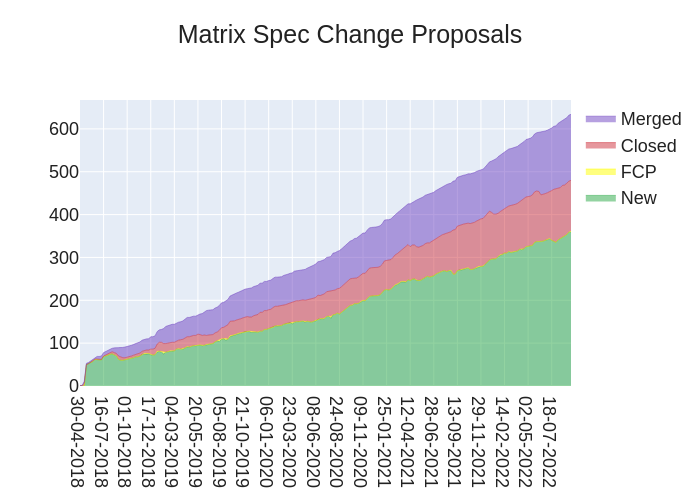
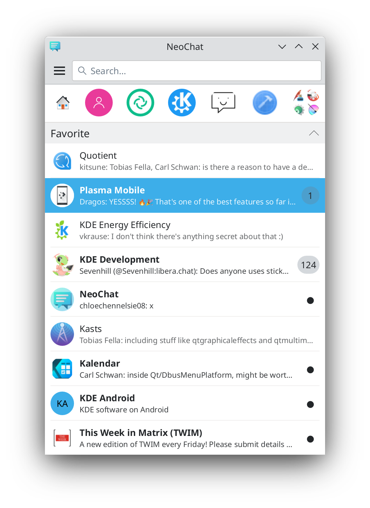

+++
title = "This Week in Matrix 2022-09-16"
path = "/blog/2022/09/16/this-week-in-matrix-2022-09-16"

[taxonomies]
author = ["Thib"]
category = ["This Week in Matrix"]
+++

## Matrix Live

{{ youtube_player(video_id="9uwd35KhWsw") }}

<!-- more -->

## Dept of *Status of Matrix* 🌡️

[Thib](https://matrix.to/#/@thib:ergaster.org) reports

> [matrix.to](https://matrix.to) links can now be opened with [Thunderbird](https://matrix.to/#/#thunderbird:mozilla.org) and [Syphon](https://matrix.to/#/#syphon:matrix.org)!

## Dept of Spec 📜

[Andrew Morgan (anoa)](https://matrix.to/#/@andrewm:element.io) reports

> Here's your weekly spec update! The heart of Matrix is the specification - and this is modified by Matrix Spec Change (MSC) proposals. Learn more about how the process works at <https://matrix.org/docs/spec/proposals>.
>
> ## MSC Status
>
> **New MSCs:**
>
> * [MSC3892: Custom Emotes with Encryption](https://github.com/matrix-org/matrix-spec-proposals/pull/3892)
> * [MSC3890: Remotely silence local notifications](https://github.com/matrix-org/matrix-spec-proposals/pull/3890)
>
> **MSCs in Final Comment Period:**
>
> * [MSC3773: Notifications for threads](https://github.com/matrix-org/matrix-spec-proposals/pull/3773) (merge)
> * [MSC3715: Add a pagination direction parameter to `/relations`](https://github.com/matrix-org/matrix-spec-proposals/pull/3715) (merge)
>
> **Accepted MSCs:**
>
> * *No MSCs were accepted this week.*
>
> **Merged MSCs:**
>
> * *No MSCs were merged this week.*
>
> ## Spec Updates
>
> This week has seen more review on threads from the Spec Core Team, as well as some further aggregations work. See the FCP list above! [MSC3771](https://github.com/matrix-org/matrix-spec-proposals/issues/3771) (Read Receipts for Threads) and [MSC3856](https://github.com/matrix-org/matrix-spec-proposals/issues/3856) (Threads List API) are also looking quite close to starting FCP.
>
> In other news, yours truly has written up some words (adapted from some internal docs written by @erikjohnston) amounting to [a simplified guide to writing MSCs](https://github.com/matrix-org/matrix-spec-proposals/blob/anoa/spec_process_docs/README.md). The hope is that it'll help spell out the process in a more succinct manner, as well as provide answers to common questions/edge cases.
>
> The document's words are still in flux, and still only exist [as a PR](https://github.com/matrix-org/matrix-spec-proposals/pull/3891); so do feel free to leave some suggestions or feedback if you have some!
>
> ## Random MSC of the Week
>
> The random MSC of the week is... [MSC3775: Markup Locations for Audiovisual Media](https://github.com/matrix-org/matrix-spec-proposals/pull/3775)!
>
> I recommend looking at [MSC3574](https://github.com/matrix-org/matrix-spec-proposals/pull/3574) (marking up resources) first as MSC3775 builds upon it. But as for MSC3775 itself, the MSC adds support for annotating media - storing those annotations as events in a Matrix room!
>
> This could be useful for building a decentralised app for marking up audio files. Collaborative audio editing anyone?
>
> As far as I can tell, this MSC is currently waiting for [MSC3574](https://github.com/matrix-org/matrix-spec-proposals/pull/3574) to progress before it itself moves much further. But feel free to check out both in the meantime if you're interested.
>
> <!-- markdownlint-disable-next-line no-alt-text -->
> 

## Dept of Servers 🏢

### Synapse ([website](https://github.com/matrix-org/synapse/))

Synapse is a Matrix homeserver implementation developed by the matrix.org core team

[Brendan Abolivier](https://matrix.to/#/@babolivier:element.io) announces

> This week we've released [Synapse 1.67](https://matrix.org/blog/2022/09/14/synapse-1-67-released/)! This Synapse release is the first one to use [Poetry 1.2](https://python-poetry.org/blog/announcing-poetry-1.2.0/), and also removes the long-deprecated TCP-based replication protocol. Synapse workers are now required to use the Redis-based protocol which we introduced back in 2020. If this isn't already the case for your deployment of Synapse, see the [documentation for workers](https://matrix-org.github.io/synapse/v1.67/workers.html#shared-configuration) as well as the [upgrade notes](https://matrix-org.github.io/synapse/v1.67/upgrade.html#direct-tcp-replication-is-no-longer-supported-migrate-to-redis), to update your configuration.
>
> In other news, Synapse 1.68 (which is due to release on the 27th of September) will introduce a couple of changes in dependencies. The minimum supported SQLite version will be raised to 3.26, meaning that Synapse 1.67 is the last version of Synapse supporting SQLite versions 3.22 to 3.26. In addition to this, a Rust compiler will be required for source checkouts, as we are starting to introduce Rust code in Synapse (as I [mentioned last week](https://matrix.org/blog/2022/09/09/this-week-in-matrix-2022-09-09#synapse-website)). This latter change should not impact installations that use `pip install matrix-synapse`, Debian packages from `packages.matrix.org` or the `matrixdotorg/synapse` Docker image to manage and run Synapse. See the [upgrade notes](https://matrix-org.github.io/synapse/v1.67/upgrade.html#rust-requirement-in-the-next-release) for more information about these two changes.

## Homeserver Deployment 📥️

### Helm Chart ([website](https://gitlab.com/ananace/charts))

Matrix Kubernetes applications packaged into helm charts

[Ananace](https://matrix.to/#/@ace:kittenface.studio) announces

> This week sees some of the usual updates to [my Helm Charts](https://gitlab.com/ananace/charts), with element-web being updated to 1.11.5 and matrix-synapse to 1.67.0.

## Dept of Bridges 🌉

### Postmoogle ([website](https://gitlab.com/etke.cc/postmoogle))

An Email to Matrix bridge. 1 room = 1 mailbox.

[Aine](https://matrix.to/#/@aine:etke.cc) announces

> Postmoogle v0.9.2
>
> * bugfixes
> * speed up email delivery
> * StartTLS enabled automatically if TLS cert and key are provided
> * set `msgtype` by attachment's mime-type (received image -> got rendered image in your matrix client; received audio -> got audio player in your matrix client; etc)
>
> [Source code](https://gitlab.com/etke.cc/postmoogle), say hi in the [#postmoogle:etke.cc](https://matrix.to/#/#postmoogle:etke.cc) room
>
### matrix-hookshot ([website](https://github.com/Half-Shot/matrix-hookshot))

A multi purpose multi platform bridge, formerly known as matrix-github

[Half-Shot](https://matrix.to/#/@Half-Shot:half-shot.uk) says

> ### matrix-hookshot 2.2.0 arrives with fewer bugs and more features
>
> Hello gang. This week, another hookshot release. They do come fast!
>
> We've fixed a bug which had the potential to cause crashes when JSON logging is enabled, and written a whole torture test for the logger to ensure it won't do that again. We've also made some quality of life improvements to the GitLab connection type :)
>
> The highlights are:
>
> * Ready/draft state changes for GitLab merge requests are now reported. ([#480](https://github.com/matrix-org/matrix-hookshot/issues/480))
> * Merge GitLab MR approvals and comments into one message. ([#484](https://github.com/matrix-org/matrix-hookshot/issues/484))
>
> You can get the latest release [here](https://github.com/matrix-org/matrix-hookshot/releases/tag/2.2.0)
>
> ---
>
> But I have a bit more for you this week, we're working on a few new features to hopefully improve the lives of developers out there building webhook integrations.
>
> First, we are adding the ability to **view requests and logging** from within the widget UI. This means you can now debug why your webhooks might not be working without
> having to leave your client. This includes the ability to log debug messages and read them back later!
>
>
> {{ youtube_player(video_id="DStAgLhmZqs") }}
>
>
> Secondly, we're adding some new sci-fi functions to the scripting environment. The first of which will allow you to **embed images / videos** into the message output, with a
> function to to create matrix content URLs from a regular URL.
>
> Finally, and this is probably the most sci-fi. We're working on a feature for you to **load scripts from other rooms** for use in your webhook. This means developers will be able to build
> whole webhook handling libraries within rooms, and then share those libraries across the federation. At the moment, this looks a bit like:
>
> ```js
> const resultOfScript = await loadMatrixScript("matrix:r/my-room-alias:domain/$my-event-id");
> // ... mutate the result
> return = resultOfScript
> ```
>
> We're still thinking about how to ensure it's both performant, and safe but the initial results are looking quite good.
>
> That's all we have for you in bridging corner today, have a good weekend 👋

### matrix-appservice-kakaotalk ([website](https://src.miscworks.net/fair/matrix-appservice-kakaotalk/))

A Matrix-KakaoTalk puppeting bridge.

[Fair](https://matrix.to/#/@fair:miscworks.net) announces

> It has been brought to my attention that the KakaoTalk service has been updated to block older clients, and unfortunately this bridge is affected.  As of this writing, **using the bridge may get your KakaoTalk account banned!**  It has happened to both me and at least one other person, so this isn't just a hypothetical risk.
>
> To be clear about this, I've updated the `master` branch to throw an error on startup, which must be manually removed from source code if you wish to continue using the bridge at your own risk.
>
> It's currently unknown what it takes to log in safely, but discussion about it is ongoing (albeit intermittently) in the discussion channel (linked below).
>
> Once the bridge is safe to use again, I'll post a TWIM update about it 🙂
>
> ---
>
> * Discussion: [#matrix-appservice-kakaotalk:miscworks.net](https://matrix.to/#/#matrix-appservice-kakaotalk:miscworks.net)
> * Testing room: [#kakaotalk-bridge-testing:miscworks.net](https://matrix.to/#/#kakaotalk-bridge-testing:miscworks.net) / <https://open.kakao.com/o/gjGQFuae>
> * Issue page: <https://src.miscworks.net/fair/matrix-appservice-kakaotalk/issues>

## Dept of Clients 📱

### Quadrix ([website](https://github.com/alariej/quadrix))

A Minimal, simple, multi-platform chat client for the Matrix protocol.

[JFA](https://matrix.to/#/@alariej:matrix.org) says

> Quadrix v1.3.3 has been released! It's available for mobiles and desktops in the respective app stores. This release introduces:
>
> 1) a new menu structure making it easier to add new functions without affecting the main UI,
>
> 2) new page animations in the "wide" app layout (on desktops and tablets) when switching between rooms or going back to the home screen, and
>
> 3) for PinePhone enthusiasts, Wayland display on KDE and SXMO UI's (it was already available on Phosh).
>
> Please leave feedback/comments at [#quadrix:matrix.org](https://matrix.to/#/#quadrix:matrix.org) or in the issues at <https://github.com/alariej/quadrix> (stars welcome :-)

### Neochat ([website](https://invent.kde.org/network/neochat))

A client for matrix, the decentralized communication protocol

[Tobias Fella](https://matrix.to/#/@tobiasfella:kde.org) reports

> * Will now show you the exact time a message was sent at when hovering over a message's timestamp (Thanks to James Graham)
> * Context Menus will now open more reliably
> * You will also no longer see useless horizontal scrollbars
> * Thanks to the GSoC work by Snehit, NeoChat now has some support for spaces: at the top of the room list, you can select a space to make the room list only show rooms of that space
> * Audio playback has been fixed
> * A few problems relating to message input have been fixed, most notable that reply and edit texts will now only be visible in the correct room when multiple rooms are opened at the same time (Thanks to James Graham)
> * Quitting NeoChat now is less crashy
> * Adding custom emojis has been fixed (Thanks to Jan Bidler)
> * Links in spoilers will now be correctly hidden
> * You can now edit notification settings for each room (Thanks to James Graham)
> * NeoChat will now better follow Kirigami's style of progress indicator and the system's color for text selection (Thanks to Bharadwaj Raju)
>
> <!-- markdownlint-disable-next-line no-alt-text -->
> 

### Ement.el ([website](https://github.com/alphapapa/ement.el))

Matrix client for Emacs

[alphapapa](https://matrix.to/#/@alphapapa:matrix.org) announces

> Ement.el, a Matrix client for [GNU Emacs](https://www.gnu.org/software/emacs/), has finally been published on the official [GNU ELPA](https://elpa.gnu.org/packages/ement.html) package repository. Now the current stable release can be installed by any Emacs user by simply using the command `M-x package-install RET ement RET`.  More improvements to come. Feel free to join us in [#ement.el:matrix.org](https://matrix.to/#/#ement.el:matrix.org).

### Element Web/Desktop ([website](https://github.com/vector-im/element-web))

Secure and independent communication, connected via Matrix. Come talk with us in [#element-web:matrix.org](https://matrix.to/#/#element-web:matrix.org)!

[Danielle](https://matrix.to/#/@daniellekirkwood:one.ems.host) reports

> * On Web we’ve been working on perfecting the app and fixing bugs
> * Also in the roadmap and currently in development:
>     * Updates to the composer. We’re working on improving the composer and creating a WYSIWYG version (What You See Is What You Get). Keep your eyes peeled for more info in the coming weeks!
>     * There are also improvements to the ‘forgot password’ flow on their way. We made these same improvements to the mobile apps some weeks ago and received great feedback.
>
> **In labs (you can enable labs features in settings on develop.element.io or on Nightly):**
>
> * Threads work continues as 2 of our 3 MSCs make their way into their FCP (Final Comment Period). We’re excited to bring improvements to you and will be dropping them straight into the product as soon as they’re ready.

### Element iOS ([website](https://github.com/vector-im/element-ios))

Secure and independent communication for iOS, connected via Matrix. Come talk with us in [#element-ios:matrix.org](https://matrix.to/#/#element-ios:matrix.org)!

[Ștefan](https://matrix.to/#/@stefan.ceriu:matrix.org) reports

> * Following this week’s release of the new app layout we’re heads down reading feedback and looking for improvements. We hope you’re enjoying it as much as we are - use the Feedback button in the top-left to let us know!
> * The team is also making improvements on the next generation of the Element app for iOS (Element X).
>     * We’re experimenting with merging together the sliding sync mechanism and the new timeline API.
>     * We’ve added support for reactions, redactions, permalinks and replying, we have a new log out mechanism and soft logout, and we’ve also overhauled the UI.

### Element Android ([website](https://github.com/vector-im/element-android))

Secure and independent communication for Android, connected via Matrix. Come talk with us in [#element-android:matrix.org](https://matrix.to/#/#element-android:matrix.org)!

[Danielle](https://matrix.to/#/@daniellekirkwood:one.ems.host) reports

> * Not only are we hard at work smashing bugs but we’re also working on 2 big updates for the coming releases:
>
>     * The new app layout! While you can currently access this via Labs, we’re closing bugs and addressing feedback that will allow us to make it the default layout for all users. Check out [more info here](https://element.io/blog/an-unrecognisable-improvement-elements-new-design-is-here/)
>     * Also coming up, starting a DM when the first message is sent. No more waiting around for the room to be created before you say hi to the recipients - your invite and message will be received together. Yey! :ta\_da:
> * We’re also working on a fix for the bug that’s making verifying others difficult.

## Dept of SDKs and Frameworks 🧰

### matrix-rust-sdk ([website](https://github.com/matrix-org/matrix-rust-sdk))

Next-gen crypto-included SDK for developing Clients, Bots and Appservices; written in Rust with bindings for Node, Swift and WASM

[ben](https://matrix.to/#/@gnunicorn:matrix.org) reports

> Major Milestone: yesterday [Sliding Sync was merged into `main`](https://github.com/matrix-org/matrix-rust-sdk/pull/728), now available behind the `sliding-sync`-feature flag and enabled by default for `matrix-sdk-ffi` for your convenience. This, too, means the `jack-in` sliding sync-test client is merged and part of our `labs` section - go out and have a try! Furthermore the [key verification for crypto-js](https://github.com/matrix-org/matrix-rust-sdk/pull/788) has been merged, as well as [support for logging out](https://github.com/matrix-org/matrix-rust-sdk/pull/1013), including tracking the soft-logout state in FFI, and support for sending [`markdown` from FFI](https://github.com/matrix-org/matrix-rust-sdk/pull/1038),
>
> Similarly the new [Timeline API](https://github.com/matrix-org/matrix-rust-sdk/pull/940), is making big leaps forward, we expecting it to land, too. It will also be available behind a feature-flag replacing the previous `experimental-timeline`-feature. If you were using that, please pay close attention to what is going on, as it will replace most of if not all of the previous API and data store.
>
> Both will be available, also together, in the upcoming release 0.6 of matrix-sdk, which we expect to land before the end of the month. It was slightly pushed back as the [`sync event` changes turned out to be more of a rabbit hole](https://github.com/matrix-org/matrix-rust-sdk/pull/1022) than anticipated.
>
>
> 👉 Wanna hack on matrix rust? Go check out our [`help wanted` tagged issues](https://github.com/matrix-org/matrix-rust-sdk/issues?q=is%3Aissue+is%3Aopen+label%3A%22help+wanted%22) and join our matrix channel at Matrix Rust SDK.

## Dept of Ops 🛠

### matrix-docker-ansible-deploy ([website](https://github.com/spantaleev/matrix-docker-ansible-deploy))

Matrix server setup using Ansible and Docker

[Slavi](https://matrix.to/#/@slavi:devture.com) announces

> [matrix-docker-ansible-deploy](https://github.com/spantaleev/matrix-docker-ansible-deploy) now has much-improved Synapse worker support:
>
> * we've added support for [Stream writer](https://matrix-org.github.io/synapse/latest/workers.html#stream-writers) workers
> * we've added support for running multiple federation sender workers (until now, we only supported 1 at most)
> * we've added support for running multiple pusher workers (until now, we only supported 1 at most)
> * we've added support for running [background tasks on a worker](https://matrix-org.github.io/synapse/latest/workers.html#background-tasks)
> * we've restored support for `appservice` workers (we had removed support for these after Synapse v1.59.0 deprecated them and redid how this type of worker is meant to be spawned)
> * we've restored support for `user_dir` workers (we had removed support for these after Synapse v1.59.0 deprecated them and redid how this type of worker is meant to be spawned)
> * we've made it possible to reliably use more than 1 `media_repository` worker (until now, using more than 1 could have caused issues due to us not correctly restricting where media background tasks run)
>
> Some backward incompatible changes were made, which could affect some people.
>
> People who are using some reocmmendation configuration like `matrix_synapse_workers_preset: one-of-each` will now get 9 additional worker processes by default.
>
> To learn more, see [our changelog entry](https://github.com/spantaleev/matrix-docker-ansible-deploy/blob/master/CHANGELOG.md#potential-backward-compatibility-break-major-improvements-to-synapse-workers)

## Dept of Services 🚀

### etke.cc ([website](https://etke.cc))

Your matrix server on your conditions

[Aine](https://matrix.to/#/@aine:etke.cc) announces

> @twim:cadair.com
> We're happy to announce that the [etke.cc Matrix hosting service](https://etke.cc/) is now better prepared to serve German customers!
>
> Besides having completely localized the website (see [etke.cc in German here](https://etke.cc/de/)) and Matrix server ordering flow, we're now also able to offer customer support in German.
>
> If you're in Germany and would like to get a managed self-hosted Matrix server, neither self-hosting difficulties nor the language barrier is getting in the way anymore.

## Dept of Bots 🤖

[use @progserega:rsprim.ru](https://matrix.to/#/@progserega:matrix.org) says

> New bot to help admins of large rooms.
> Capabilities:
>
> 1. The admin can add a reaction signature to the user, which will be added by the bot to each message from this user, for example: "spammer"
> 2. The admin can fix violations of the rules of the room by the user. The counter of violations is also displayed as a reaction under each user message in the form: "N ❗️", where N is the number of violations.
> 3. The bot captures who added the signature or violation, when it happened and for what reason (description). All this can be asked from the bot by any member of the room
> 4. The user can add his own description, which the bot will report to any member of the room on the appropriate request.
> 5. The moderator can switch the language that the bot speaks in this room. Message translations are stored in standard po files.
>
> Anybody can try bot by invite @react-sig-bot:sibnsk.net to his room.
>
> Source code for the bot: <https://github.com/progserega/matrix-reaction-signature-bot>

## Dept of Events and Talks 🗣️

### W3C TPAC 2022

[cel](https://matrix.to/#/@cel:hope.net) reports

> World Wide Web Consortium (W3C)'s TPAC (Technical Plenary and Advisory Committee, i.e. "Annual W3C Conference") takes place, 12-16 September, Vancouver, BC, Canada: <https://www.w3.org/2022/09/TPAC/>
>
> ### W3C Matrix Space
>
> W3C now has a public Matrix space: #w3.org:matrix.org

## Dept of Ping

Here we reveal, rank, and applaud the homeservers with the lowest ping, as measured by [pingbot](https://github.com/maubot/echo), a [maubot](https://github.com/maubot/maubot) that you can host on your own server.

### [#ping:maunium.net](https://matrix.to/#/#ping:maunium.net)

Join [#ping:maunium.net](https://matrix.to/#/#ping:maunium.net) to experience the fun live, and to find out how to add YOUR server to the game.

|Rank|Hostname|Median MS|
|:---:|:---:|:---:|
|1|nognu.de|346|
|2|jameskitt616.one|366.5|
|3|alemann.dev|598|
|4|kittenface.studio|824|
|5|matrix.nicfab.it|1443|
|6|quyo.de|1501|
|7|helderferreira.io|1547|
|8|cutema.re|1693|
|9|rom4nik.pl|1763.5|
|10|jacksonchen666.com|1824|

### [#ping-no-synapse:maunium.net](https://matrix.to/#/#ping-no-synapse:maunium.net)

Join [#ping-no-synapse:maunium.net](https://matrix.to/#/#ping-no-synapse:maunium.net) to experience the fun live, and to find out how to add YOUR server to the game.

|Rank|Hostname|Median MS|
|:---:|:---:|:---:|
|1|conduit.hazmat.jacksonchen666.com|231|
|2|sspaeth.de|322|
|3|joeth.uk|326|
|4|dendrite.matrix.org|371|
|5|dendrite.neilalexander.dev|539|
|6|rustybever.be|627|
|7|kumma.juttu.asia|711|
|8|matrix.awesomesheep48.me|967|
|9|forlorn.day|1611|

## That's all I know

See you next week, and be sure to stop by [#twim:matrix.org](https://matrix.to/#/#twim:matrix.org) with your updates!
