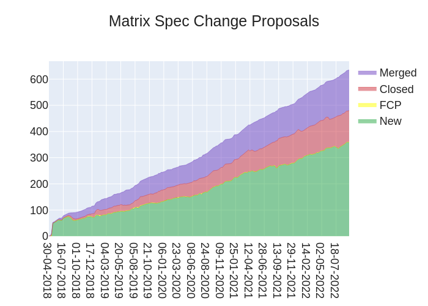
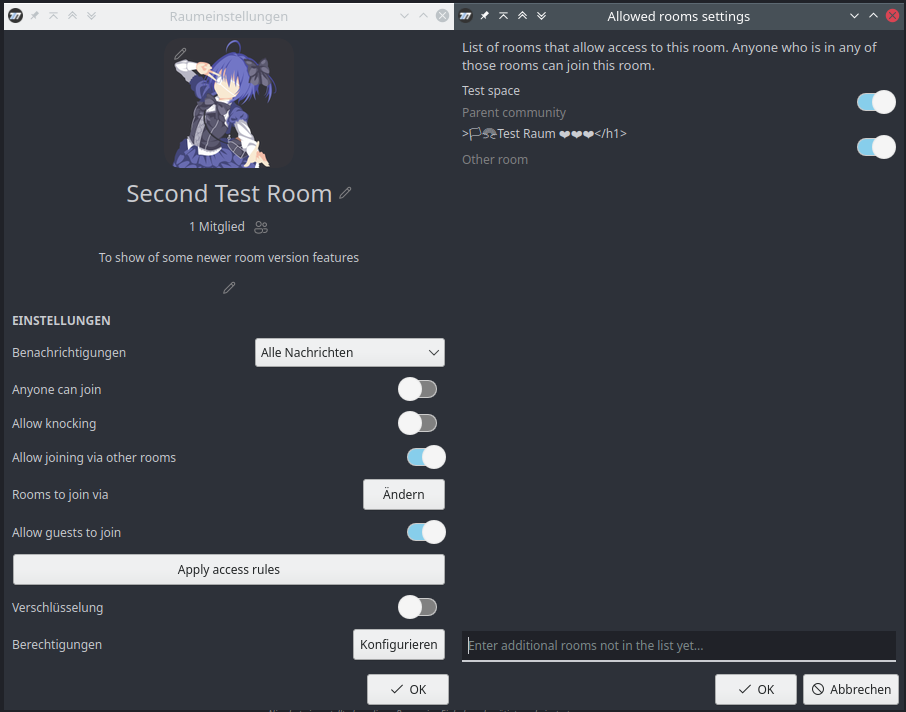
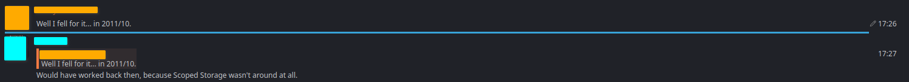
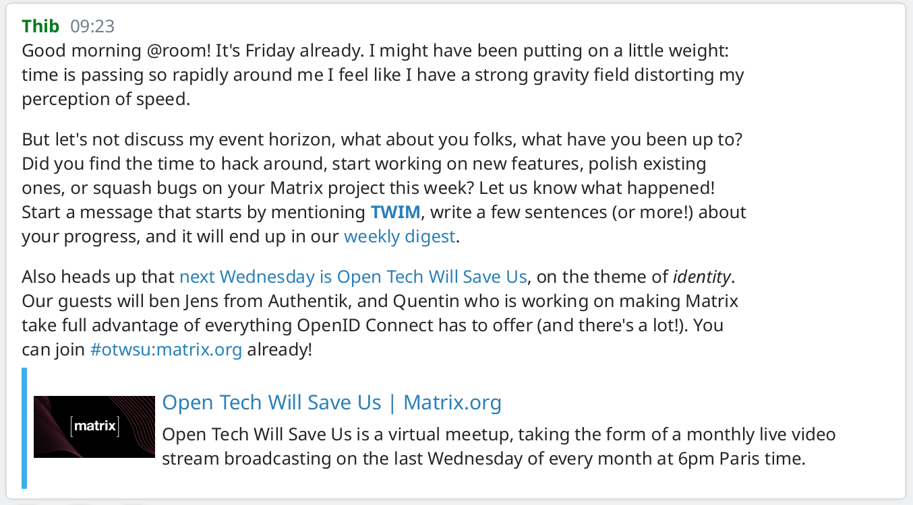
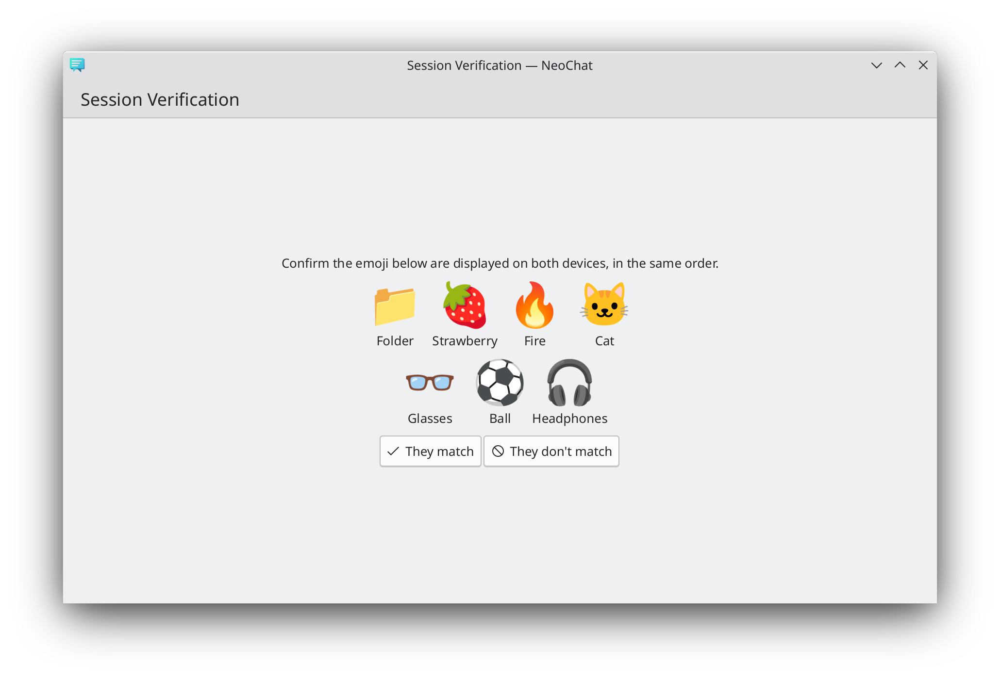
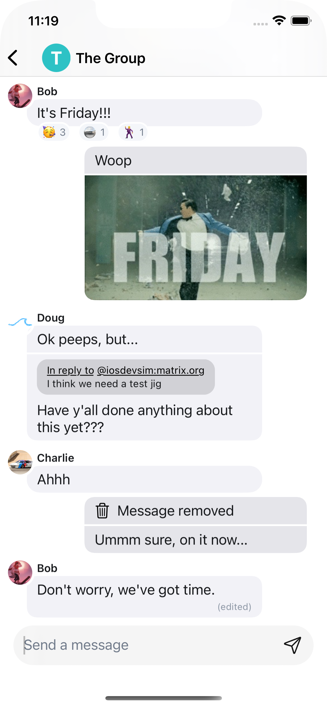
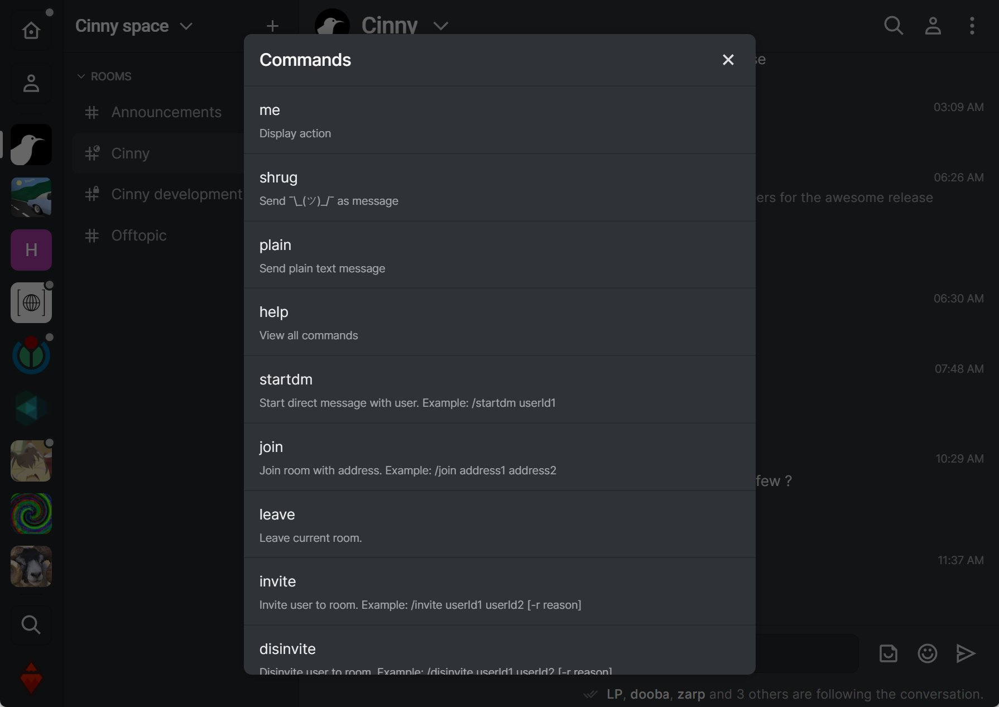
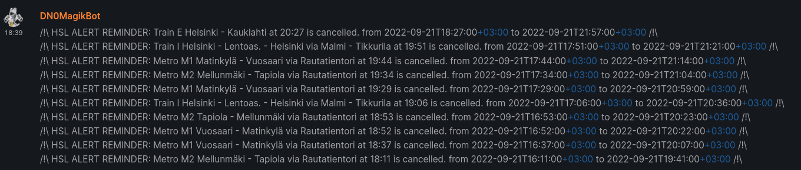

+++
title = "This Week in Matrix 2022-09-23"
date = "2022-09-23T19:09:21Z"
updated = "2022-09-23T18:41:15Z"
path = "/blog/2022/09/23/this-week-in-matrix-2022-09-23"

[taxonomies]
author = ["Thib"]
category = ["This Week in Matrix"]

[extra]
image = "https://matrix.org/blog/img/nHPgFgyvkPnvPDETuAFzniPw.png"
+++

## Matrix Live

{{ youtube_player(video_id="MwOh4NvPdtQ") }}

<!-- more -->

## Dept of Social Good 🙆

[carla](https://matrix.to/#/@lalider:matrix.org) says

> [Carla Griggio, a researcher at the University of Aarhus](https://carlagriggio.com), is conducting Human-Computer Interaction research on how messaging interoperability affects personal expression and privacy attitudes in online communication. The study consists of a short questionnaire and a 30-60 minute interview about experiences with cross-app messaging (for example, privacy concerns related to differences between clients). The results will contribute an interpersonal perspective to the design of messaging interoperability and potentially influence future policy making.
>
> Interested in participating? Eligible participants should live within the EU and either:
> a) Have frequent conversations on a Matrix.org client with contacts that use *different* Matrix.org clients (such as Element-FluffyChat) or
> b) Frequently use bridges between Matrix.org and other platforms (for example, using Beeper, or Element with bridges to Telegram, IRC, etc.)
>
> Reach out directly to @lalider:matrix.org for questions and arranging an interview. Thank you!

## Dept of Spec 📜

[Andrew Morgan (anoa)](https://matrix.to/#/@andrewm:element.io) reports

> Here's your weekly spec update! The heart of Matrix is the specification - and this is modified by Matrix Spec Change (MSC) proposals. Learn more about how the process works at <https://matrix.org/docs/spec/proposals>.
>
> ## MSC Status
>
> **New MSCs:**
>
> * [MSC3895: Federation API Behaviour of Partial-State Resident Servers](https://github.com/matrix-org/matrix-spec-proposals/pull/3895)
>
> **MSCs in Final Comment Period:**
>
> * [MSC3856: Threads List API](https://github.com/matrix-org/matrix-spec-proposals/pull/3856) (merge)
> * [MSC3771: Read receipts for threads](https://github.com/matrix-org/matrix-spec-proposals/pull/3771) (merge)
>
> **Merged MSCs:**
>
> * [MSC3773: Notifications for threads](https://github.com/matrix-org/matrix-spec-proposals/pull/3773)
> * [MSC3715: Add a pagination direction parameter to `/relations`](https://github.com/matrix-org/matrix-spec-proposals/pull/3715)
>
> ## Spec Updates
>
> The next major release of the spec is now just around the corner! **The Spec Core Team expects to release Matrix v1.4 next week,** so be on the look out for the announcement and blog post then! Highlights for v1.4 include Threads and Message Edits!
>
> Review this week from the Spec Core Team has once again mainly focused on Threads as we work towards getting it over the line (and to see client and homeserver implementations stablise). With fixes for notification issues and increased support for querying threads in a room for clients, we expect to see it land in v1.4!
>
> In addition, [MSC2676](https://github.com/matrix-org/matrix-spec-proposals/pull/2676) has been [merged to the spec](https://github.com/matrix-org/matrix-spec/pull/1211) (finally)! This means that it is now [available in the unstable space](https://spec.matrix.org/unstable/client-server-api/#event-replacements) and will be available in the next spec release. Congrats to all involved as it's been a particularly long-running MSC, and especially richvdh for pushing it over the line and writing up the spec bits, and TravisR for reviewing them.
>
> ## Random MSC of the Week
>
> The random MSC of the week is... [MSC3265: Login and SSSS with a Single Password](https://github.com/matrix-org/matrix-spec-proposals/pull/3265)!
>
> This MSC actually has a fairly detailed description right in the PR, so I encourage you to click through and see what it's all about!
>
> <!-- markdownlint-disable-next-line no-alt-text -->
> 

## Dept of GSoC 🎓️

### matrix-cerberus

[kuries](https://matrix.to/#/@kuries:matrix.org) announces

> The Google Summer of Code 2022 has officially ended this week and I'm proud to present the [matrix-cerberus](https://github.com/MatrixDoctors/matrix-cerberus)!
>
> It's an application that has the ability to delegate membership of a room based on a user’s interaction with other third-party services.
>
> Some of the use cases could be:
>
> * If you have a "team" of developers under an organisation in GitHub and would like to create a room just for them. Then instead of sending manual invites or making the room public, you can just add the condition under a room in the matrix-cerberus admin panel and the app will invite all of them for you!
> * Managing memberships for rooms where patrons belonging to a particular tier in a campaign have access.
>
> > Note: Both of the cases would require the user to log in with matrix and the respective third-party service in our app.
>
> The application is built using React (frontend), FastAPI (backend) and matrix-nio for the bot. The entire application is containerized with docker compose to reduce the effort required to set up all the services.
>
> Currently, it has support for the following third-party services:
>
> * GitHub
> * Patreon
>
> There's also an interesting feature in this app - Room External URL Invites. If you have one of these room external url invites you can just log in as a matrix user with our app and relevant invites will be issued.
>
> You can find documentation related to the usage, installation and hosting over [here](https://matrixdoctors.github.io/matrix-cerberus/).
> If you want to play around with the app and see how it works you can check out the demo version of the app hosted here: <https://cerberus.cadair.dev/>
>
> And finally, if you have any queries and issues related to setting up or just want to discuss the app then feel free to join: <https://matrix.to/#/#matrix-cerberus:cadair.com>

[Cadair](https://matrix.to/#/@cadair:cadair.com) adds

> Worth noting that the demo version of the app should only be used for experimenting, I make 0 promises for how long it will stay online for!

## Dept of Servers 🏢

### Construct

[Jason Volk](https://matrix.to/#/@jevolk:matrix.org) reports

> Construct 0.8 has been rolling out with a set of performance improvements courtesy of the new `io_uring(7)` backend added to Boost ASIO on Linux platforms. These improvements were not truly necessary since Construct is already backed by a custom `aio(7)` implementation on Linux, but there's still a significant all-around improvement with `io_uring`. Users building on systems with boost 1.78+ will benefit from `io_uring` replacing the core `epoll(2)` event loop and networking. This has a significant impact for certain operations like sending messages to large rooms with lots of servers by greatly reducing the number of system calls. Users with boost 1.79+ get the added benefit of some local filesystem operations using the `io_uring` rather than `aio`. If your distribution ships an older version of Boost, rebuild Construct with the option `--with-included-boost=1.80.0` to `./configure` so you too can enjoy these benefits.
>
> For questions or support don't forget to idle and perform [#construct:zemos.net](https://matrix.to/#/#construct:zemos.net)

### Synapse ([website](https://github.com/matrix-org/synapse/))

Synapse is a Matrix homeserver implementation developed by the matrix.org core team

[Brendan Abolivier](https://matrix.to/#/@babolivier:element.io) reports

> This week we've released not one, but two release candidates for Synapse 1.68. This Synapse version will be the first one to require a Rust compiler for installations from a source checkout. 1.68.0rc2 fixes an issue the previous RC had related to this change - so if you were bitten by Rust-related issues when trying out rc1, please try rc2! The minimum required version of Rust has also been set to 1.58 to make it easier for third-party packagers to package Synapse (it previously was 1.61).
>
> Thanks a lot to everyone who help us by testing Synapse RCs and catching these issues early! Please report any feedback or bug in [#synapse:matrix.org](https://matrix.to/#/#synapse:matrix.org) or [the issue tracker](https://github.com/matrix-org/synapse/issues/new?assignees=&labels=&template=BUG_REPORT.yml), respectively 🙂
>
> In other news, Synapse 1.68 will also be raising the minimum required version of SQLite to 3.27. If you're running a Synapse instance with SQLite, please make sure your environment is up to date!

### Dendrite ([website](https://github.com/matrix-org/dendrite))

Second generation Matrix homeserver

[neilalexander](https://matrix.to/#/@neilalexander:matrix.org) reports

> This week we released [Dendrite 0.9.9](https://github.com/matrix-org/dendrite/releases/tag/v0.9.9) which contains some bug fixes and performance improvements — if you are running Dendrite then it is recommended to upgrade! Changes include:
>
> * Dendrite will now try to keep HTTP connections open to remote federated servers for a few minutes after a request and attempt to reuse those connections where possible
>     * This should reduce the amount of time spent on TLS handshakes and often speed up requests to remote servers
>     * This new behaviour can be disabled with the `federation_api.disable_http_keepalives` option if needed
> * A number of dependencies have been updated
> * A bug where the roomserver did not correctly propagate rewritten room state to downstream components (like the federation API and sync API) has been fixed, which could cause issues when performing a federated join to a previously left room
> * Event auth now correctly parses the `join_authorised_via_users_server` field in the membership event content
> * Database migrations should no longer produce unique constraint errors at Dendrite startup
> * The `origin` of device list updates should now be populated correctly
> * Send-to-device messages will no longer be dropped if we fail to publish them to specific devices
> * The roomserver query to find state after events will now always resolve state if there are multiple prev events
> * The roomserver will now return no memberships if querying history visibility for an event which has no state snapshot
> * The device list updater will now mark a device list as stale if a requesting device ID is not known
> * Transactions sent to appservices should no longer have accidental duplicated transaction IDs (contributed by [tak-hntlabs](https://github.com/tak-hntlabs))
>
> As always, please feel free to join us in [#dendrite:matrix.org](https://matrix.to/#/#dendrite:matrix.org) for more related discussion.

## Dept of Bridges 🌉

### Postmoogle ([website](https://gitlab.com/etke.cc/postmoogle))

An Email to Matrix bridge. 1 room = 1 mailbox.

[Aine](https://matrix.to/#/@aine:etke.cc) announces

> ~~Postfix~~ Postmoogle v0.9.4
>
> *almost* Postfix. The biggest change: you can use postmoogle to send emails from your apps, scripts and other tools using standard SMTP protocol (or Matrix Client Server API, if you wish so)
>
> * send emails in UTF-8 👋
> * fix options descriptions
> * add SMTP auth
> * allow sending emails from your apps and scripts using postmoogle as email provider
>
> [Source code](https://gitlab.com/etke.cc/postmoogle), say hi in [#postmoogle:etke.cc](https://matrix.to/#/#postmoogle:etke.cc)
>
> PS: now I'm wondering - can you use postmoogle as SMTP server/relay in synapse? Send emails from matrix, using matrix backend, using matrix.... 😵‍💫

## Dept of Clients 📱

### Nheko ([website](https://nheko-reborn.github.io))

Desktop client for Matrix using Qt and C++17.

[Nico](https://matrix.to/#/@deepbluev7:neko.dev) reports

> We completely redesigned how you can modify the access rules in a room. You now have a list of toggles to allow public access to a room, knocking and/or joining via a different room. You can also now edit what rooms you can access the current room via. By default the parent communities are in that list and you can enable joining via those using a toggle button, but you can also add other rooms in. This is helpful when you have a welcome room in a private community, but you still want people to be able to join the other community rooms after you explained the rules in the main room. We are still working on restructuring the room settings though, so that the new rules UI doesn't seem as out of place between the other settings.
>
> <!-- markdownlint-disable-next-line no-alt-text -->
> 
>
> Nheko now also shows you what community a room is in and allows you to switch to that community or join it if you haven't yet. This should make it easier to discover communities and related rooms. In this case too, we built the feature, but I am not happy yet with how it looks, so it might change in the future.
>
> <!-- markdownlint-disable-next-line no-alt-text -->
> 
>
> q234rty also fixed sending messages using the Enter key, when an input method is active. We significantly shrunk our flatpak images (to almost a third) by using the upstream gstreamer again (which is recent enough in the recent runtimes now). Thanks to Forest users now have significantly more control over what Nheko logs when troubleshooting an issue and Hiers added an unread line to make it easier to find where you left off. (The blue line is the unread indicator, the names and avatars are just replaced with color boxes to protect the innocent.)
>
> <!-- markdownlint-disable-next-line no-alt-text -->
> 
>
> As you can see there were lots of new features that might need some time to figure out the UI, so feedback is welcome as always in [#nheko:nheko.im](https://matrix.to/#/#nheko:nheko.im).

### Neochat ([website](https://invent.kde.org/network/neochat))

A client for matrix, the decentralized communication protocol

[Tobias Fella](https://matrix.to/#/@tobiasfella:kde.org) says

> This week, Bharadwaj implemented showing link previews. While working on E2EE, support for showing stickers broke a while ago, which James now fixed. I (Tobias) finished the work on basic device verification; it will start working once libQuotient officially supports it. I also implemented support for reporting messages to the server admins.
>
> <!-- markdownlint-disable-next-line no-alt-text -->
> 
>
> <!-- markdownlint-disable-next-line no-alt-text -->
> 

### Element ([website](https://element.io))

Everything related to Element but not strictly bound to a client

[Matthew](https://matrix.to/#/@matthew:matrix.org) announces

> upcoming critical security update for matrix-{js,ios,android}-sdk on Wednesday Sept 28 at 16:00 UTC: <https://matrix.org/blog/2022/09/23/pre-disclosure-upcoming-critical-security-release-of-matrix-sd-ks-and-clients>

### Element Web/Desktop ([website](https://github.com/vector-im/element-web))

Secure and independent communication, connected via Matrix. Come talk with us in [#element-web:matrix.org](https://matrix.to/#/#element-web:matrix.org)!

[Robin](https://matrix.to/#/@robin:robin.town) says

> Hi 👋 It's just the VoIP team this week, but we're excited to share that Element Call is on its way into the app! We've added an experimental implementation of Element Call video rooms in Labs, which you can try out on develop.element.io and Nightly, and are working on bringing native group calls to text rooms as well. Thanks to everyone who contributed to last week's community testing session, and please keep the feedback coming.

### Element iOS ([website](https://github.com/vector-im/element-ios))

Secure and independent communication for iOS, connected via Matrix. Come talk with us in [#element-ios:matrix.org](https://matrix.to/#/#element-ios:matrix.org)!

[Ștefan](https://matrix.to/#/@stefan.ceriu:matrix.org) reports

> * This was a busy week in iOS land. Version 1.9.6 is now available on the AppStore and brings with it a lot of significant improvements:
>     * Crash fixes when logging out, previewing rooms or displaying the keyboard
>     * New layout tweaks for when logging out and back in again
> * We also have made a lot of progress on ElementX:
>     * We have successfully merged the sliding sync mechanism with the new timeline API
>     * We have redesigned the home screen, the settings, the timeline bubbles, the message composer and more
>     * We received support for local echoes
>     * We have also had our first look at encryption working through sliding sync and the Rust SDK and it’s even more magical than expected
>
> <!-- markdownlint-disable-next-line no-alt-text -->
> 

### Element Android ([website](https://github.com/vector-im/element-android))

Secure and independent communication for Android, connected via Matrix. Come talk with us in [#element-android:matrix.org](https://matrix.to/#/#element-android:matrix.org)!

[benoit](https://matrix.to/#/@benoit.marty:matrix.org) reports

> * Element Android 1.5.0 will land on the stores soon. We finally decided to postpone the activation of the new App Layout by default, to give us some time to fix the remaining bugs. In this version there will be deferred DM creation on the first message, i.e. the DM will be created and the invite sent only when a first message is sent to the room.
> * We are working to fix our flaky tests. Some of them have been disabled in the past because they were not passing on the CI. It’s time to restore and update them, and ensure there is no regression on the app. Our priority is to make sure the releases we push to the stores have no regression and only working features!
> * The support for Android 12 has been merged on develop, it will be for the next release, with hopefully the new App Layout enabled by default!

### Cinny ([website](https://cinny.in))

Cinny is a Matrix client focused on simplicity, elegance and security

[ajbura](https://matrix.to/#/@ajbura:matrix.org) reports

> Cinny v2.2.0
>
> #### Features
>
> * Open image in lightbox
> * Update sidebar on room/space switch
> * Edit last message with up arrow key
> * Improve commands
>     * Commands now works as they are sent
>     * Add /plain text command
>     * Add /myroomnick and /myroomavatar
>     * Add /converttodm and /converttoroom
>     * Add /me and /shrug
>     * Add /help command
>     * /startdm /ban /unban /kick /invite /disinvite /ignore /unignore /join now accept multiple targets
> * Notification settings
>     * Add notification on favicon in browser tab
>     * Add Global notification settings in user settings
>     * Can manage notification keywords
> * Manage ignored users
> * Rework Markdown parsing
>     * Fix Emojis rendering in code-blocks
>     * Strip excessive whitespace in HTML formatted messages
>     * Support sending spoilers with reason `||spoiler||(reason)`
>     * Fix everything between two $ rendering as TeX math
>     * Fix Numbered lists are numbered wrongly
>     * Preserve Markdown newlines
>     * Send room address as matrix.to links
> * Delete notifications after messages have been read or deleted
> * Improve MIME type handling on File Upload and in Message Component
> * Cancel edit-message on `Esc` Key press
> * Cancel replyto on `Esc` key press
> * Add Clear cache and reload button
>
> #### Bugs
>
> * Fix room not selecting with bad emoji data
> * Fix emojiboard icon background
> * Fix crash in manage device
> * Fix crash with unknown mime type
> * Fix wrong notification count
> * Copy Olm directly from node modules
> * Handle messages with invalid body
> * Ignore mimetype parameters in safety check
> * Change "Join public room" label to "Explore public rooms"
> * Fix grammar of read receipt text
>
> #### Docker Image
>
> * Push Docker image to ghcr registry
>
> **Release**: <https://github.com/cinnyapp/cinny/releases/tag/v2.2.0>
> **Full Changelog**: <https://github.com/cinnyapp/cinny/compare/v2.1.2...v2.2.0>
> <!-- markdownlint-disable-next-line no-alt-text -->
> 

## Dept of SDKs and Frameworks 🧰

### matrix-bot-sdk ([website](https://github.com/turt2live/matrix-bot-sdk))

A TypeScript/JavaScript SDK for Matrix bots

[TravisR](https://matrix.to/#/@travis:t2l.io) reports

> [matrix-bot-sdk](https://github.com/turt2live/matrix-bot-sdk) has just had a [v0.6.2](https://github.com/turt2live/matrix-bot-sdk/releases/tag/v0.6.2) release with mostly bug fixes this time around. Please give it a go, and if you run into issues please report bugs or visit [#matrix-bot-sdk:t2bot.io](https://matrix.to/#/#matrix-bot-sdk:t2bot.io) 🙂
>
> Also, check out the [matrix.org guide](https://matrix.org/docs/guides/usage-of-matrix-bot-sdk) to learn more about how to use this SDK.

## Dept of Bots 🤖

### HSL Matrix Notifier ([website](https://git.jae.fi/jae/hsl-matrix-notifier))

[Jae (DN0)](https://matrix.to/#/@me:jae.fi) says

> A very simple bot to notify rooms every 12h of HSL (Helsinki Regional Transports) disruptions (for instance, cancelled trains, metros, buses or trams).  
> For now, the bot is very barebones but more is planned:
>
> * Only new events shown (RSS-feed style)
> * Per-room language
> * More customizable transport methods (select from bus, train, metro, tram)
>
> At some point will also be added more beautiful display of those events but for now the focus is on pure functionality.
>
> <!-- markdownlint-disable-next-line no-alt-text -->
> 

## Dept of Ping

Here we reveal, rank, and applaud the homeservers with the lowest ping, as measured by [pingbot](https://github.com/maubot/echo), a [maubot](https://github.com/maubot/maubot) that you can host on your own server.

### [#ping:maunium.net](https://matrix.to/#/#ping:maunium.net)

Join [#ping:maunium.net](https://matrix.to/#/#ping:maunium.net) to experience the fun live, and to find out how to add YOUR server to the game.

|Rank|Hostname|Median MS|
|:---:|:---:|:---:|
|1|conduit.rs|298|
|2|nognu.de|359.5|
|3|babel.sh|380.5|
|4|alemann.dev|526|
|5|kittenface.studio|774|
|6|dendrite.babel.sh|790.5|
|7|kootstra.frl|928.5|
|8|almum.de|1111.5|
|9|kif.rocks|1456|
|10|aria-net.org|1518|

### [#ping-no-synapse:maunium.net](https://matrix.to/#/#ping-no-synapse:maunium.net)

Join [#ping-no-synapse:maunium.net](https://matrix.to/#/#ping-no-synapse:maunium.net) to experience the fun live, and to find out how to add YOUR server to the game.

|Rank|Hostname|Median MS|
|:---:|:---:|:---:|
|1|conduit.rs|123|
|2|babel.sh|169|
|3|dendrite.matrix.org|201|
|4|conduit.hazmat.jacksonchen666.com|237.5|
|5|dendrite.babel.sh|260.5|
|6|babel1.eu|278|
|7|joeth.uk|305.5|
|8|kumma.juttu.asia|327|
|9|dendrite.s3cr3t.me|432.5|
|10|matrix.awesomesheep48.me|516|

## That's all I know

See you next week, and be sure to stop by [#twim:matrix.org](https://matrix.to/#/#twim:matrix.org) with your updates!
