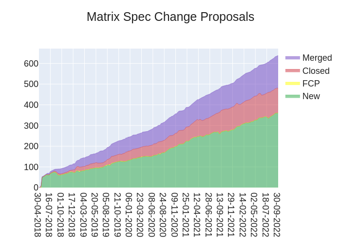
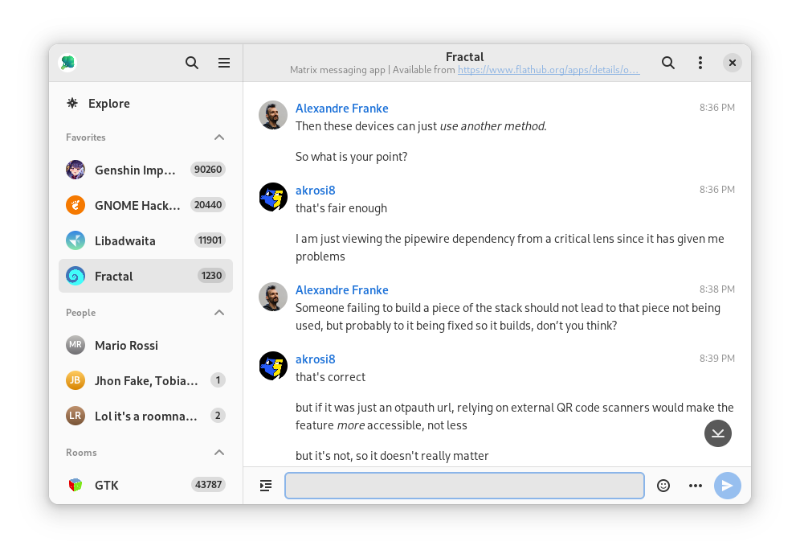
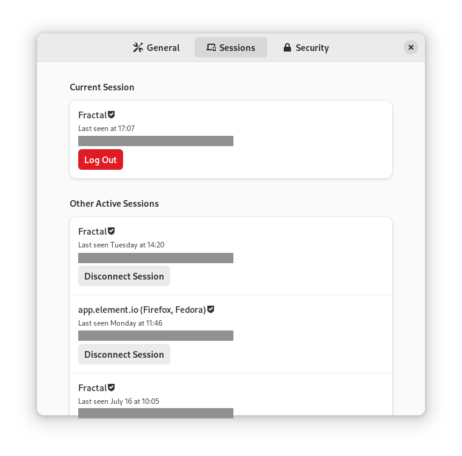

+++
title = "This Week in Matrix 2022-09-30"
path = "/blog/2022/09/30/this-week-in-matrix-2022-09-30"

[taxonomies]
author = ["Thib"]
category = ["This Week in Matrix"]
+++

## Matrix Live

{{ youtube_player(video_id="cJHlndIcgMM") }}

<!-- more -->

## Dept of *Status of Matrix* 🌡️

[Matthew](https://matrix.to/#/@matthew:matrix.org) reports

> There’s been a lot of discussion in the cryptography community on whether the fact Matrix currently lets homeservers define room membership counts as a E2EE vulnerability or not. On one hand, we consider it to be a low severity issue because we warn users when unexpected devices or users join an E2EE room (if you have verified users; if you haven’t verified all bets are off anyway). On the other hand, many in the cryptography community consider this a serious misdesign. Eitherway, it’s avoidable behaviour and we’re ramping up work now to address it by signing room memberships so the clients control membership rather than the server.

[Thib](https://matrix.to/#/@thib:ergaster.org) adds

> For a balanced coveraged of the vulnerability, see the following articles:
>
> * [Matrix.org Foundation — Upgrade now to address E2EE vulnerabilities in matrix-js-sdk, matrix-ios-sdk and matrix-android-sdk2](https://matrix.org/blog/2022/09/28/upgrade-now-to-address-encryption-vulns-in-matrix-sdks-and-clients)
> * [The original paper — Practically-exploitable Cryptographic Vulnerabilities in Matrix](https://nebuchadnezzar-megolm.github.io)
> * [ars technica — Serious vulnerabilities in Matrix’s end-to-end encryption have been patched](https://arstechnica.com/information-technology/2022/09/matrix-patches-vulnerabilities-that-completely-subvert-e2ee-guarantees/)

## Dept of Spec 📜

[Andrew Morgan (anoa)](https://matrix.to/#/@andrewm:element.io) reports

> Here's your weekly spec update! The heart of Matrix is the specification - and this is modified by Matrix Spec Change (MSC) proposals. Learn more about how the process works at <https://matrix.org/docs/spec/proposals>.
>
> ## MSC Status
>
> **New MSCs:**
>
> * [MSC3901: Deleting state](https://github.com/matrix-org/matrix-spec-proposals/pull/3901)
> * [\[WIP\] MSC3898: Native Matrix VoIP signalling for cascaded SFUs](https://github.com/matrix-org/matrix-spec-proposals/pull/3898)
> * [MSC3896: Appservice media](https://github.com/matrix-org/matrix-spec-proposals/pull/3896)
>
> **MSCs in Final Comment Period:**
>
> * *No MSCs are in FCP.*
>
> **Accepted MSCs:**
>
> * [MSC3856: Threads List API](https://github.com/matrix-org/matrix-spec-proposals/pull/3856)
> * [MSC3771: Read receipts for threads](https://github.com/matrix-org/matrix-spec-proposals/pull/3771)
>
> ## Spec updates
>
> This last week the SCT has largely been focusing on getting [Matrix 1.4](https://matrix.org/blog/2022/09/29/matrix-v-1-4-release) out the door, with threads being the last major piece of it all 🎉
>
> With the inclusion of edits and private read receipts too, it's one of the larger feature releases we've done in a while, but fret not: v1.5 (due approximately November 2022) is expected to be mostly spec maintenance rather than features this time around. That said, if you have any MSCs you think would be good to include in v1.5, please let us know in the [#sct-office:matrix.org](https://matrix.to/#/#sct-office:matrix.org) so we can figure out how to make forward progress on them.
>
> Otherwise, a new simplified spec process guide has been merged to the [Matrix Spec Proposals repo](https://github.com/matrix-org/matrix-spec-proposals/#the-matrix-spec-process). If the MSC process has ever seemed mysterious or complex, or you'd just like a refresher on some spec terminology, feel free to give it a read. [Check it out](https://github.com/matrix-org/matrix-spec-proposals/#the-matrix-spec-process)!
>
> ## Random MSC of the Week
>
> The random MSC of the week is... [MSC2596: Proposal to always allow rescinding invites](https://github.com/matrix-org/matrix-spec-proposals/pull/2596)!
>
> When you invite a user to a room in Matrix, you send a membership state event of "invite" with their Matrix ID as a state key. This requires a high enough power level to "invite" users. If you would like to rescind this invite, you would send a second membership state event of "leave". A separate power level is required to the do the latter.
>
> There is an edge case whereas if you have the power level required to invite a user, but not set their membership to "leave" (aka *kicking* them), then you wind up not being able to rescind an invite. This can be unwelcome, especially if you accidentally invited a user.
>
> This MSC aims to define rescinding an invite as a special case, with separate power level logic from the generic "set a user's membership to 'leave'" action - allowing anyone to rescind an invite they sent regardless of their current power level.
>
> Seems useful to me! If this is something that bothers you, feel free to weigh in on the proposal with feedback.
>
> <!-- markdownlint-disable-next-line no-alt-text -->
> 

[jaller94](https://matrix.to/#/@jaller94:matrix.org) says

> ### Matrix Spec v1.4 for Dash and Zeal
>
> I've updated the Dash/Zeal Docset which you can use to read the Matrix Spec offline.
>
> Link to the new Docset: <https://chrpaul.de/dash/Matrix-docset-1.4-1.tgz>
>
> If you use Dash or Zeal, give it a try. Let me know, if you find pages that are not working. I hope that [Matrix will be included in their list of user-contributed docsets.](https://github.com/Kapeli/Dash-User-Contributions/issues/3750)
>
> [Project on Gitlab.com](https://gitlab.com/jaller94/dash-matrix-spec)
>
> Note, this is not an official release distribution of the Matrix Spec. Enjoy at your own risk of this breaking or not getting updated.

## Dept of Servers 🏢

### Sliding Sync Proxy

[Kegan](https://matrix.to/#/@kegan:matrix.org) says

> The sliding sync proxy has seen a number of massive architectural changes to support horizontal scaling in a kubernetes-like environment. The intention is to run a version of this scalable proxy to support expected user loads on matrix.org.
>
> This is currently a work in progress, but the [majority of the work](https://github.com/matrix-org/sliding-sync/pull/49) is now complete, so watch this space! To get a high-level overview of the changes, take a look at the [scaling design doc](https://github.com/matrix-org/sliding-sync/blob/5a13a02e8c48d1b0cd450f99f15e5158043ccfeb/SCALING.md).

### Synapse ([website](https://github.com/matrix-org/synapse/))

Synapse is a Matrix homeserver implementation developed by the matrix.org core team

[Shay](https://matrix.to/#/@shayshay:matrix.org) announces

> Hello all. Synapse team has been hard at work, and just released v1.68.0. As mentioned last week, this will be the
> first version to require Rust. Some other notable features are:
>
> * Add an admin API endpoint to fetch messages within a particular window of time.
> * Add an admin API endpoint to find a user based on their external ID in an auth provider.
> Plus a host of bugfixes, internal changes to speed up Synapse 🚀(including work on faster joins-stay tuned as this is quickly approaching), improvements to the documentation, and more. Check it out here!: <https://matrix.org/blog/2022/09/27/synapse-1-68-released>

### Dendrite ([website](https://github.com/matrix-org/dendrite))

Second generation Matrix homeserver

[neilalexander](https://matrix.to/#/@neilalexander:matrix.org) reports

> This week we released [Dendrite 0.10.0](https://github.com/matrix-org/dendrite/releases/tag/v0.10.0) which contains a number of significant improvements and fixes. If you are running a Dendrite server, please upgrade! Changes include:
>
> * High performance full-text searching has been added to Dendrite
>     * Search must be enabled in the [`search` section of the `sync_api` config](https://github.com/matrix-org/dendrite/blob/6348486a1365c7469a498101f5035a9b6bd16d22/dendrite-sample.monolith.yaml#L279-L290) before it can be used
>     * The search index is stored on the filesystem rather than the sync API database, so a path to a suitable storage location on disk must be configured
> * Sync requests should now complete faster and use considerably less database connections as a result of better transactional isolation
> * The notifications code has been refactored to hopefully make notifications more reliable
> * A new `/_dendrite/admin/refreshDevices/{userID}` admin endpoint has been added for forcing a refresh of a remote user's device lists without having to modify the database by hand
> * A new `/_dendrite/admin/fulltext/reindex` admin endpoint has been added for rebuilding the search index (although this may take some time)
> * A number of bugs in the device list updater have been fixed, which should help considerably with federated device list synchronisation and E2EE reliability
> * A state resolution bug has been fixed which should help to prevent unexpected state resets
> * The deprecated `"origin"` field in events will now be correctly ignored in all cases
> * Room versions 8 and 9 will now correctly evaluate `"knock"` join rules and membership states
> * A database index has been added to speed up finding room memberships in the sync API (contributed by [PiotrKozimor](https://github.com/PiotrKozimor))
> * The client API will now return an `M_UNRECOGNIZED` error for unknown endpoints/methods, which should help with client error handling
> * A bug has been fixed when updating push rules which could result in `database is locked` on SQLite
>
> As always, please feel free to join us in [#dendrite:matrix.org](https://matrix.to/#/#dendrite:matrix.org) for more related discussion.

## Dept of Clients 📱

### SmallTalk ([website](https://github.com/ouchadam/small-talk))

Minimal Android messenger powered by Matrix

[adam](https://matrix.to/#/@adam:iswell.cool) reports

> *A lightweight Android matrix client, focused on family and friends messaging.*
>
> It's been a while since the last TWIM update, development is still progressing and the app is still small (1.84mb~ when delivered via app bundle)!
>
> Some of the bigger recent highlights -
>
> * [Material You](https://material.io/blog/announcing-material-you) theme
> * Notifications overhaul - adding support for [UnifiedPush](https://unifiedpush.org/), consistent ping rules and a first pass at invitations.
> * Attaching or sharing images.
> * A FOSS variant hosted on [IzzySoft's F-Droid repository](https://apt.izzysoft.de/fdroid/index/apk/app.dapk.st).
> * Automatic Monday & Thursday release trains.
> * A separate repository for [feature requests](https://github.com/ouchadam/small-talk-features)
>
> There's still a few big features missing like room history, verification and a form of markdown support but if you're feeling brave SmallTalk is in the *it's kinda usable* phase, links below for trying it out!
>
> | [Google Play Beta](https://play.google.com/apps/testing/app.dapk.st) | [F-Droid via IzzySoft](https://apt.izzysoft.de/fdroid/index/apk/app.dapk.st) | [Repository](https://github.com/ouchadam/small-talk) | [Matrix room](https://app.element.io/#/room/#small-talk:iswell.cool) |

### Quadrix ([website](https://github.com/alariej/quadrix))

A Minimal, simple, multi-platform chat client for the Matrix protocol.

[JFA](https://matrix.to/#/@alariej:matrix.org) reports

> Quadrix v1.3.6 has been released and is available for mobiles and desktops in the respective app stores (the iOS version is still awaiting approval).
>
> The release brings bug fixes, "under the hood" improvements, with upgrades to React 18 and React-Native 0.70, and also two new features:
>
> 1. A floating "Send" button just above the virtual keyboard on mobile devices, useful especially on larger phones.
> 2. An information button on the main screen, for now only used to inform users that a new app version is available.
>
> Please leave feedback/comments at [#quadrix:matrix.org](https://matrix.to/#/#quadrix:matrix.org) or in the issues at <https://github.com/alariej/quadrix> (stars welcome :-)

### Nheko ([website](https://nheko-reborn.github.io))

Desktop client for Matrix using Qt and C++17.

[Nico](https://matrix.to/#/@deepbluev7:neko.dev) reports

> Nheko version 0.10.2 is out now.
>
> **This is a security release!**
>
> A malicious homeserver could intercept the secrets requests after a verification or when clicking the button for it in the settings and poison the cached secrets in Nheko. This could in theory be used to mark some devices as cross-signed over federation that weren't or to attack the online key backup as such this is fairly high severity.
>
> To protect against this update to 0.10.2 or don't do any verifications of your own devices while on a vulnerable version (and don't hit the request buttons in the settings).
>
> Thanks goes out to the matrix.org team for disclosing this!

[Nico](https://matrix.to/#/@deepbluev7:neko.dev) announces

> As mentionedin the security update earlier, we had a small security release on Wednesday. As part of that we requested our first CVE. While security issues are never something you want to have, this still feels like a major milestone for Nheko. It is certainly not something I even imagined when I started contributing to Nheko and yet here we are. I'd like to thank everyone who made this security release as seamless as it was and I appreciate that all of you were as understanding as you were! I certainly don't take that for granted! But now on to some more fun stuff:
>
> Nheko now has crude support for threading. This means you can start and participate in a thread and replies automatically land in a thread by default. Threads are also now marked in the timeline. Noticeably are ways to filter down the timeline to a specific thread, which will be added at a later date. This now makes Nheko technically implement all new features of Matrix 1.4 in some way or another.
>
> Nheko now also allows you to edit permissions in a community and all the rooms in the community at once as long as you have permission to do so. This should make managing larger communities much easier. As part of that we now also try to handle rate limits more gracefully.
>
> We also upgraded our codebase to some subset of C++20. The major blocker there is Apple, who only implements a very tiny subset of C++20 features at this time (even though they default to C++23...). As part of that we also made our Apple codesigning much more robust and widened our build testing matrix.

### Fractal ([website](https://gitlab.gnome.org/GNOME/fractal))

Matrix messaging app for GNOME written in Rust.

[Julian Sparber](https://matrix.to/#/@jsparber:gnome.org) announces

> This week we tagged Fractal as 5.alpha1. This is our first release since Fractal has been rewritten to take advantage of GTK 4 and the Matrix Rust SDK. It is the result of eighteen months of work.
> Currently supported features are:
>
> * Sending and receiving messages and files
> * Sending files via Drag-n-Drop and pasting in the message entry
> * Rendering of rich formatted (HTML) messages, as well as media
> * Displaying edited messages, redacting messages
> * Showing and adding reactions
> * Tab completion of user names
> * Sending and displaying replies
> * Sharing the current location
> * Exploring the room directory
> * Sorting the rooms by category
> * Joining rooms
> * Sending and accepting invitations
> * Logging into multiple accounts at once
> * Logging in with Single-Sign On
> * Sending and reading encrypted messages
> * Verifying user sessions using cross-signing
> * Exporting and importing encryption keys
> * Managing the connected devices
> * Changing the user profile details
> * Deactivating the account
>
> Major missing features are:
>
> * Notifications
> * Read markers
>
> As the name implies, this is still considered alpha stage and is not ready for general use just yet. If you want to give this development version a try, you can get it from the [GNOME Apps Nightly flatpak repository](https://wiki.gnome.org/Apps/Nightly).
> A list of known issues and missing features for a 5.0 release can be found in the [Fractal v5 milestone](https://gitlab.gnome.org/GNOME/fractal/-/milestones/18) on Gitlab.
>
> We also published a blogpost about the security quick scan performed by Radically Open Security as part of the NLnet grant <https://blogs.gnome.org/jsparber/2022/09/27/fractal-security-audit/>
>
> <!-- markdownlint-disable-next-line no-alt-text -->
> 
>
> <!-- markdownlint-disable-next-line no-alt-text -->
> 

### Ement.el ([website](https://github.com/alphapapa/ement.el))

Matrix client for Emacs

[alphapapa](https://matrix.to/#/@alphapapa:matrix.org) says

> [Ement.el](https://github.com/alphapapa/ement.el), a Matrix client for [GNU Emacs](https://www.gnu.org/software/emacs/), has been updated to version 0.3.  It can be installed directly from [GNU ELPA](https://elpa.gnu.org/packages/ement.html) with the command `M-x package-install RET ement RET`.
>
> Since the last announcement on TWIM, the following improvements have been made.  The most notable is the addition of the `ement-directory` commands that allow listing and searching public room directories.
>
> *Additions*
>
> * Command `ement-directory` shows a server's room directory.
> * Command `ement-directory-search` searches a server's room directory.
> * Command `ement-directory-next` fetches the next batch of rooms in a directory.
> * Command `ement-leave-room` accepts a `FORCE-P` argument (interactively, with prefix) to leave a room without prompting.
> * Command `ement-forget-room` accepts a `FORCE-P` argument (interactively, with prefix) to also leave the room, and to forget it without prompting.
> * Option `ement-notify-mark-frame-urgent-predicates` marks the frame as urgent when (by default) a message mentions the local user or "@room" and the message's room has an open buffer.
>
> *Changes*
>
> * Read receipts are re-enabled.
> * When determining whether a room is considered unread, non-message events like membership changes, reactions, etc. are ignored.  This fixes a bug that caused certain rooms that had no message events (like some bridged rooms) to appear as unread when they shouldn't have.
> * The `ement-taxy-room-list` view no longer automatically refreshes the list if the region is active in the buffer.  (This allows the user to operate on multiple rooms without the contents of the buffer changing before completing the process.)
> * Minor improvements to date/time headers.
>
> *Fixes*
>
> * Links to only rooms (as opposed to links to events in rooms) may be activated to join them.
> * Read receipts mark the last completely visible event (rather than one that's only partially displayed).
> * Prevent error when a room avatar image fails to load.
> * Info manual export filename.
> * Command `ement-describe-room` for rooms without topics.
> * Improve insertion of old messages around existing timestamp headers.
> * Reduce D-Bus notification system check timeout to 2 seconds (from the default of 25).
> * Compatibility with Emacs 27.

### Element Web/Desktop ([website](https://github.com/vector-im/element-web))

Secure and independent communication, connected via Matrix. Come talk with us in [#element-web:matrix.org](https://matrix.to/#/#element-web:matrix.org)!

[Danielle](https://matrix.to/#/@daniellekirkwood:one.ems.host) reports

> * We’ve released a security update this week, [more info here](https://element.io/blog/important-security-update/). Please make sure to upgrade.
> * Now you can create and join new Element Call powered rooms! Element Call rooms are available on [develop.element.io](http://develop.element.io/) so be sure to check it out.
>     * Head to; Settings → Labs → Enable Video Rooms Beta, and then enable Element Call video rooms.
> * We’re progressing on a new WYSIWYG composer. You’ll be able to avoid markdown (if you want) to craft and preview messages before sending them.
> * Updates are being made on the new device manager, including the ability to rename sessions. The whole thing’s is a lot simpler
> * There’s also a fix for the missing dot on the notification panel. The bell in the top right should now let you know if you have something new. 🔔

### Element iOS ([website](https://github.com/vector-im/element-ios))

Secure and independent communication for iOS, connected via Matrix. Come talk with us in [#element-ios:matrix.org](https://matrix.to/#/#element-ios:matrix.org)!

[Ștefan](https://matrix.to/#/@stefan.ceriu:matrix.org) says

> * We’ve released a security update this week, more info [here](https://element.io/blog/important-security-update/). Please make sure to upgrade.
> * There’s been several other bug fixes in iOS this week, including:
>     * Fixed the flashing spinner when trying to view media attachments
>     * Fixed crash on iPad when you click sign out or invite to element
> * We’ve started hearing that performance of the iOS is decreasing - research has started and we’ll be doing what we can!

### Element Android ([website](https://github.com/vector-im/element-android))

Secure and independent communication for Android, connected via Matrix. Come talk with us in [#element-android:matrix.org](https://matrix.to/#/#element-android:matrix.org)!

[Manu](https://matrix.to/#/@Manu:matrix.org) says

> * We’ve released a security update this week, more info here. Please make sure to upgrade.
> * There’s exciting work happening on deferring DM creation until the first message is sent.
> * Also, improvements have been made to the new app layout. It’s available in Labs today but will be the default from the next release so be sure to check it out and let us know what you think?

### Element ([website](https://element.io))

Everything related to Element but not strictly bound to a client

[Danielle](https://matrix.to/#/@daniellekirkwood:one.ems.host) announces

> There have been security releases across our platforms this week; please make sure to upgrade to the following versions:
>
> * Element Web/Desktop 1.11.8 or later
> * Element Android 1.5.1 or later
> * Element iOS 1.9.7 or later
>
> The upgrades resolve two critical severity vulnerabilities in end-to-end encryption found in the SDKs which power Element, Beeper, Cinny, SchildiChat, Circuli, Synod.im and any other clients based on matrix-js-sdk, matrix-ios-sdk or matrix-android-sdk2.
>
> The issues are fixed by the upgrades. Neither Element or Matrix have seen any evidence of them being exploited in the wild.
>
> For the full background on the update, visit the [Matrix blog post.](https://matrix.org/blog/2022/09/28/upgrade-now-to-address-encryption-vulns-in-matrix-sdks-and-clients)

### Cinny ([website](https://cinny.in))

Cinny is a Matrix client focused on simplicity, elegance and security

[Lozenge](https://matrix.to/#/@kfiven:matrix.org) announces

> Cinny v2.2.2
> *-----------
>
> In [this release](https://github.com/cinnyapp/cinny/releases/tag/v2.2.2) we have bumped `matrix-js-sdk` to v20.0.0 as being a user of SDK, Cinny was affected with vulnerabilities found in it. So please make sure you are using Cinny **v2.2.2 or higher**.
>
> Apart from that, this release also fixes some issues with markdown, crash on leaving space, and improves `View source` of events.
>
> Since we are talking about vulnerabilities, since v2 we have also taken **zero vulnerable dependency approach** and reduced vulnerable npm packages from 18 to just 3. We are working on 3 as well but good thing is that they are just dev dependencies so production builds doesn't include them.
>
> Lastly, if you like you know more about Cinny, join our Matrix space: <https://matrix.to/#/#cinny-space:matrix.org> or see: <https://cinny.in>

## Dept of Non Chat Clients 🎛️

### Thirdroom ([website](https://github.com/matrix-org/thirdroom))

A browser-based open metaverse client

[Robert Long](https://matrix.to/#/@arobertlong:matrix.org) says

> Hey everyone! We just launched Third Room Tech Preview 1! 3D decentralized virtual worlds built on Matrix! Go check it out: <https://thirdroom.io>

## Dept of Widgets 🧩

### matrix-widget-api

[Dominik Henneke](https://matrix.to/#/@dhenneke:matrix.org) reports

> We from [Nordeck](https://nordeck.net/) added support for [retrieving related events](https://github.com/matrix-org/matrix-widget-api/pull/72) in Widgets into the matrix-widget-api over the last weeks. With the existing APIs we could not reliable read all the data from the room, as the room timeline is lazily loaded in Element. To learn more about the issue, have a look at the related [MSC](https://github.com/matrix-org/matrix-spec-proposals/pull/3869). With this weeks [Element release 1.11.6](https://github.com/vector-im/element-web/releases/tag/v1.11.6) this feature has now landed. The change improves using the room as a data storage for Matrix Widgets, which allows us to build cool tools. We keep you updated when we publish our widgets as Open Source.

## Dept of SDKs and Frameworks 🧰

### matrix-rust-sdk ([website](https://github.com/matrix-org/matrix-rust-sdk))

Next-gen crypto-included SDK for developing Clients, Bots and Appservices; written in Rust with bindings for Node, Swift and WASM

[ben](https://matrix.to/#/@gnunicorn:matrix.org) reports

> The Matrix Rust SDK team is proud to announce, that [we've released a new version of the SDK](https://github.com/matrix-org/matrix-rust-sdk/releases/tag/matrix-sdk-0.6.0) to the public: You can get the latest [`matrix-sdk 0.6.0` (and its subcrates) on crates.io](https://crates.io/crates/matrix-sdk/0.6.0) since Wednesday, [matrix-sdk-crypto-nodejs 0.1.0-beta.2 via npm](https://www.npmjs.com/package/@matrix-org/matrix-sdk-crypto-nodejs) since Thursday. Please note that this is a breaking release, with a quite few public API changes, that will probably break your build if you don't change your code for that. You can find broad list and a troubleshooting guide, helping you adapt your code to common errors you'll see [in the Upgrade Guide](https://github.com/matrix-org/matrix-rust-sdk/blob/530f8057cc6622ec5ecb09fc88d50112a4855d47/UPGRADING-0.5-to-0.6.md) provided. This also marks the first release, we have `sliding-sync` available behind a feature-flag for testing (note, that it doesn't yet support extensions for to-device messages or E2EE)If you are using latest `main`, be aware that most deprecated functions are going to be removed soon, as well as the previous `experimental-timeline`, which will be replaced [by the next generation](https://github.com/matrix-org/matrix-rust-sdk/pull/940).
>
> As you can imagine the release preparation and [last](https://github.com/matrix-org/matrix-rust-sdk/pull/1070) [minute](https://github.com/matrix-org/matrix-rust-sdk/pull/1071) [fixes](https://github.com/matrix-org/matrix-rust-sdk/pull/1062) to bugs have been the main focus for the team that last two weeks. Most notably, we have [fixed a nasty deserialization bug](https://github.com/matrix-org/matrix-rust-sdk/pull/1066) in encrypted to-device messages we found while experimenting with the \[upcoming sliding sync extensions\] and had to [revert the changes to have join and leave return full room-types](https://github.com/matrix-org/matrix-rust-sdk/pull/1061) as that caused internal state inconsistencies, which we have to rework our architecture for to support proper.
>
> ️ Wanna hack on matrix rust? Go check out our [`help wanted` tagged issues](https://github.com/matrix-org/matrix-rust-sdk/issues?q=is%3Aissue+is%3Aopen+label%3A%22help+wanted%22) and join our matrix channel at Matrix Rust SDK.

## Dept of Interesting Projects 🛰️

### Other Clients October

[Asbjørn](https://matrix.to/#/@asbjorn:olli.ng) says

> I'd like to propose a community event. It's about exploring Matrix clients.
>
> The concept is simple: For the month of October, only use Matrix clients that you don't normally use.
>
> I have gotten stuck in my ways - using the same Matrix client for years on end.
> When I was at the Matrix Community Summit in Berlin, I discovered that there are actually many mature clients, with distinct differences and advantages.
> So, in order to break up my habits a little, I'm going to force myself to not use my daily-driver client for the month of October.
>
> I hope some of you want to join me! To that end, I set up a room for this project, to share our discoveries and frustrations, and compare experiences.
>
> Join the room here: [#other-clients-october:olli.ng](https://matrix.to/#/%23other-clients-october:olli.ng)

## Dept of Guides 🧭

[Paul](https://matrix.to/#/@ptman:kapsi.fi) reports

> I wrote a small [blog post](https://paul.totterman.name/posts/matrix-menu-bot/) about a [bot](https://gitlab.com/ptman/matrix-menu-bot) that demonstrates the use of polls as menu-driven bot interaction. DM @menubot:matrix.org to test

## Dept of Ping

Here we reveal, rank, and applaud the homeservers with the lowest ping, as measured by [pingbot](https://github.com/maubot/echo), a [maubot](https://github.com/maubot/maubot) that you can host on your own server.

### [#ping:maunium.net](https://matrix.to/#/#ping:maunium.net)

Join [#ping:maunium.net](https://matrix.to/#/#ping:maunium.net) to experience the fun live, and to find out how to add YOUR server to the game.

|Rank|Hostname|Median MS|
|:---:|:---:|:---:|
|1|nognu.de|485|
|2|envs.net|510|
|3|kittenface.studio|880.5|
|4|rom4nik.pl|1156.5|
|5|matrix.tdstoragebay.com|1314|
|6|mindlesstux.com|1460.5|
|7|t2bot.io|1509.5|
|8|jeroenhd.nl|1964|
|9|utzutzutz.net|2009|
|10|matrix.netho.tk|2780|

### [#ping-no-synapse:maunium.net](https://matrix.to/#/#ping-no-synapse:maunium.net)

Join [#ping-no-synapse:maunium.net](https://matrix.to/#/#ping-no-synapse:maunium.net) to experience the fun live, and to find out how to add YOUR server to the game.

|Rank|Hostname|Median MS|
|:---:|:---:|:---:|
|1|dendrite.matrix.org|220.5|
|2|matrix.awesomesheep48.me|225.5|
|3|joeth.uk|230|
|4|conduit.hazmat.jacksonchen666.com|258.5|
|5|kumma.juttu.asia|306.5|
|6|dendrite.s3cr3t.me|950.5|

## That's all I know

See you next week, and be sure to stop by [#twim:matrix.org](https://matrix.to/#/#twim:matrix.org) with your updates!
