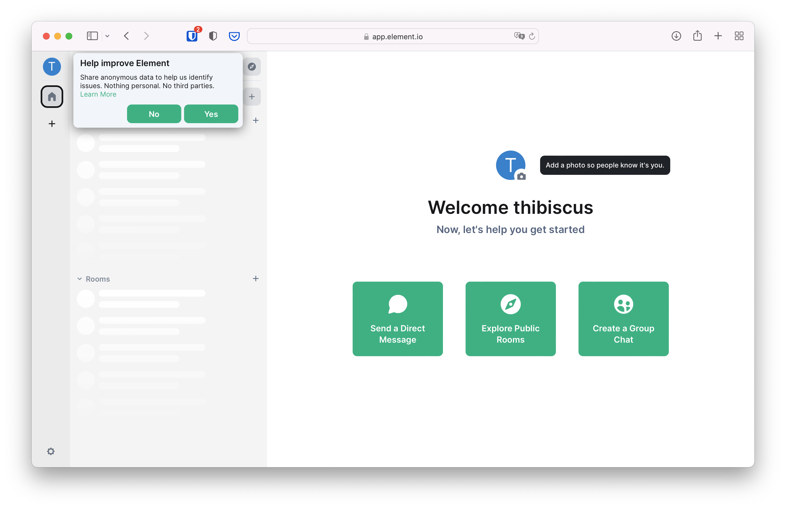

+++
title = "Chat basics"
weight = 100
template = "docs/with_menu.html"
[extra]
emoji = "🧑"
tile = "Learn the basics on how to chat on Matrix, for individuals"
updated = "2022-10-18T16:00:00Z"
+++

## Matrix for Instant Messaging

Matrix works a little like email, but instantaneous and secure:

- You need to register an account at a provider
- Whatever your provider is, you can talk to people using other providers
- In the same way you can use Outlook or Thunderbird with the same email
  account, you can use different Matrix apps for the same Matrix account.

Several apps exist, but we're going to go with Element for the sake of
simplicity, as it's among the most advanced apps on the market.

Once you are more comfortable with the basics and if you want to use another
app, head to the [clients](/ecosystem/clients) section of this website.

{{ page_card(
    title="Clients",
    path="/ecosystem/clients",
    summary="Discover Matrix clients and pick one best suited for your needs
             once you're comfortable with the basics.")
}}

## Creating a Matrix account

You can use any provider you want. The experts can even set-up their own
provider, but it's not a requirement at all.

The Matrix.org Foundation is a public provider everybody can register an account
on for free. For your first steps, the simplest is to register an account there.

To register an account, you need to use an app. In our case, we're going to get
started with Element, but you can seamlessly move to using any other client at
any point in time, even if you started with Element.

Go to [app.element.io](https://app.element.io), and click on "Create Account".
You should land on the following page.

For simplicity you can connect with a Google, Facebook, Apple, GitHub or GitLab
account if you have any of these. They will be notified that you're using your
account to create a Matrix one. This is sometimes called "Social Login".

If you're more privacy conscious, you can also register by entering a username,
password and email in the form below the Social Login buttons.

You might be challenged with a captcha (a set of tiles or pictures where you
need to find certain objects), and will be asked to accept Matrix.org's terms
and conditions.

After accepting the terms, you will end on a screen that asks you to confirm
your email address. You can safely close this window.

Check your inbox, and click the link to verify your email address. The link will
bring you to the homepage of Element, the Matrix web application to participate
to Matrix conversations.

You now have an account, and are using the web version of Element. We recommend
you to [download the desktop version of Element](https://element.io/get-started#download),
which makes following Matrix links much easier. If you don't want to download a
desktop app you can carry on with the web version.

Now you can either decide to create a private group chat to experiment with and
invite friends later, or join public rooms to participate in existing
conversations.
