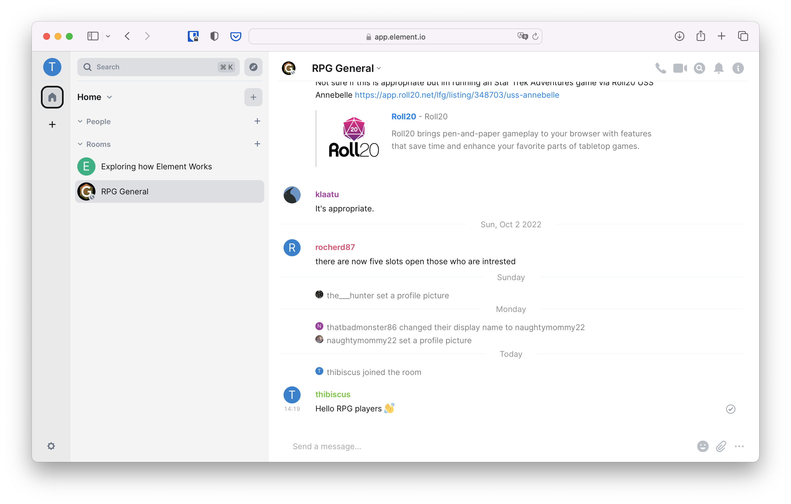
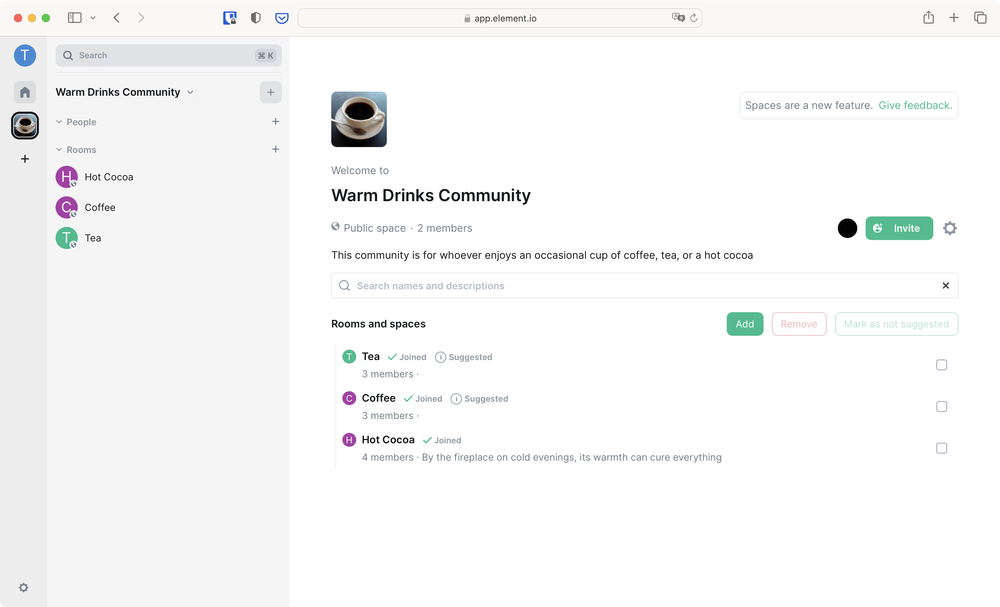

+++
title = "Public Rooms"
weight = 300
template = "docs/with_menu.html"
[extra]
emoji = "🌐"
tile = "I want to join public conversations"
updated = "2022-10-18T16:00:00Z"
meta_description = """
Matrix is often use for public online discussions. Being an interoperable
protocol, it allows people using different providers to talk together online,
safely.
"""
+++

When you want to join larger public conversations, you have three major options
at hand:

1. [Joining a specific room](@/docs/chat_basics/public-rooms/_index.md#joining-a-specific-room) from its address/alias or from a `matrix.to` link
2. [Browsing a public directory](@/docs/chat_basics/public-rooms/_index.md#browsing-the-public-directory) to find rooms of interest
3. Joining a room that was listed in a [Space](@/docs/chat_basics/public-rooms/_index.md#spaces)

Some clients also allow applying specific settings to public rooms, such as
[hiding images by default](#hiding-images-by-default).

## Joining a specific room

Someone might have shared a link that starts with `matrix.to` with you, or you
might have stumbled upon it on a website. Those links will bring you to the
public conversation you tried to join after asking you what client you want to
use.

Clicking a `matrix.to` link you will open a new tab in your browser, showing you
a UI that looks like the following.

Click on accept, and you will be redirected to a preview of the room you're
trying to join, containing its name, address (on the format
`#room-name:example.com`), and number of people currently in the room. Below
this preview is a list of clients you can use to join the room.

Since this documentation started with Element, let's carry on with it. You will
be able to seamlessly change to another client when you're more used to Matrix.

Click on "Continue" below Element. If you have installed Element Desktop, your
browser may ask you if you want to allow this page to open Element. Click on
Allow. If you haven't installed Element Desktop, you can either click on
"Download" to get it, or "Continue in your browser" to carry on with the web
app.

Depending on the privacy settings set by the administrators of the room, you may
or may not be able to see a preview of the conversation.

Click on "Join the discussion": you can now participate in the room!

## Browsing the public directory

Joining a specific room is handy when you know exactly what you want to discuss
or where, but sometimes you just want to find a casual place to talk of things
of interest with people on the Internet.

Matrix has a built-in directory where people can publish their public rooms for
others to find them. The directory only shows rooms published on a single
provider at once. If you have created an account on matrix.org, it's going to
show you only rooms published on matrix.org's directory.

To access the directory, click on the `+` in the left bar, and on "Join public
room".

It will open a list of all the public rooms published in the directory of your
provider.

The directory can be very large sometimes, and the rooms displayed at the top of
the list may not be of interest to you. You can type a center of interest to see
if someone has created a room for it already.

You can click "Join" to join the room, and voilà, you're in!

## Spaces

A Space is a way to group several rooms together. If you are familiar with other
platforms, Matrix Spaces are similar to Slack Workspaces or Discord Servers. It
looks like the following.

To join a Space, you need to either know its address, or click on a matrix.to
link to that space someone would have shared with you. For example, to join the
Space of the Matrix Community, you can click on
[https://matrix.to/#/#community:matrix.org](https://matrix.to/#/#community:matrix.org)

The process to join a Space is the same as for [Joining a specific room](#joining-a-specific-room).

Once you have joined a Space, clicking on its icon on the leftmost bar will
bring you to the index view of the space: you will see all the rooms contained
in this space, and you will be able to join them by clicking on "Join".

Note that when you join a Space, you are not automatically joining all the rooms
inside it.

Here are a few Spaces you might be interested in:

- Matrix Community [https://matrix.to/#/#community:matrix.org](https://matrix.to/#/#community:matrix.org)
- Science [https://matrix.to/#/#science-space:matrix.org](https://matrix.to/#/#science-space:matrix.org)
- Libre Gaming [https://matrix.to/#/#libregaming-games:tchncs.de](https://matrix.to/#/#libregaming-games:tchncs.de)
- Retro Computing & Gaming [https://matrix.to/#/#retro:nil.im](https://matrix.to/#/#retro:nil.im)
- Mathematics [https://matrix.to/#/#mathematics-on:matrix.org](https://matrix.to/#/#mathematics-on:matrix.org)

## Hiding images by default

In public rooms, sometimes people post inappropriate content, including images
you don't want to see. Hopefully a room's moderators will tidy things up quite
quickly, but many people prefer to make images in public rooms hidden, allowing
them to show individual images when they are ready.

### In Fractal

In Fractal, images in public rooms are hidden by default. You can check and
adjust this in Account Settings.

{{ figure(
    img="fractal_menu_settings.avif"
    caption=""
    alt="Fractal, after clicking the avatar to show a pop-up menu. The gear
    icon is highlighted, saying Account Settings."
) }}

Choose Safety, and find "Media Previews". Make sure "Show only in private rooms"
is selected.

{{ figure(
    img="fractal_settings_safety.avif"
    caption=""
    alt="Fractal's settings screen, on the Safety tab. Show only in private
    rooms is highlighted, under Media previews."
) }}

Now images will be hidden by default. You can make them visible by clicking on
"Click to show preview".

{{ figure(
    img="fractal_show_image.avif"
    caption=""
    alt="Fractal's main timeline, with some hidden images. Click to show
    preview is highlighted on one of them."
) }}

You can re-hide them by choosing the "eye" icon in the corner of the image.

{{ figure(
    img="fractal_hide_image.avif"
    caption=""
    alt="Fractal's main timeline, with some images. The eye symbol in the
    top right of one is highlighted. The tooltip says Hide media preview."
) }}

### In Element X

In Element X, you can hide images in public rooms in Settings, by tapping on
your avatar.

{{ figure(
    img="element_x_main.avif"
    caption=""
    alt="Element X, with the avatar highlighted."
) }}

Choose Advanced Settings.

{{ figure(
    img="element_x_settings.avif"
    caption=""
    alt="Element X's Settings screen, with Advanced settings highlighted."
) }}

Under "Show media in timeline" choose "In private rooms".

{{ figure(
    img="element_x_advanced_settings.avif"
    caption=""
    alt="Element X's Advanced settings screen, showing Show media in timeline,
    with the In private rooms option highlighted."
) }}

Now images will be hidden by default. You can make them visible by clicking on
"Show".

{{ figure(
    img="element_x_show_image.avif"
    caption=""
    alt="Element X's timeline, with a hidden image which has a Show button
    that is highlighted."
) }}

To hide an image after it has been shown, go back to the room list and re-enter
the room.

### In Element Web

In Element Web, you can hide images in public rooms in Settings.

{{ figure(
    img="element_menu_settings.avif"
    caption=""
    alt="Element Web with the avatar highlighted, and the avatar menu visible,
    with All settings highlighted."
) }}

Choose Preferences, and scroll down to Moderation and safety. Click "In private
rooms" under "Show media in timeline".

{{ figure(
    img="element_settings_preferences_safety.avif"
    caption=""
    alt="Element Web's settings menu, on the Preferences page, showing the
    Moderation and safety section. Under Show media in timeline, In private
    rooms is highlighted."
) }}

Now images will be hidden by default. You can make them visible by clicking on
"Show image".

{{ figure(
    img="element_show_image.avif"
    caption=""
    alt="Element Web's timeline with a hidden image. The Show image button
    is highlighted."
) }}

You can re-hide them by choosing the "eye" icon when you hover over the image.

{{ figure(
    img="element_hide_image.avif"
    caption=""
    alt="Element Web, hovering over an image to show the pop-up menu. On this
    menu is an eye image that is highlighted. The tooltip says Hide."
) }}
