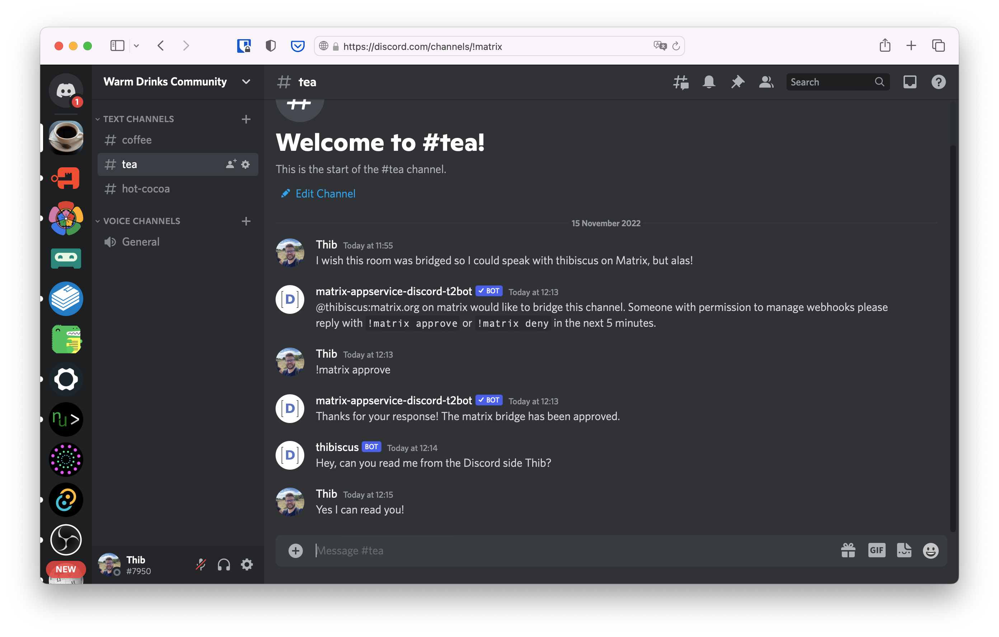

+++
title = "Bridging"
template = "docs/with_menu.html"
weight = 400
[extra]
emoji = "🌉"
tile = "I want to bridge my community from another platform with Matrix"
updated = "2022-11-18T09:50:00Z"
+++

The easiest way to bridge your Matrix community with you Discord one is to rely
on the free Discord bridge [provided by t2bot.io](https://t2bot.io/discord/).

It contains all the instructions about how to bridge your Discord channels with
your Matrix rooms. Please refer to their documentation directly.

Here you can see a bridged room from the Matrix and the Discord perspective.

<!-- markdownlint-disable-next-line no-alt-text -->

<!-- markdownlint-disable-next-line no-alt-text -->

If you're interested in self-hosting your bridge or discovering all the Discord
bridge implementations, please head to the [Ecosystem > Bridges](/ecosystem/bridges)
section of this website.

{{ page_card(
    title="Bridges",
    path="/ecosystem/bridges",
    summary="Understand how bridges work, find out which platforms Matrix can
             bridge against, and how to deploy your own.")
}}
