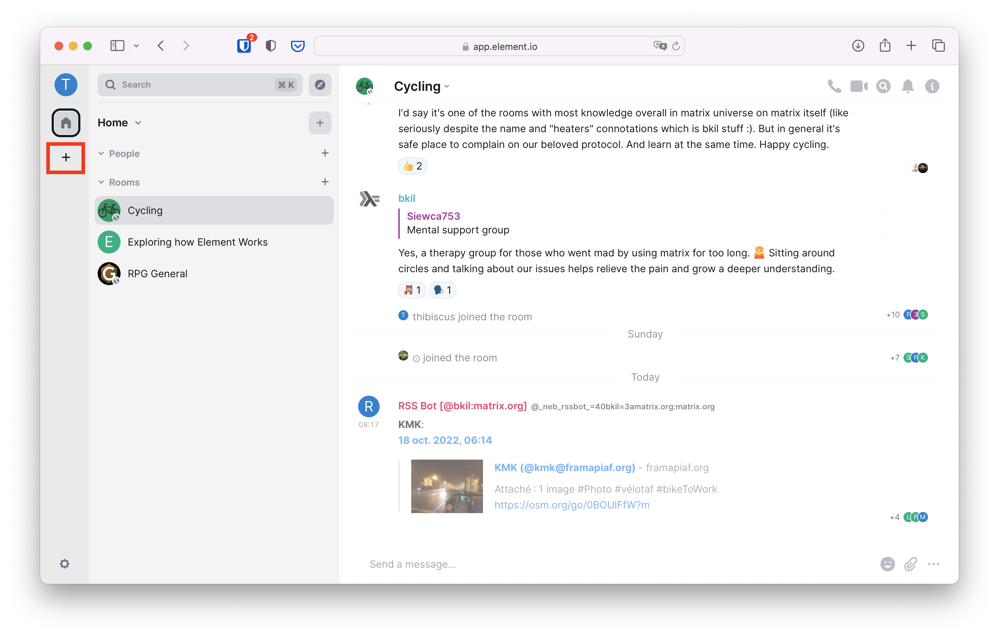
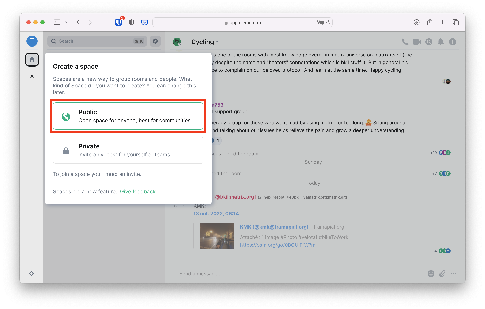
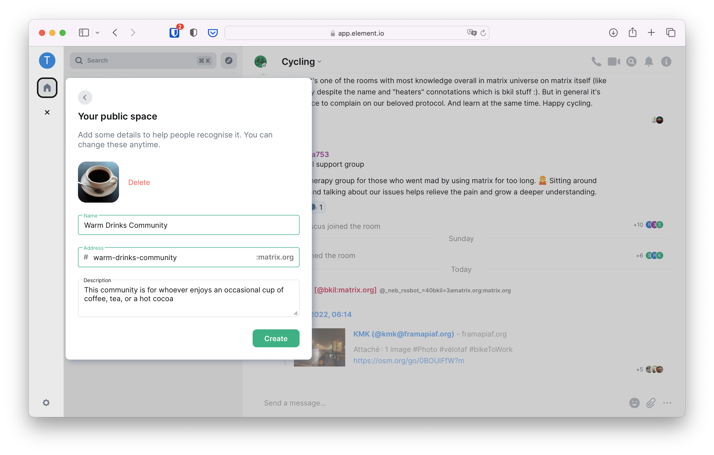
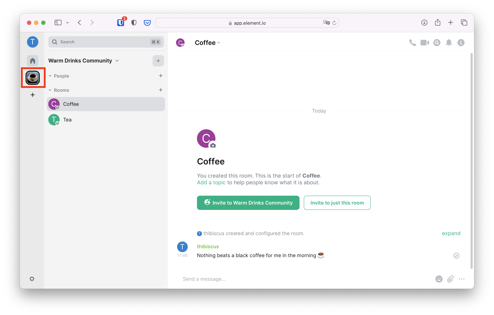
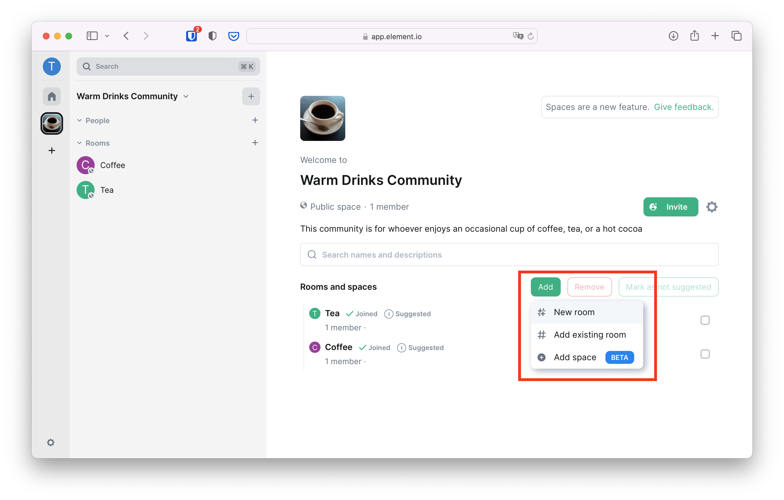
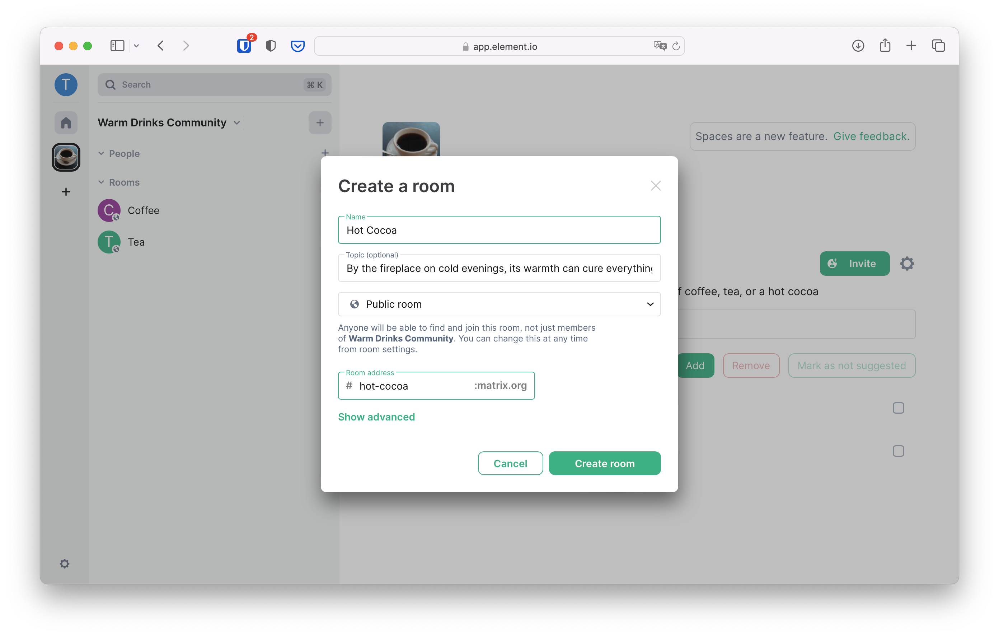
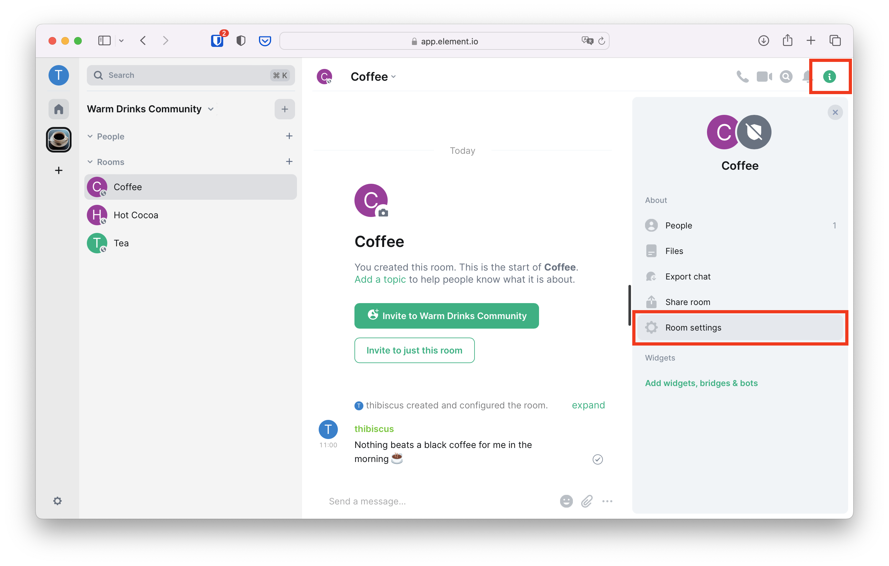
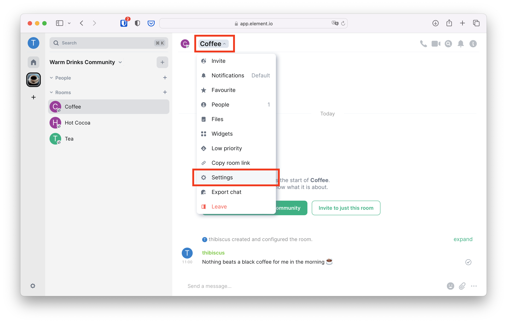
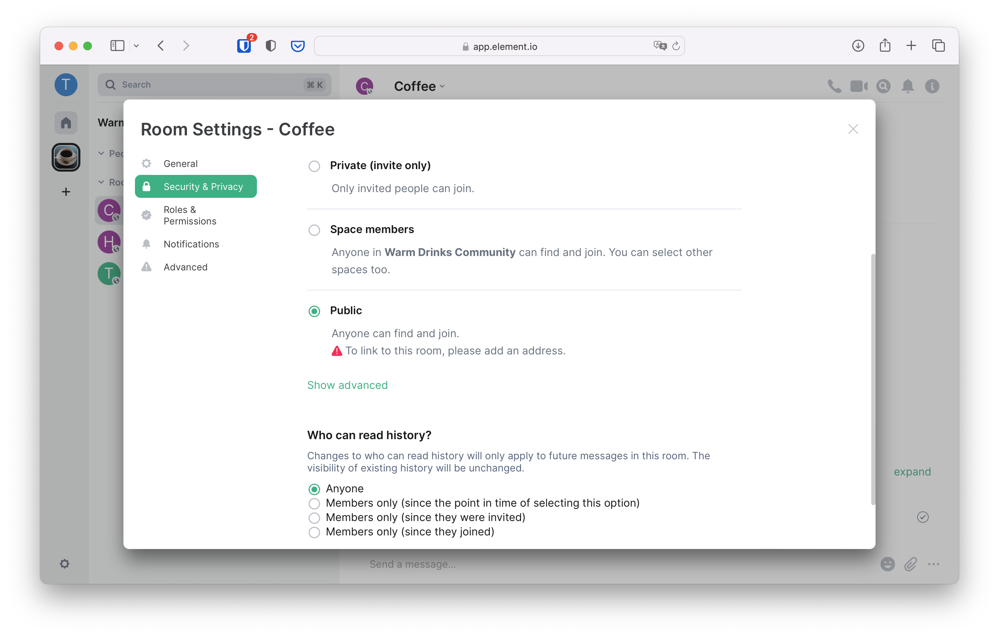

+++
title = "Getting Started"
weight = 100
template = "docs/with_menu.html"
aliases = ["/docs/communities/"]
[extra]
emoji = "👪"
tile = "Create a cozy place on Matrix for your community or organisation"
updated = "2022-11-18T09:50:00Z"
meta_description = """
Everyone can start their community on Matrix by creating a Matrix Space.
Community Managers can then tweak the Space to their needs.
"""
+++

We strongly recommend getting familiar with Matrix as an individual. It's easy
to use and to get started, but the amount of clients and providers in the wild
can make things overwhelming for newcomers. Follow [the users documentation](/docs/chat_basics)
to get started using Matrix as an individual.

For this tutorial we're going to assume your provider (homeserver) is
Matrix.org. You will see later that Matrix's flexibility allows you to start a
community on Matrix.org and then move to another provider if you want. You can
also bridge your existing community to Matrix to progressively migrate people
without a traumatic big platform switch.

Here are a couple of screenshots to see how a thriving community can look like
on Matrix.

<!-- markdownlint-disable-next-line no-alt-text -->

<!-- markdownlint-disable-next-line no-alt-text -->

We recommend you to set up a dummy community to play around first, and then you
can move on creating your full community and/or bridging your existing one to
Matrix.

The first thing to do whether you are starting a new community or trying to
bridge one to Matrix is to create a Space for it. You can think of Matrix Spaces
as equivalents of Slack Workspaces, or Discord Servers. They're a way to group
people and rooms.

## Creating & sharing a Space

Click on the + on the leftmost column of Element to create a new Space

<!-- markdownlint-disable-next-line no-alt-text -->

In this example, we're creating a public space for people who enjoy warm drinks.

<!-- markdownlint-disable-next-line no-alt-text -->

You can add a picture, name and description for your Space to be easier to find
and for people to have a good idea about what's happening in your community.

<!-- markdownlint-disable-next-line no-alt-text -->

Note there's also an address field. The address of your Space consists of a name
(sometimes called the local part) and of the domain of your provider. Here the
provider domain is `matrix.org` because we're creating the space from an account
that was created on Matrix.org

People can join your Space if it's public and you give them the address, which
is much easier to jot down or to memorise than a full [matrix.to](https://matrix.to)
link!

Later if you decide to deploy your own provider or to rent one as a service
(see [the list of providers we're aware of](/ecosystem/hosting) for more
details), you will be able to add new addresses to this Space and change the
main one.

You can then add a couple of rooms to get started with the basics... and voilà,
you now have a community on Matrix!

## Adding rooms

You can play around in the rooms, but look! We forgot to create a room for
people who enjoy hot cocoas! Click on the Space avatar in the left bar to go to
the Space's index

<!-- markdownlint-disable-next-line no-alt-text -->

From there you can see the list of all the rooms in your Space. The rooms you
see in the left panel are the rooms you are a member of, and the rooms you see
in the main panel are all the rooms in your Space. Since you're the
administrator of the Space they're the same to you, but that will not
necessarily be the case for new joiners.

Click on "Add" then on "New room" to create the room for hot cocoa drinkers.

<!-- markdownlint-disable-next-line no-alt-text -->

Here again, you can give the room a name, a description, an address, and make it
public or private.

<!-- markdownlint-disable-next-line no-alt-text -->

Note that you can create a private room in a public Space. People who are not
members of this room will not see it in the Space index, and people who are
member of this room will see it in their room list when they're in this Space.
There's a third mode: visible to members of the Space. You can change the room
visibility at any point in the room settings.

## History visibility

The room visibility is not the only important parameter in a room. You can also
change the _history_ visibility so people can either:

- Not see what was said in this room before they joined
- See what happened since the option was selected
- See what happened since they were invited in the room
- See what happened since they joined

To change this setting, click on the `i` on the top right, then on "Room
settings"

<!-- markdownlint-disable-next-line no-alt-text -->

Alternatively you can click on the room name in the header and click on
"Settings"

<!-- markdownlint-disable-next-line no-alt-text -->

Finally head to the "Security & Privacy" tab

<!-- markdownlint-disable-next-line no-alt-text -->

There is no best practice here, it depends entirely on your preferences and what
you want for your community.

## Basic Moderation

For a good overview of what are roles, power levels, redactions, and how to keep
a group safe at the room level, please head to
[the group chat documentation](/docs/chat_basics/private-group-chat/#keeping-the-group-safe).

## Advanced moderation

Basic moderation is enough for small groups, but it tends not to scale too well
as the number of people and rooms in a community grow. Indeed, the basic
moderation decisions you take are only enforced room by room. If you wanted to
ban someone from your entire community, you would have to ban them from all the
rooms manually. Tedious, and not efficient!

The Matrix.org Foundation created a bot called mjolnir, which you could consider
as the security guard of your community. You tell it in a control room to
perform certain actions against one or a group of individuals, and the mjolnir
bot enforces it in all the rooms. More information in the [moderation section](/docs/communities/moderation).

## Moving to another provider

The community you have just created with an account on matrix.org will have
room addresses ending with `:matrix.org`. This is not an issue, but if you want
to get addresses ending with `:your-org.com`, you need to get your own Matrix
instance for that domain.

Additionally, moving to your own provider will give your administrators more
control over rooms and accounts created there. One of the appeals of Matrix is
its decentralised nature. But some organisations may need to have local
centralisation of power to stay in control of their official communications.

Finally, if you get your own Matrix instance, you can deploy your own bridges
too and you should see a general improvement in performance over matrix.org
which can sometimes be a bit busy. More information in the [dedicated section](/docs/communities/switching-providers/).
