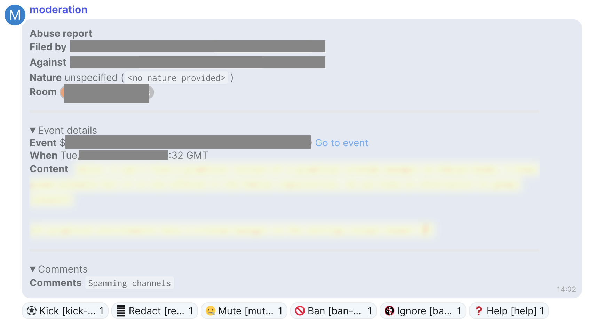
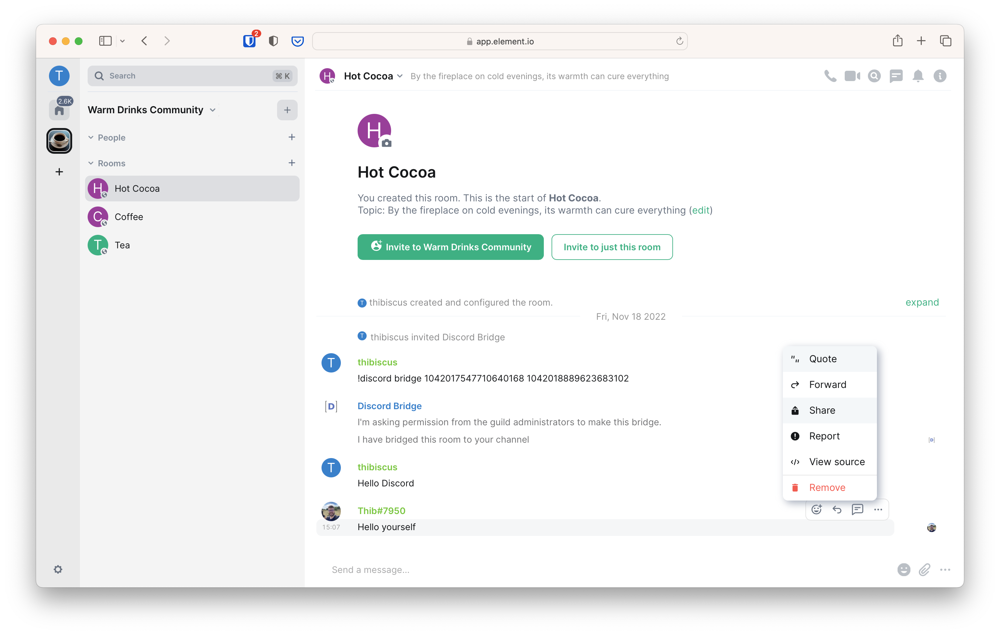
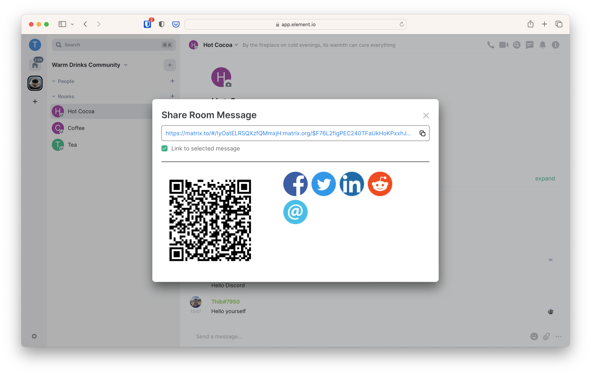

+++
title = "Community Moderation"
template = "docs/with_menu.html"
weight = 200
[extra]
emoji = "🛡️"
tile = "I want to deploy moderation tools"
updated = "2023-01-25T06:43:00Z"
meta_description = """
Matrix allows communities to stay safe thanks to moderation tools. Mjolnir is
the recommended solution for community managers who want to fight abuse on
Matrix.
"""
+++

## Power levels

Matrix has a basic system of roles, sometimes also called Power Levels. It is a
number usually going from 0 to 100. Advanced users can decide to use a different
range, but we will not cover it here for the sake of simplicity.

By default, there are three roles in Matrix:

| Power Level | Role          |
|-------------|---------------|
| 0           | User          |
| 50          | Moderator     |
| 100         | Administrator |

With the recommended default:

- **Users** can send messages, media, reactions and redact their own messages in
  a room.
- **Moderators** can also change the room name, address, topic, remove users
  from the room (temporarily or permanently), redact other's messages and send a
  notification to everyone in the room at once using `@room`.
- **Administrators** can also change the history visibility (whether people can
  see messages from before they joined or not), enable encryption in the room,
  remove entire servers from the room, and promote others to Moderator or
  Administrator.

Most people in your community are just going to be regular users. Usually
Moderators are appointed to handle the ad-hoc moderation issues. Note that this
can be an issue if you want to preserve the anonymity of your Trust & Safety
team for their own security. The moderation bot mjolnir brings a good answer to
this.

If you're taking over a community  previously managed by someone with a high
level of technical expertise in Matrix and strongly opinionated on power levels, the
roles may not be the same. In that case, we recommend you to email
[support@matrix.org](mailto:support@matrix.org) for help.

## Your community's security guard

The tools built into Matrix are good for small group moderation, but they are
limited for now: removing a user (temporarily or permanently) is only possible
at the room level, and banning an entire server from a room is not exposed in
the UI.

Fortunately, a tool exists to step up your moderation game: a security guard
robot you add to all of your public rooms that can enforce your moderation
decisions on all the rooms at once.

And that's really what mjolnir is: a security guard for your rooms. Because of
the decentralised nature of Matrix, you need to add the robot to guard the door
of each of your rooms, and you need to grant it the Administrator role so it can
do its job properly.

### Getting mjolnir

At the moment, to get mjolnir for your community you need either to pay someone
to run mjolnir for you, or to [run it yourself on your own infrastructure](https://github.com/matrix-org/mjolnir/tree/main/docs)
if you have the technical knowledge to do it. We're aware this situation is
suboptimal and are working on a service so people get can mjolnir bots much more
easily.

### Setting it up in your rooms

Once you have performed the technical set-up of mjolnir, you need to:

1. Make sure your moderation staff is in the control room of your community
1. Invite mjolnir the security guard bot in all your rooms
1. Make the mjolnir bot Administrator in all your rooms (so it can enforce
   moderation decisions).

To do so you need to invite the moderation bot in each room. You can do so
either by opening the right panel, opening the members list and clicking on
Invite, or you can type the following message in the message bar at the bottom:

```txt
/invite @yourMjolnirBot:example.com
```

The bot will join, and you can then promote it Administrator by finding it in
the list of members and changing its role, or you can type the following message
in the message bar at the bottom:

```txt
/op @yourMjolnirBot:example.com 100
```

You should spend some time thinking about what privileges you want to give to your Mjolnir.
A common setup is to give the Mjolnir user power level 100.
This gives Mjolnir the permissions to kick and ban people from the rooms it protects.
This has a couple of implications.
First, anyone with access to the Mjolnir has power level 100 in the rooms it protects.
Also, Mjolnir is the de-facto owner of those community rooms.
For more advanced set-ups, read the [spec covering power levels](https://spec.matrix.org/v1.5/client-server-api/#mroompower_levels).

## Getting moderation reports

By default, the moderation reports go to the reporter's homeserver
administrator. If you are the homeserver admin, you can choose to send the reports to the Mjolnir management room.
Those reports look like this:

<!-- markdownlint-disable-next-line no-alt-text -->


The report gives you some information about the reported message.
Underneath, there are some buttons that you can use to take action on the report.

We'll talk about moderation actions in a moment. If you want to set up these reports, please follow the documentation [here](https://github.com/matrix-org/mjolnir#enabling-readable-abuse-reports).

## Enforcing moderation

### Redacting a specific message

There are two ways to redact a message.
You can click the {{ mjolnirbutton(text="🗍 Redact") }} button underneath a report,
if you are using those reports.
You can also redact a particular message by sending a message in Mjolnir's control room.
This method is useful when you haven't received a report about a message, but you want to redact it.

To redact a specific message, you need to find its permalink.
You can find the permalink by hovering the message you want to delete, clicking on the `…`, then on `Share`.

<!-- markdownlint-disable-next-line no-alt-text -->


This will open a pop-up window from which you can copy the permalink.

<!-- markdownlint-disable-next-line no-alt-text -->


Once you have the permalink, you can use it in mjolnir's redaction command

```txt
!mjolnir redact <event permalink> 
```

For example

```txt
!mjolnir redact https://matrix.to/#/!yOatELRSQXzfQMmxjH:matrix.org/$F76L2figPEC240TFaUkHoKPxxhJ3P54vP4hi14Sd8xw?via=matrix.org&via=t2bot.io
```

One important feature of Mjolnir is to protect individual moderators from retaliation.
If you redact a message using the client UI, that redaction appears with your user id. When you use Mjolnir,
it shows Mjolnir's id. This can help to reduce direct retaliation against moderators for their moderation actions.
Your management room will record who took the action.

### Redacting a user's last messages

Offensive users can sometimes try to spam messages before they are caught.
Finding the permalinks for these messages would be tedious and would make
moderation particularly inefficient.

If such a user has been identified, it's possible to redact their last n
messages, either globally or in a specific room. To do so, grab the user's
Matrix ID and issue a command following this pattern:

```txt
!mjolnir redact <user ID> [room alias/ID] [limit] 
```

For example to redact the last 100 messages of `@john:example.com` in
`#matrix:matrix.org`:

```txt
!mjolnir redact @john:example.com #matrix:matrix.org 100
```

Or to redact the last 100 messages from `@john:example.com` globally:

```txt
!mjolnir redact @john:example.com 100
```

Note that this command will redact the last messages of the user, but will not
take any measure to prevent them from posting more abusive messages. Most of the
time you will want to also remove this person temporarily or permanently from
your community.

### Removing someone temporarily (kick)

If you have moderation reports enabled and click on the
{{ mjolnirbutton(text="⚽️ Kick") }} button below it, mjolnir will kick the user
from the room where they were reported.

If you don't have moderation reports enabled, you can also kick a user either
from a specific room or globally with the following command.

```txt
!mjolnir kick <glob> [room alias/ID] [reason]
```

For example

```txt
!mjolnir kick @john:example.com #matrix:matrix.org Inappropriate interactions with other people.
```

### Removing someone definitely (ban)

Some people may not stop after their messages have been redacted and they have
been kicked. In that case you need to be able to remove them permanently from
your community.

If you have reports enabled, and click on the
{{ mjolnirbutton(text="🚫 Ban") }} button below it, mjolnir will ban the user
from all the rooms it protects. The user will be banned not only from the room
where they were reported, but from your whole community.

If you don't have moderation reports enabled, you can also ban either a user
with the following command

```txt
!mjolnir ban <list shortcode> <user|room|server> <glob> [reason]
```

For example, to remove `@john:example.com` permanently from your community for
infringement to the code of conduct, you can issue the following command in
mjolnir's control room.

```txt
!mjolnir ban coc user @john:example.com User keeps insulting people
```

That's a complex command, let's try to understand what it does.

- `!mjolnir ban` tells mjolnir we want it to perform a ban
- `coc` tells mjolnir we want to add the person to the ban list with shortname
  `coc`. We'll explore what ban lists are a little further below.
- `user` tells mjolnir it needs to ban a user. It is not strictly mandatory, but
   it's a good practice to add it in order to avoid banning a whole server when
   trying to ban a single user, in case of typo.
- `@john:example.com` is the Matrix ID of the person we want to ban
- `User keeps insulting people` is the reason why we are banning them. Their
   client will be able to display that message.

Mjolnir then adds the user we're banning to the ban list we specified. Mjolnir
keeps watching one or several ban lists, and will ban all the users present on
those lists from all the rooms it protects.

Note that this command will likely fail if it's the first time you are trying to
ban someone. Indeed, you need to create one or more ban lists before adding
users or servers on them. See the section [Creating ban lists](#creating-ban-lists)
below for more information on how to create them.

### Removing a server definitely

Matrix is a federated network. This means people can set up new servers
specifically to harm some communities. This allows them to create a virtually
infinite number of users, making it possible to raid other communities easily.

Fortunately, all these malicious users have one thing in common: they come from
the same homeserver. This means if you block the malicious homeserver entirely,
all the malicious users are going to be banned at once.

To do so, you can issue a variant of the command used to ban an individual user.
The command was

```txt
!mjolnir ban <list shortcode> <user|room|server> <glob> [reason]
```

As you probably guessed, you are not going to ban a user but a server this once.
For example, to ban the `maliciousdomain.tld` domain:

```txt
!mjolnir ban spam server maliciousdomain.tld
```

Mjolnir is going to add the domain to the `spam` ban list, and whenever someone
from that homeserver tries to join your community they are going to be banned.

### Creating ban lists

Mjolnir allows you to create several ban lists that it can later watch. Those
ban lists can also be watched by third parties if you make them public.

The command to issue in mjolnir's control room to create a list is the
following

```txt
!mjolnir list create <shortcode> <alias localpart>
```

- `shortcode` is a short name given to this list. It should be short and easy to
  type, since you are likely to type it a lot when banning users.
- `alias localpart` is the local part of the address mjolnir is going to create
  for this list. This is useful if you ever want to share your ban list with
  other communities.

For example, assuming the server mjolnir is deployed against is `example.com`,
the following command will create a ban list with the short code `spam` and the
address `#my-community-spam-ban-list:example.com`

```txt
!mjolnir list create spam my-community-spam-ban-list
```

You only need to create a ban list once, and can then add as many users and
servers as you want to that ban list. You can also create as many ban lists as
you want.

Communities often create two ban lists: one for spam, and one for code of
conduct infringements.

It is also possible to configure a default ban list mjolnir will use for bans if
no short code is specified. For example, to use the ban list with short code
`spam` by default, issue the following command:

```txt
!mjolnir default spam
```

Finally, from a technical perspective, a ban list is just a regular Matrix room
filled with moderation hidden messages, technically called events. As such, you
can give it a public address, and make it publicly accessible like you would for
any other room.

### Subscribing to ban lists

Ban lists are a clever mechanism that allows moderation teams to ban users for
different motives (e.g. one list for `spam` and one for `coc`). Such a
distinction can be useful when several communities want to collaborate together.

Not all communities will share a similar Code of Conduct, but a lot of them will
agree on what is spam. Being able to subscribe to another community's spam list
means your own community will be protected from spammers the other community has
already met, all while observing different code of conducts.

To subscribe to a public ban list, you need to retrieve the address of this
list. That list being technically nothing more than a Matrix room, its address
follows the usual `#room_name:server.tld` format.

Then to make mjolnir follow this list, you need to issue the following command
in its control room

```txt
!mjolnir watch <room alias/ID>
```

For example to subscribe to the `#matrix-org-hs-tos-bl:matrix.org` ban list
maintained by the Matrix.org Foundation, you would issue the following command

```txt
!mjolnir watch #matrix-org-hs-tos-bl:matrix.org
```
