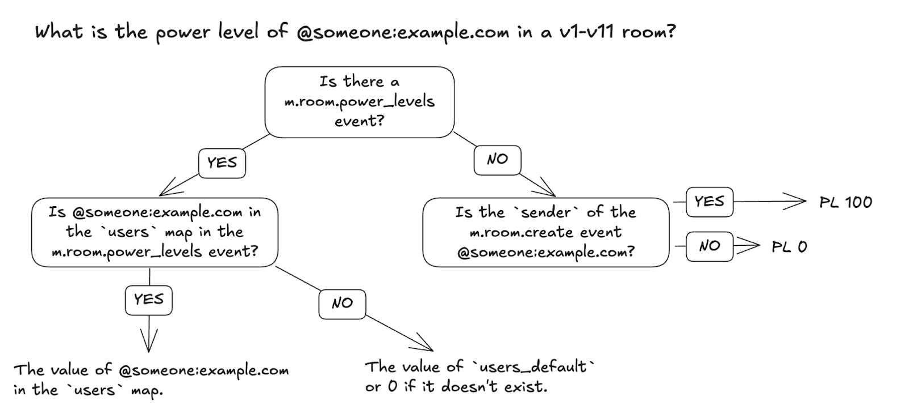
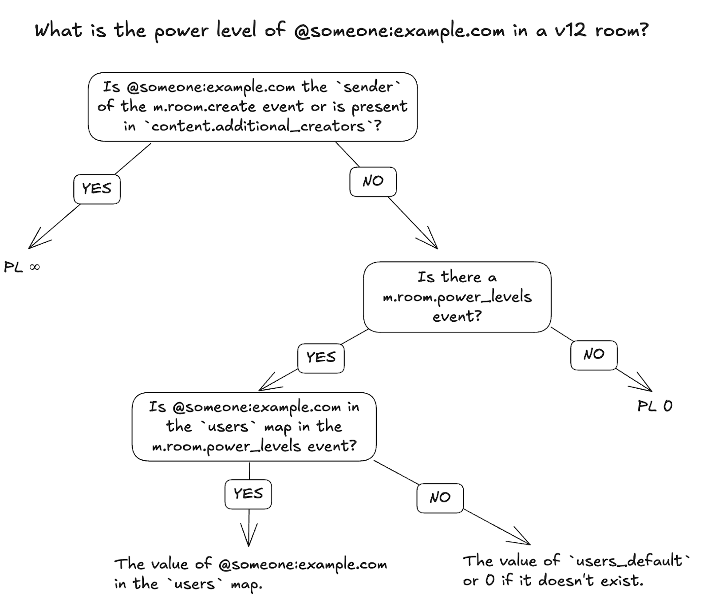

+++
title = "Creator power level in room version 12"
weight = 100
template = "docs/with_menu.html"
[extra]
updated = "2025-08-14T17:00:00Z"
meta_description = """
Power levels for room creators work a little differently in room version 12. This
guide explains how.
"""
+++

Previously, the [specification](https://spec.matrix.org/v1.15/client-server-api/#mroompower_levels) defined the power levels of users as follows:

Room version 12 defines the power levels of users as follows:

Note in both cases clients need the `m.room.create` event and `m.room.power_levels` event to accurately determine the power level of users. Since most rooms have a `m.room.power_levels` event, many clients failed to implement first branching “no” in v1-v11 rooms. The new rules take into account the privileged position of room creators whilst also ensuring that clients implement the full decision flow chart.
