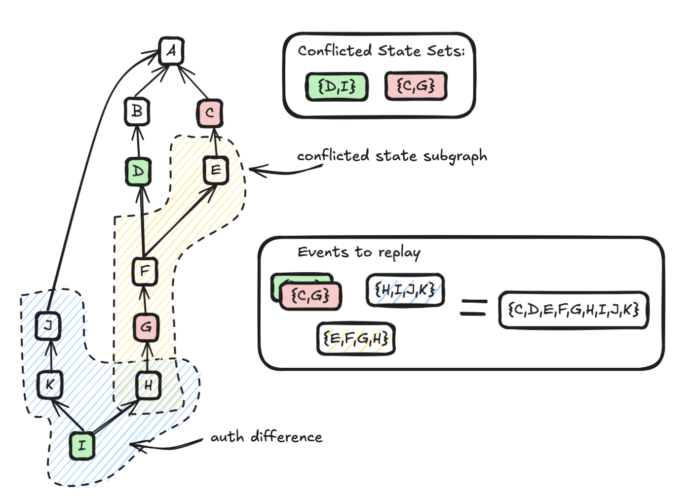
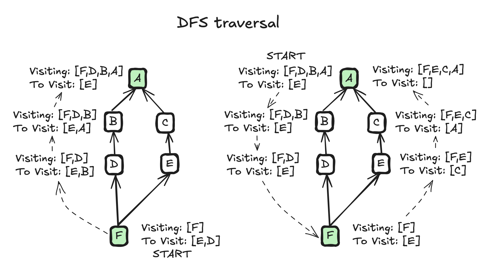
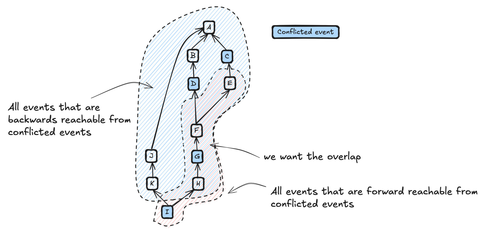

+++
title = "State Res v2.1: An implementer's guide"
weight = 100
template = "docs/with_menu.html"
[extra]
updated = "2025-08-14T17:00:00Z"
meta_description = """
State Res v2.1 is an incremental change to the state resolution algorithm in
Matrix. See MSC4297 for rationale on _why_ this change is needed and what issues
it addresses.
"""
+++

State Res v2.1 is an incremental change to the state resolution algorithm in Matrix. See [MSC4297](https://github.com/matrix-org/matrix-spec-proposals/pull/4297) for
rationale on _why_ this change is needed and what issues it addresses. This guide focuses on the
_how_ and is aimed at server developers who want to implement the algorithm. It assumes v2 is already
implemented.

## Change 1: Begin from the empty set and not the unconflicted set

This is a trivial change to make. When performing the initial iterative auth checks, replace the
unconflicted set with the empty set:
```py
    resolved_state = await _iterative_auth_checks(
        clock,
        room_id,
        room_version,
        sorted_power_events,
        {}, # was unconflicted_state
        event_map,
        state_res_store,
    )
```

## Change 2: Include events in the conflicted subgraph

This is a more invasive change and is the bulk of this guide. In essence, this is asking for a
subgraph to be produced from the existing auth graph, which is bounded by two conflicted auth events:




### Naive implementation

A simple but inefficient implementation works by taking each conflicted event and walking
depth-first to the root of the graph. If the traversal encounters another conflicted event, then the
events on that path are part of the conflicted subgraph. By walking depth first,
the events on the path are naturally calculated as part of the walk, which saves time computing it.

Whlist this works, it is inefficient because it does a lot of repeat work. For example, once you have
visited from G to A, you no longer need to visit C to A or D to A as you already did that work.

```py
subgraph = set()

def on_visit(event_id, visiting):
    if event_id in conflicted_set:
        # add everything in 'visiting' to conflicted subgraph
        subgraph.update(visiting)
    for prev in events[event_id]["auth_events"]:
        visiting.append(event_id)
        on_visit(prev, visiting)
        visiting.pop()


for conflicted_event_id in conflicted_set:
    on_visit(conflicted_event_id, [])
```



### Strongly connected components

An alternative, more performant implementation is possible, based on the observation that the
conflicted state subgraph corresponds precisely to a _strongly connected component_ (SCC) in the
graph obtained by contracting all conflicted nodes into a single conflicted "supernode".

In that contracted graph, the desired subgraph is exactly the SCC containing the supernode, which
can be computed with the standard forward-backward method: intersect the set of nodes
forward-reachable from the supernode with the set of nodes that can reach the supernode.



Although we do not explicitly build the contracted graph, this observation justifies running an
equivalent procedure directly on the original (uncontracted) graph, which is to perform the forward
and backward searches from each conflicted event and intersecting the aggregated results.

Only two sets are required to implement this, but servers are required to know or calculate the
relevant _forwards reachable events_ first. Servers already know the _backwards reachable_ events
as this is an intrinsic part of calculating the _auth difference_. Once this is done, the algorithm
proceeds as follows:

```py
# This assumes you have already implemented
# get_backwards_reachable_events and get_forwards_reachable_events

backwards_reachable = set()
forwards_reachable = set()

backwards_reachable.update(
    get_backwards_reachable_events(conflicted_set)
)
forwards_reachable.update(
    get_forwards_reachable_events(conflicted_set)
)

subgraph = backwards_reachable.intersection(forwards_reachable)
```

The performance of this algorithm depends on the implementation of `get_backwards_reachable_events`
and `get_forwards_reachable_events`. Synapse uses the
[chain cover index](https://github.com/element-hq/synapse/blob/develop/docs/auth_chain_difference_algorithm.md)
to enhance load times of backwards reachable events. It is also possible to return only the _relevant_
forwards reachable events rather than _all_ forwards reachable events to speed up load times of forwards
reachable events, but this is out of scope for this guide.
