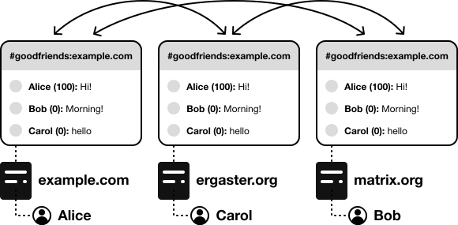

+++
title = "Rooms & Events"
weight = 200
template = "docs/with_menu.html"
[extra]
updated = "2023-02-08T08:00:00Z"
+++

Users on a server can send *events* into *rooms*. An event is a particular json
object, describing what a user is trying to do (join a room, send a message,
update a specific value…). An event will look like the following

```json
{
  "content": {
    "body": "This is an example text message",
    "format": "org.matrix.custom.html",
    "formatted_body": "<b>This is an example text message</b>",
    "msgtype": "m.text"
  },
  "event_id": "$143273582443PhrSn:example.org",
  "origin_server_ts": 1432735824653,
  "room_id": "!jEsUZKDJdhlrceRyVU:example.org",
  "sender": "@example:example.org",
  "type": "m.room.message",
  "unsigned": {
    "age": 1234
  }
}
```

In the case of instant messaging, clients display rooms very similarly to Slack,
Discord or IRC channels. Most of the events in such rooms are messages. Rooms
have a unique technical identifier, and zero or more human-readable aliases.
Aliases are made of a room name, and a server part, and are sometimes referred
to as "addresses". A typical room alias would be:

```
#goodfriends:example.com
```


## Local copies

Homeservers are federated: the Matrix specification defines a [Sever-Server API](https://spec.matrix.org/latest/server-server-api/)
(also known as Federation API) to describe interactions between servers.
Whenever a user is in a room, their homeserver needs to have a local copy of
that room.

For example, if `@alice:example.com` is the first user from `example.com` to try
to join `#goodfriends:matrix.org`, then her homeserver is going to reach out to
`matrix.org` to get a copy of the room. `example.com` and `matrix.org` then stay
in touch to synchronise their copy of the room.



## Administration

Whenever the homeserver receives new events, it's in charge of parsing them,
perform checks on the event, and take action accordingly (e.g. sending messages
from users on the homeserver to other participating homeservers, or distributing
messages from other participating homeservers to users). The expected behaviour
of homeservers is described fully in the [Matrix Specification](https://spec.matrix.org).

It could seem dangerous to think that everyone has their own local copy of the
room. Doesn't that mean anyone can become administrator of the room and do nasty
things? Not really.
