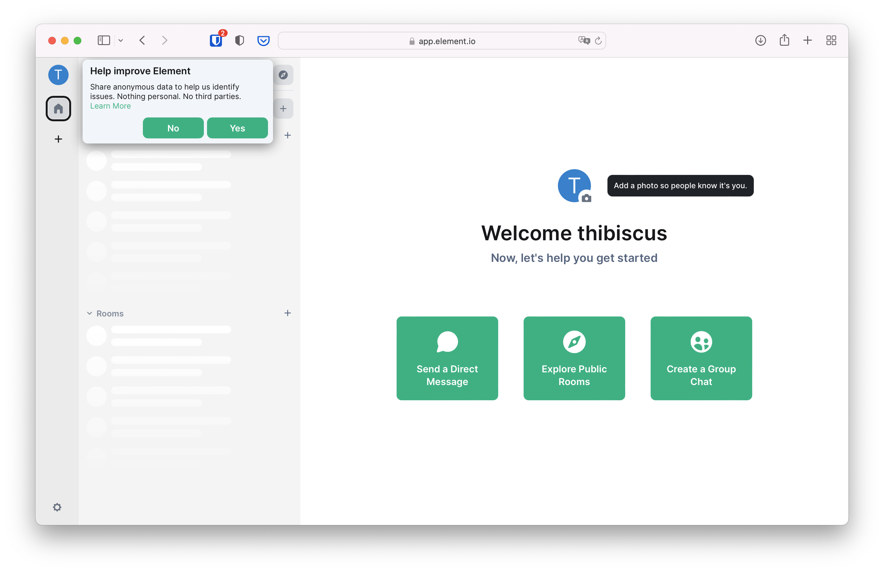

+++
title = "Desktop"
date = "2022-10-12T08:00:00Z"
template = "docs/index.html"
weight = 100
[extra]
emoji = "💻️"
tile = "I'm using a computer"
+++

## Creating an account

Go to <https://app.element.io>, and click on "Create Account". You should land
on the following page.

For simplicity you can connect with a Google, Facebook, Apple, GitHub or Gitlab
account if you have any of these. They will be notified that you're using your
account to create a Matrix one. This is sometimes called "Social Login".

If you're more privacy conscious, you can also register by entering a username,
password and email in the form below the Social Login buttons.

You might be challenged with a captcha (a set of tiles or pictures where you
need to find certain objects), and will be asked to accept Matrix.org's terms
and conditions.

After accepting the terms, you will end on a screen that asks you to confirm
your email address. You can safely close this window.

Check your inbox, and click the link to verify your email address. The link will
bring you to the homepage of Element, the Matrix web application to participate
to Matrix conversations.

Then you can either decide to create a private group chat to experiment with and
invite friends later, or join large public rooms to join conversations.
