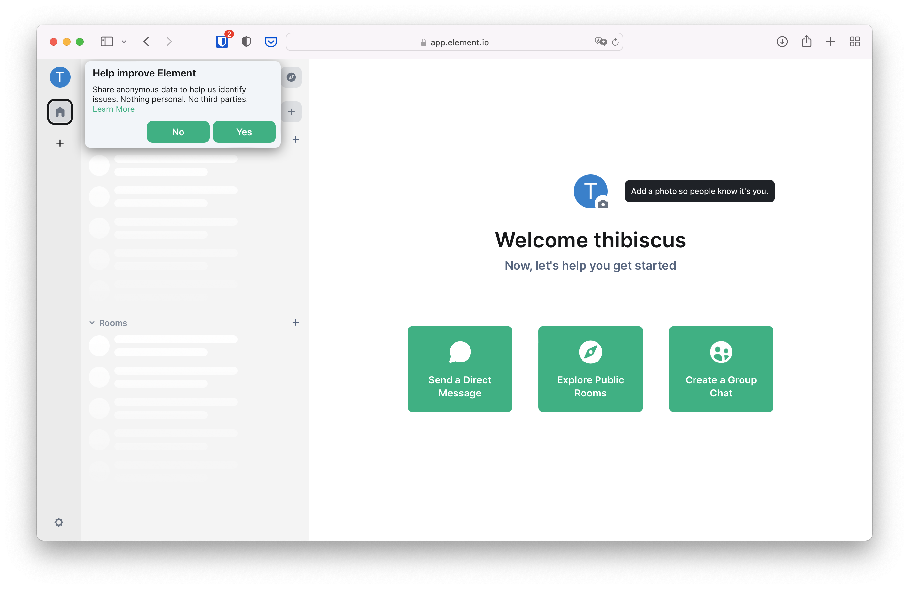

+++
title = "Desktop"
date = "2022-10-12T08:00:00Z"
weight = 100
[extra]
emoji = "💻️"
tile = "I'm using a computer"
+++

Go to <https://app.element.io>, and click on "Create Account". You should land
on the following page.

For simplicity you can connect with a Google, Facebook, Apple, GitHub or Gitlab
account if you have any of these. They will be notified that you're using your
account to create a Matrix one. This is sometimes called "Social Login".

If you're more privacy conscious, you can also register by entering a username,
password and email in the form below the Social Login buttons.

You might be challenged with a captcha (a set of tiles or pictures where you
need to find certain objects), and will be asked to accept Matrix.org's terms
and conditions.

After accepting the terms, you will end on a screen that asks you to confirm
your email address. You can safely close this window.

Check your inbox, and click the link to verify your email address. The link will
bring you to the homepage of Element, the Matrix web application to participate
to Matrix conversations.

## Your own place to experiment

### Creating a group chat for yourself

The simplest way to get started is to create a private group chat so you can
safely try some Matrix features. To do so, click on the large "Create a Group
Chat" button in the main panel.

A room creation screen will appear. For our first steps, we're going to create a
private room so we can experiment safely without anyone watching:

* Let's call the room "Exploring how Element Works".
* For the topic, we can use "I don't even know what a topic is!".
* Leave "Private room (invite only)" selected
* Leave "Enable end-to-end encryption" switched on
* No need to fiddle with advanced settings for now, we can click the "Create
  room" button.

An empty private room will be create with only you inside. The room is secured
using a method called "end-to-end encryption" to prevent anyone else than the
members of this room from deciphering the messages. The math and cryptography
behind it is quite complex, but fortunately you don't need to understand any of
it.

Every member of an encrypted private room has a secret piece of information they
can use to decrypt the messages. Losing access to this secret piece of
information means losing access to history and new messages in encrypted rooms.

This secret piece of information used to decrypt messages is stored on a digital
safe. The key unlocking that digital safe is called a Security Key. Element
walks you through the set-up of this digital safe called "Secure Backup" when
you click on Continue on the top-left pop-up.

You can either let Element generate a Security Key that is difficult to guess to
secure your digital safe, or pick your own. Unless you are an expert and know
exactly what you are doing, in most cases it's better to let Element generate it
for you. Leave "Generate a Security Key" ticked, and click on "Continue".

Element will display the Security Key it has generated. This is a unique and
very secret key that should only be known by you. In your day to day usage of
Matrix, you will not need it. But if all your devices connected to Matrix stop
functionning, are stolen, or if you just lose access to them: this Security Key
is the only way for you to regain access to your messages. You should store it
in a password manager if you use one, or at least print it and save it somewhere
safe. As inconvenient as it sounds, this is necessary to ensure nobody else but
you can read encrypted messages.

Make sure to download and print the security key before clicking on Continue, as
it will never be displayed again and cannot be recovered.

### Sending your first messages

Voilà, you're in your own group chat! In the Matrix jargon, chats are called
rooms. Let's give it a try immediately and type a message, then either press the
return key or click on the send button.

You can see your message in the room! That large area where your message appears
(and soon others' as well) is called the timeline. But look more closely: you
made a typo! Fortunately, Matrix supports message edits, either by pressing the
up arrow of the keyboard or by clicking the pen icon when hovering the mouse
over the message we want to edit.

Fixing the typo and either pressing return or clicking "Save" will update the
message for everyone else in the room.

But now you realise… this message doesn't add much to the conversation. Maybe
it's worth removing it entirely? To do so, hover the mouse over the message you
want to remomve, and click on the bin.

There are other fun ways to handle a conversation in Matrix, such as replies or
threads. We suggest you to play around with the interface of this room: be bold,
you can't break anything!

* Inviting people

## A small group chat

* Redacting other people's messages
* Excluding troublemakers
* Who can redact?
* Promoting/demoting others
* Ownership of the group

## Joining larger public rooms

* Following a matrix.to link
* Creating a public room and giving it an alias
