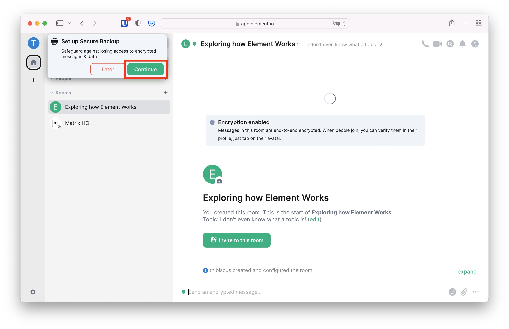
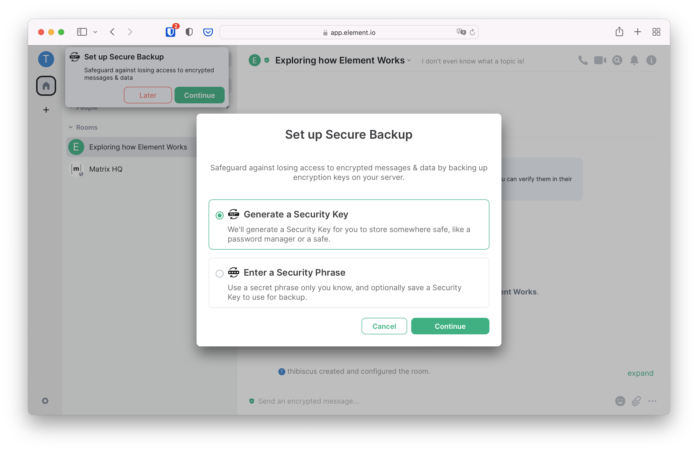
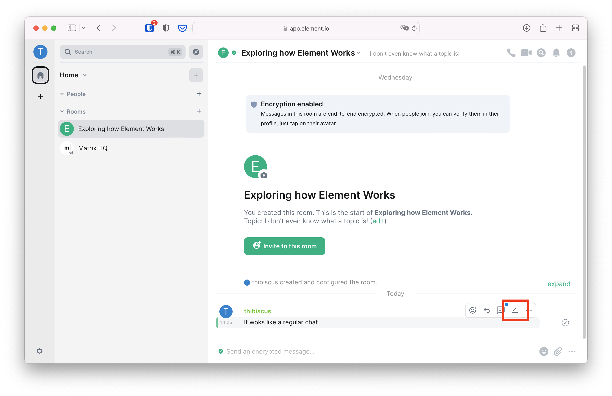
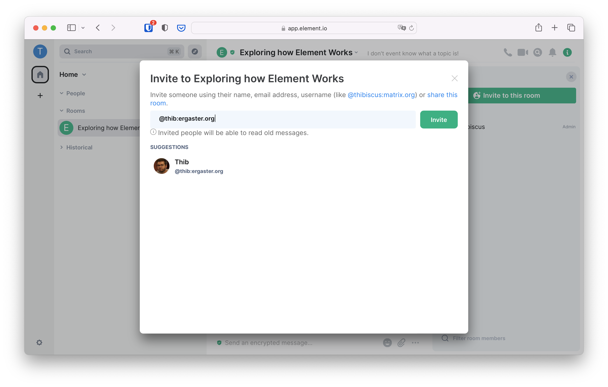
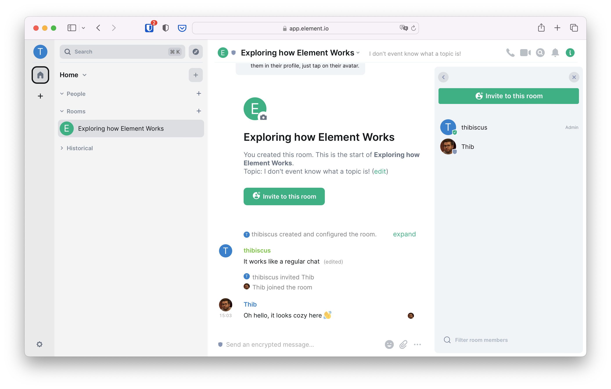
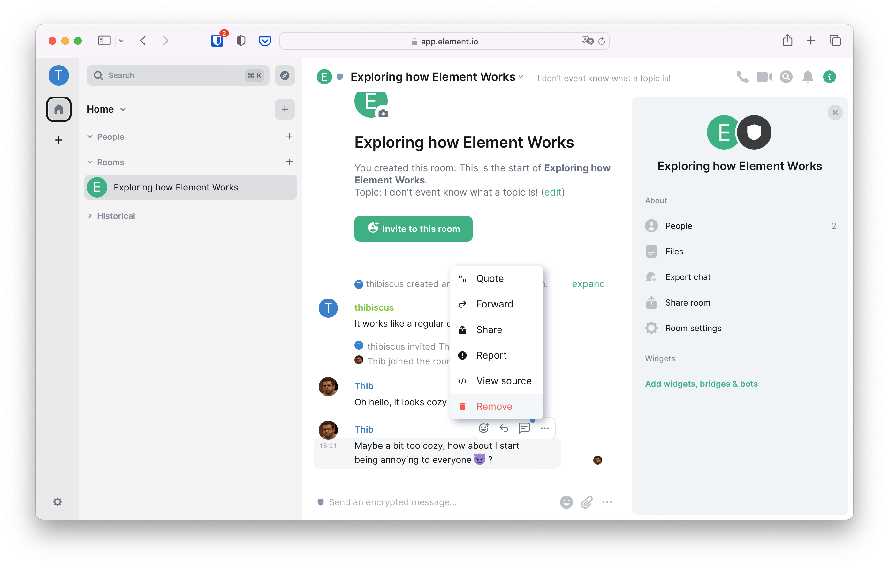
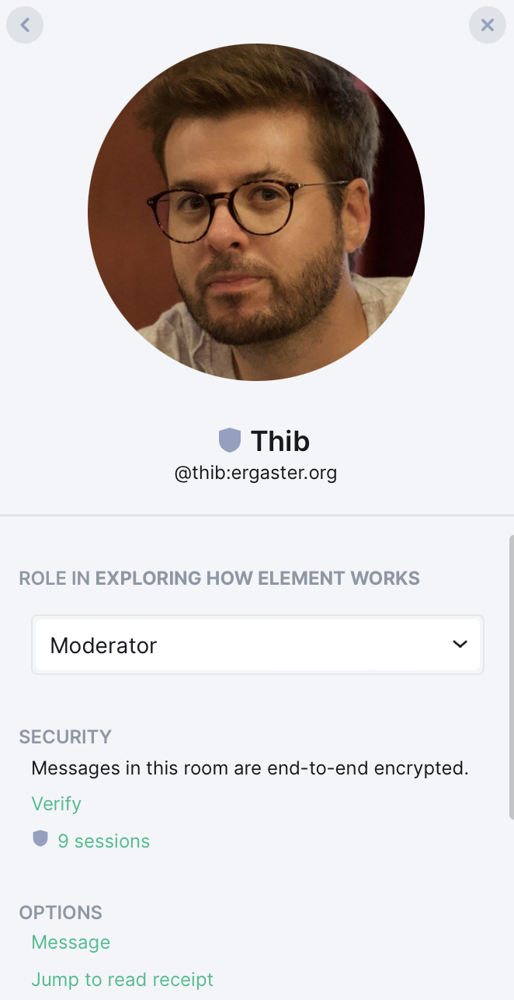

+++
title = "Private Group Chat"
weight = 100
[extra]
emoji = "🧑‍🤝‍🧑"
tile = "I want to create a private group chat"
updated = "2022-10-18T16:00:00Z"
+++

The simplest way to get started is to create a private group chat so you can
safely try some Matrix features. To do so, click on the large "Create a Group
Chat" button in the main panel.

A room creation screen will appear. For our first steps, we're going to create a
private room so we can experiment safely without anyone watching:

* Let's call the room "Exploring how Element Works".
* For the topic, we can use "I don't even know what a topic is!".
* Leave "Private room (invite only)" selected
* Leave "Enable end-to-end encryption" switched on
* No need to fiddle with advanced settings for now, we can click the "Create
  room" button.

An empty private room will be create with only you inside. The room is secured
using a method called "end-to-end encryption" to prevent anyone else than the
members of this room from deciphering the messages. The math and cryptography
behind it is quite complex, but fortunately you don't need to understand any of
it.

Every member of an encrypted private room has a secret piece of information they
can use to decrypt the messages. Losing access to this secret piece of
information means losing access to history and new messages in encrypted rooms.

This secret piece of information used to decrypt messages is stored on a digital
safe. The key unlocking that digital safe is called a Security Key. Element
walks you through the set-up of this digital safe called "Secure Backup" when
you click on Continue on the top-left pop-up.

You can either let Element generate a Security Key that is difficult to guess to
secure your digital safe, or pick your own. Unless you are an expert and know
exactly what you are doing, in most cases it's better to let Element generate it
for you. Leave "Generate a Security Key" ticked, and click on "Continue".

Element will display the Security Key it has generated. This is a unique and
very secret key that should only be known by you. In your day to day usage of
Matrix, you will not need it. But if all your devices connected to Matrix stop
functionning, are stolen, or if you just lose access to them: this Security Key
is the only way for you to regain access to your messages. You should store it
in a password manager if you use one, or at least print it and save it somewhere
safe. As inconvenient as it sounds, this is necessary to ensure nobody else but
you can read encrypted messages.

Make sure to download and print the security key before clicking on Continue, as
it will never be displayed again and cannot be recovered.

### Sending your first messages

Voilà, you're in your own group chat! In the Matrix jargon, chats are called
rooms. Let's give it a try immediately and type a message, then either press the
return key or click on the send button.

You can see your message in the room! That large area where your message appears
(and soon others' as well) is called the timeline. But look more closely: you
made a typo! Fortunately, Matrix supports message edits, either by pressing the
up arrow of the keyboard or by clicking the pen icon when hovering the mouse
over the message we want to edit.

Fixing the typo and either pressing return or clicking "Save" will update the
message for everyone else in the room.

But now you realise… this message doesn't add much to the conversation. Maybe
it's worth removing it entirely? To do so, hover the mouse over the message you
want to remomve, and click on the bin.

There are other fun ways to handle a conversation in Matrix, such as replies or
threads. We suggest you to play around with the interface of this room: be bold,
you can't break anything!

But it starts to feel a little lonely here. How about inviting friends in this
group chat?

### Inviting people

To invite friends in your group chat, click on the circled `i` on the top right
corner. It opens the right panel. Click on "People" to display the list of
members of this room: you should be the only one there for now.

Click on "Invite to this room" on top of the people list, and a prompt will open
so you can invite your friends to join you in Matrix. If they're already on
Matrix, enter their Matrix ID. If they're not, enter their email address and
they will be invited to join.

The person you invited can either accept or decline the invite. If they accept
it, you should see them joining the room. The more the merrier!

## Keeping the group safe

### Removing messages or people from the group chat

It's great to be able to have a conversation with nice people, but some of them
can turn nasty. It's important to keep your group chats healthy and safe. When
troublemakers start being annoying, you can redact their messages. You can do it
the same way you did it for your messages: hover the message, click on the three
dots, and click on "Remove"

You can provide a reason why the message is redacted, but it's not strictly
mandatory. Once it's removed, a placeholder is going to be displayed instead.

If the person sent a lot of messages that need to be deleted, you can click on
their avatar to open the details view in the right panel. Scroll to the bottom
of the right panel and click on "Remove recent messages".

But sometimes removing the messages is not enough, and the troublemaker doesn't
want to be reasoned with. In such case, you can remove them from the private
group chat. To do so, click on their avatar in the timeline, scroll to the
bottom of the right panel, and click on "Remove from room".

### Getting help keeping the group safe

So far, only the person who created the group chat has enough privileges to
remove messages or people from the conversation. Those privileges are
technically called a "Power Level", or a "Role" in Element.

With the "Default" role, people can only participate in the conversation.
Element defines two other roles: "Moderator" and "Admin".

If you promote someone "Moderator", they will be able to redact other people's
messages and remove them from the room. You can demote the moderators back to 
the default role whenever you want.

If you promote someone "Admin", they become co-owners of the room with you, and
you cannot take it back! Be very careful who you promote administrator.
