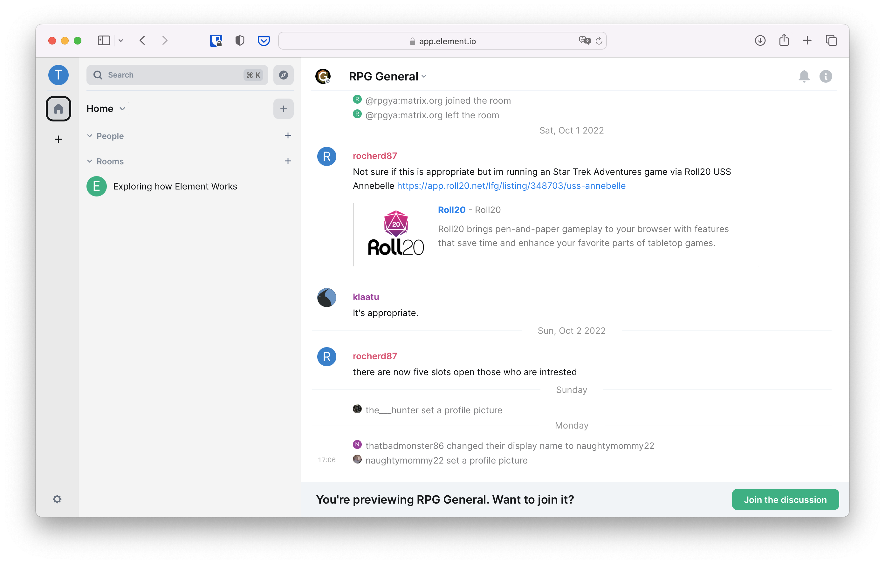
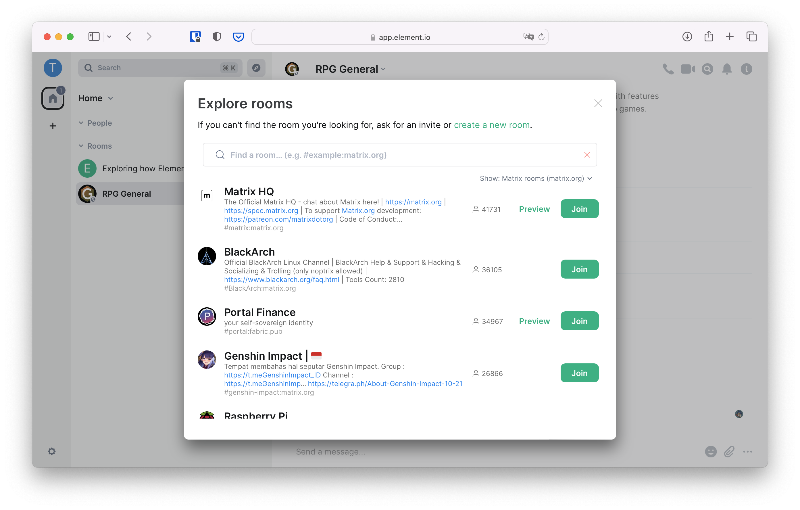

+++
title = "Public Rooms"
weight = 200
[extra]
emoji = "🌐"
tile = "I want to join public conversations"
updated = "2022-10-18T16:00:00Z"
+++

When you want to join larger public conversations, you have three major options
at hand:

1. Joining a specific room from its address/alias or from a matrix.to link
2. Browsing a public directory to find rooms of interest
3. Joining a room that was listed in a Space

## Joining a specific room

Someone might have shared a link that starts with `matrix.to` with you, or you
might have stumbled upon it on a website. Those links will bring you to the
public conversation you tried to join after asking you what client you want to
use.

Clicking a `matrix.to` link you will open a new tab in your browser, showing you
a UI that looks like the following.

Click on accept, and you will be redirected to a preview of the room you're
trying to join, containing its name, address (on the format
`#room-name:example.com`), and number of people currently in the room. Below
this preview is a list of clients you can use to join the room.

Since this documentation started with Element, let's carry on with it. You will
be able to seamlessly change for another client when you're more used to Matrix.

Click on "Continue" below Element. If you have installed Element Desktop, your
browser may ask you if you want to allow this page to open Element. Click on
Allow. If you haven't installed Element Desktop, you can either click on
"Download" to get it, or "Continue in your browser" to carry on with the web
app.

Depending on the privacy settings set by the administrators of the room, you may
or may not be able to see a preview of the conversation.

Click on "Join the discussion": you can now participate in the room!

## Browsing the public directory

Joining a specific room is handy when you know exactly what you want to discuss
or where, but sometimes you just want to find a casual place to talk of things
of interest with people on the Internet.

Matrix has a built-in directory where people can publish their public rooms for
others to find them. The directory only shows rooms published on a single
provider at once. If you have created an account on matrix.org, it's going to
show you only rooms published on matrix.org's directory.

To access the directory, click on the `+` in the left bar, and on "Join public
room".

It will open a list of all the public rooms published in the directory of your
provider.

The directory can be very large sometimes, and the rooms displayed at the top of
the list may not be of interest to you. You can type a center of interest to see
if someone has created a room for it already.

You can click "Join" to join the room, and voilà, you're in!

## Spaces

TODO: What are Spaces
TODO: Joining a Space, & a few curated ones
TODO: joining a room from a Space
